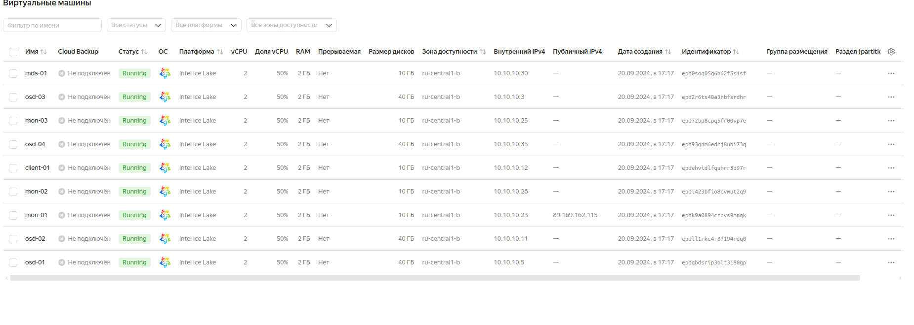
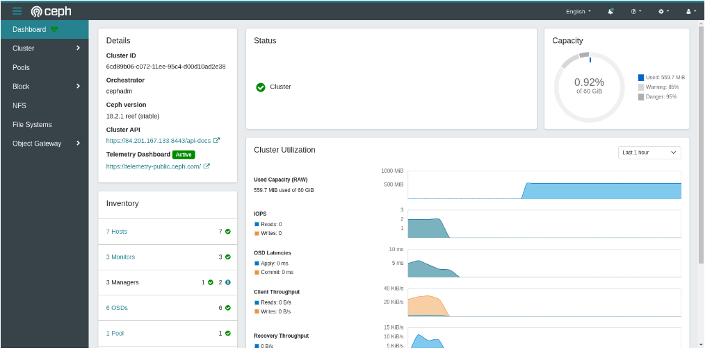
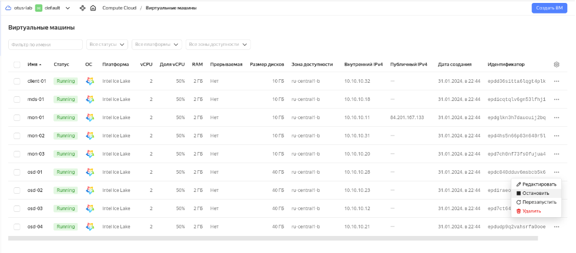
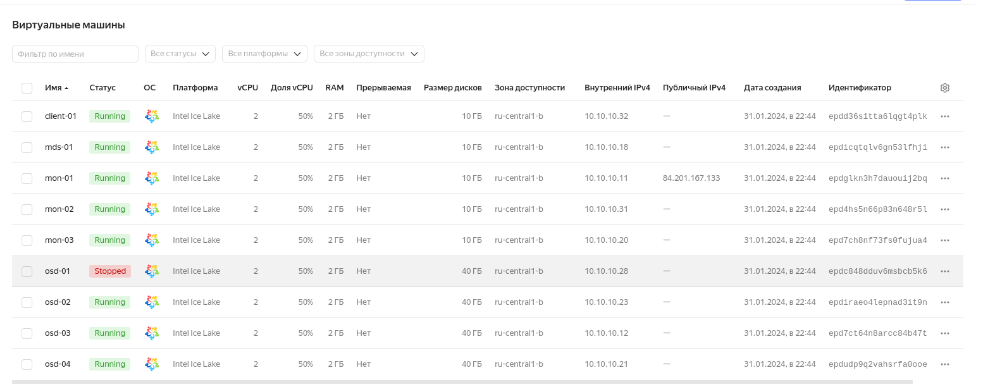
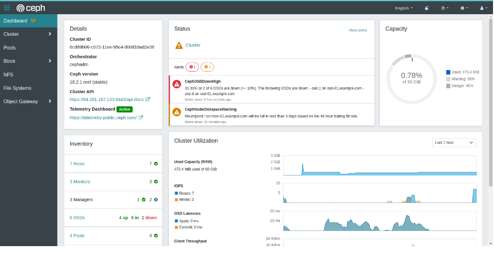
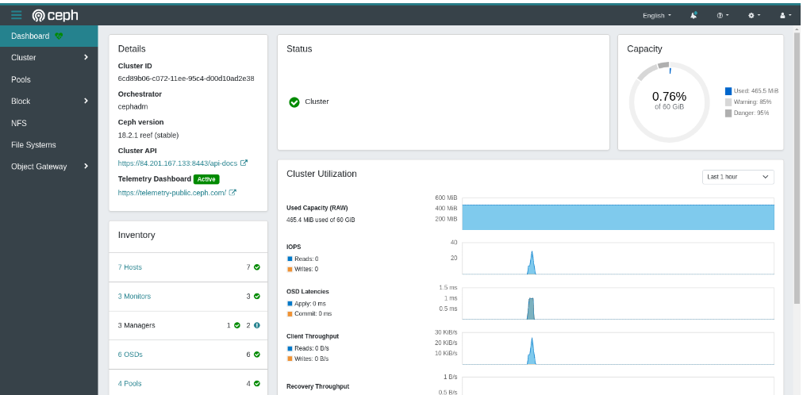

# настройка CEPH

## Цель:

> Поднять отказоустойчивый кластер одним из способов, с фактором репликации 2 или выше, для использования rbd, cephfs, s3. ПОдключить клиентов к 
> созданному хранилищу. Отработать сценарии сбоев.


## Описание/Пошаговая инструкция выполнения домашнего задания:

> C помощью terraform и ansible поднять отказоустойчивый кластер одним из способов, с фактором репликации 2 или выше, для использования rbd, cephfs


1. Cделать расчет кластера
2. Просчитать pg для pool'ов из расчета: rbd - 5/10 объема дисков cephfs - 3/10 объема дисков объяснить логику расчёта, создать пулы.
3. Создать и пробросить на клиентские машины: 3 rbd cephfs (общий раздел на каждую машину)
4. Аварии и масштабирование: Сгенерировать split-brain, посмотреть поведение кластера, решить проблему (результат - запись консоли с выполнением)
   Сгенерировать сбой ноды с osd, вывести из кластера, добавить новую Сгенерировать сбой/обслуживание серверной/дата центра, проверить работоспособность сервисов (результат - запись консоли) Расширить кластер на 2+osd, сделать перерасчёт pg, объяснить логику Уменьшить кластер на 1+osd, сделать перерасчёт pg, объяснить логику


## Формат сдачи

> terraform манифесты ansible роль (можно использовать https://github.com/ceph/ceph-ansible.git) README.md

## Выполнение домашнего задания

> Стенд будем разворачивать с помощью Terraform на YandexCloud, настройку серверов будем выполнять с помощью Ansible.


> Для того чтобы развернуть ceph кластер, нужно выполнить следующую команду:

```
terraform init && terraform apply -auto-approve && \
sleep 60 && ansible-playbook ./provision.yml
```

> По завершению команды получим данные outputs:

```
Outputs:

client-info = {
  "client-01" = {
    "ip_address" = tolist([
      "10.10.10.12",
    ])
    "nat_ip_address" = tolist([
      "",
    ])
  }
}
mds-info = {
  "mds-01" = {
    "ip_address" = tolist([
      "10.10.10.30",
    ])
    "nat_ip_address" = tolist([
      "",
    ])
  }
}
mon-info = {
  "mon-01" = {
    "ip_address" = tolist([
      "10.10.10.23",
    ])
    "nat_ip_address" = tolist([
      "89.169.162.115",
    ])
  }
  "mon-02" = {
    "ip_address" = tolist([
      "10.10.10.26",
    ])
    "nat_ip_address" = tolist([
      "",
    ])
  }
  "mon-03" = {
    "ip_address" = tolist([
      "10.10.10.25",
    ])
    "nat_ip_address" = tolist([
      "",
    ])
  }
}
osd-info = {
  "osd-01" = {
    "ip_address" = tolist([
      "10.10.10.5",
    ])
    "nat_ip_address" = tolist([
      "",
    ])
  }
  "osd-02" = {
    "ip_address" = tolist([
      "10.10.10.11",
    ])
    "nat_ip_address" = tolist([
      "",
    ])
  }
  "osd-03" = {
    "ip_address" = tolist([
      "10.10.10.3",
    ])
    "nat_ip_address" = tolist([
      "",
    ])
  }
  "osd-04" = {
    "ip_address" = tolist([
      "10.10.10.35",
    ])
    "nat_ip_address" = tolist([
      "",
    ])
  }
}
```

> На всех серверах будут установлены ОС Almalinux 9, настроены синхронизация времени Chrony, система принудительного контроля доступа SELinux по 
> рекомендации из документации Ceph для быстрой установки и настройки ceph кластера переведён в Permissive, в качестве firewall будет использоваться 
> NFTables.

> Список виртуальных машин после запуска стенда:



> Ceph кластер будет состоять из следующих серверов:

- мониторы (тут же и менеджеры): mon-01, mon-02, mon-03;
- сервер метаданных: mds-01;
- OSD: osd-01, osd-02, osd-03.

> Также будут подготовлены:

- клиентский сервер client-01 для подключения к ceph кластеру;
- сервер osd-04 для замены одного из osd серверов.

> Все osd сервера имеют по три дополнительных диска по 10 ГБ:

- vdb, vdc - которые будут включены в кластер во время разворачивания;
- vdd - для дополнительного включения в кластер при выполнении лабораторной работы.

> Если в строке браузера введём следующую строку:

```
https://84.201.167.133:8443
```



> В дальнейшем все команды будем выполнять на сервере mon-01, поэтому подключимся к этому серверу с помощью ssh, имея публичный адрес, полученный во время
> разворачивания инфраструктуры ceph кластера:

```
ssh almalinux@84.201.167.133
```

```
(.venv) [user@rocky9 hw-14]$ ssh almalinux@84.201.167.133
Last login: Wed Sep 18 22:57:42 2024 from 10.10.10.11
[almalinux@mon-01 ~]$ sudo -i
[root@mon-01 ~]# 
```

> Просчитать pg для pool'ов: rbd - 5/10 объема дисков cephfs - 3/10 объема дисков объяснить логику расчёта, создать пулы.

```
Total PGs = (Total_number_of_OSD * %_data * Target_PGs_per_OSD) / max_replication_count

Total_number_of_OSD - количество OSDs, в которых этот пул будет иметь PGS. Обычно это количество OSDs всего кластера, но может быть меньше в зависимости от правил CRUSH. (например, отдельные наборы дисков SSD и SATA)

%_data - это значение представляет приблизительный процент данных, которые будут содержаться в этом пуле для данного конкретного OSDs. 

Target PGs per OSD - это значение должно быть заполнено на основе следующего указания:
    100 - если количество OSDs кластера, как ожидается, не увеличится в обозримом будущем.
    200 - если ожидается, что количество OSDs кластера увеличится (до удвоения размера) в обозримом будущем.
    300 - если ожидается, что количество OSDs кластера увеличится в 2-3 раза в обозримом будущем.

max_replication_count - количество реплик, которые будут находиться в пуле. Значение, по умолчанию, равно 3.
```

> Для 6 osd (с дисками по 10 Гб) получаем:

> Для RBD:

```
total PGs = (6 * 5/10 * 100) / 3 = 100 => 128 pg
```

> Создаем пул myrbd:

```
ceph osd pool create myrbd 128
ceph osd pool set myrbd size 3
ceph osd pool application enable myrbd rbd
```

```
[root@mon-01 ~]# ceph osd pool create myrbd 128
pool 'myrbd' created
[root@mon-01 ~]# ceph osd pool set myrbd size 3
set pool 2 size to 3
[root@mon-01 ~]# ceph osd pool application enable myrbd rbd
enabled application 'rbd' on pool 'myrbd'
[root@mon-01 ~]# 
```

> Для cephfs:

```
total PGs = (6 * 3/10 * 100) / 3 = 60 => 64 pg
```

> Создаем пул для данных cephfs_data:

```
ceph osd pool create cephfs_data 64
ceph osd pool set cephfs_data size 3
```

```
[root@mon-01 ~]# ceph osd pool create cephfs_data 64
pool 'cephfs_data' created
[root@mon-01 ~]# ceph osd pool set cephfs_data size 3
set pool 3 size to 3
[root@mon-01 ~]# 
```

> и для метаданных cephfs_meta:

```
ceph osd pool create cephfs_meta 64
ceph osd pool set cephfs_meta size 3
```

```
[root@mon-01 ~]# ceph osd pool create cephfs_meta 64
pool 'cephfs_meta' created
[root@mon-01 ~]# ceph osd pool set cephfs_meta size 3
set pool 4 size to 3
[root@mon-01 ~]# 
```

> RBD

> Создать и пробросить на клиентские машины 3 rbd

> Создадим 3 rbd диска:

```
rbd create disk1 --size 1G --pool myrbd
rbd create disk2 --size 2G --pool myrbd
rbd create disk3 --size 3G --pool myrbd
```

```
[root@mon-01 ~]# rbd create disk1 --size 1G --pool myrbd
[root@mon-01 ~]# rbd create disk2 --size 2G --pool myrbd
[root@mon-01 ~]# rbd create disk3 --size 3G --pool myrbd
[root@mon-01 ~]# rbd ls --pool myrbd
disk1
disk2
disk3
[root@mon-01 ~]# 
```

> С клиентской машины client-01 осуществим подключение к ceph кластеру.

> Скопируем ceph конфиг файл ceph.conf и ключ ceph.client.admin.keyring на клиентскую машину client-01:

```
scp /etc/ceph/{ceph.client.admin.keyring,ceph.conf} almalinux@client-01:/tmp/
```

```
[root@mon-01 ~]# scp /etc/ceph/{ceph.client.admin.keyring,ceph.conf} almalinux@client-01:/tmp/
ceph.client.admin.keyring                     100%  151   419.8KB/s   00:00    
ceph.conf                                     100%  265   894.2KB/s   00:00    
[root@mon-01 ~]# 
```


> Подключимся к клиентской машине client-01 с помощью ssh и из директории /tmp перенесём ceph.conf и ключ ceph.client.admin.keyring в /etc/ceph/:

```
[root@mon-01 ~]# ssh almalinux@client-01
Last login: Wed Sep 18 22:53:29 2024 from 10.10.10.11
[almalinux@client-01 ~]$ sudo -i
[root@client-01 ~]# mv /tmp/{ceph.client.admin.keyring,ceph.conf} /etc/ceph/
[root@client-01 ~]# 
```

> Ceph конфиг файл ceph.conf выглядит следующим образом:

```
[root@client-01 ~]# cat /etc/ceph/ceph.conf
# minimal ceph.conf for 6cd89b06-c072-11ee-95c4-d00d10ad2e38
[global]
	fsid = 6cd89b06-c072-11ee-95c4-d00d10ad2e38
	mon_host = [v2:10.10.10.11:3300/0,v1:10.10.10.11:6789/0] [v2:10.10.10.31:3300/0,v1:10.10.10.31:6789/0] [v2:10.10.10.20:3300/0,v1:10.10.10.20:6789/0]
```

> Ключ клиента ceph.client.admin.keyring выглядит подобным образом: 

```
[root@client-01 ~]# cat /etc/ceph/ceph.client.admin.keyring
[client.admin]
	key = AQDbpbplnLIMOBAAT7d4QijceBXi3ASEopVo2A==
	caps mds = "allow *"
	caps mgr = "allow *"
	caps mon = "allow *"
	caps osd = "allow *"
```

> Подключим блочное устройство, например, disk3 к клиенту:

```
rbd device map myrbd/disk3
```

```
[root@client-01 ~]# rbd device map myrbd/disk3
/dev/rbd0
[root@client-01 ~]# rbd showmapped
id  pool   namespace  image  snap  device   
0   myrbd             disk3  -     /dev/rbd0
[root@client-01 ~]# 
```

> Создадим файловую систему и смонтируем устройство:


```
[root@client-01 ~]# mkfs.xfs /dev/rbd/myrbd/disk3
meta-data=/dev/rbd/myrbd/disk3   isize=512    agcount=8, agsize=98304 blks
         =                       sectsz=512   attr=2, projid32bit=1
         =                       crc=1        finobt=1, sparse=1, rmapbt=0
         =                       reflink=1    bigtime=1 inobtcount=1 nrext64=0
data     =                       bsize=4096   blocks=786432, imaxpct=25
         =                       sunit=16     swidth=16 blks
naming   =version 2              bsize=4096   ascii-ci=0, ftype=1
log      =internal log           bsize=4096   blocks=16384, version=2
         =                       sectsz=512   sunit=16 blks, lazy-count=1
realtime =none                   extsz=4096   blocks=0, rtextents=0
Discarding blocks...Done.
[root@client-01 ~]# 
```

> Создадим директорий для монтирования:

```
mkdir /mnt/ceph_rbd
```

```
[root@client-01 ~]# mkdir /mnt/ceph_rbd
[root@client-01 ~]# 
```
> Смонтируем файловую систему:

```
mount -t xfs /dev/rbd/myrbd/disk3 /mnt/ceph_rbd/
```

```
[root@client-01 ~]# mount -t xfs /dev/rbd/myrbd/disk3 /mnt/ceph_rbd/
[root@client-01 ~]# df -h | grep rbd
/dev/rbd0       3.0G   54M  2.9G   2% /mnt/ceph_rbd
[root@client-01 ~]# 
```

> Автоматизируем данный процесс, но предварительно отмонтируем устройство:

```
umount /mnt/ceph_rbd/
rbd unmap /dev/rbd0
rbd showmapped
```

```
[root@client-01 ~]# umount /mnt/ceph_rbd/
[root@client-01 ~]# rbd unmap /dev/rbd0
[root@client-01 ~]# rbd showmapped
[root@client-01 ~]# 
```

> Для автоматического подключения RBD устройств воспользуемся службой rbdmap, которая использует файл /etc/ceph/rbdmap и подключает все устройства,
> прописанные в данном файле.

> Отредактируем файл /etc/ceph/rbdmap:

```
echo "myrbd/disk3             id=admin,keyring=/etc/ceph/ceph.client.admin.keyring" >> /etc/ceph/rbdmap
```

```
[root@client-01 ~]# echo "myrbd/disk3             id=admin,keyring=/etc/ceph/ceph.client.admin.keyring" >> /etc/ceph/rbdmap 
[root@client-01 ~]# cat /etc/ceph/rbdmap
# RbdDevice		      Parameters
#poolname/imagename	id=client,keyring=/etc/ceph/ceph.client.keyring
myrbd/disk3         id=admin,keyring=/etc/ceph/ceph.client.admin.keyring  #<--- добавлена строка
```

> Добавим службу rbdmap в автозагрузку и сразу же запустим:

```
systemctl enable --now rbdmap
```

```
[root@client-01 ~]# systemctl enable --now rbdmap
Created symlink /etc/systemd/system/multi-user.target.wants/rbdmap.service → /usr/lib/systemd/system/rbdmap.service.
[root@client-01 ~]# rbd showmapped
id  pool   namespace  image  snap  device   
0   myrbd             disk3  -     /dev/rbd0
[root@client-01 ~]# 
```

> Подправим fstab, для автоматического монтирования после перезагрузки ОС:

```
echo "/dev/rbd/myrbd/disk3                      /mnt/ceph_rbd           xfs     _netdev         0 0" >> /etc/fstab
```

### Cephfs

> Создать и пробросить на клиентские машины cephfs (общий раздел на каждую машину)

> Создадим файловую систему cephfs, для этого на сервере mon-01 выполним следующую команду:

```
ceph fs new cephfs cephfs_meta cephfs_data

[root@mon-01 ~]# ceph fs new cephfs cephfs_meta cephfs_data
  Pool 'cephfs_data' (id '3') has pg autoscale mode 'on' but is not marked as bulk.
  Consider setting the flag by running
    # ceph osd pool set cephfs_data bulk true
new fs with metadata pool 4 and data pool 3
[root@mon-01 ~]# 

[root@mon-01 ~]# ceph fs ls
name: cephfs, metadata pool: cephfs_meta, data pools: [cephfs_data ]
[root@mon-01 ~]# 
```

> На клиентской машине client-01 cоздадим директорий для монтирования файловой системы cephfs:

```
mkdir /mnt/cephfs

[root@client-01 ~]# mkdir /mnt/cephfs
[root@client-01 ~]# 
```

> Получим fsid ceph кластера:

```
ceph fsid
[root@client-01 ~]# ceph fsid
2c745bde-bf98-11ee-9416-d00d3f30ed62
[root@client-01 ~]# 
```

> Смонтируем файловую систему cephfs:

```
mount.ceph admin@$(ceph fsid).cephfs=/ /mnt/cephfs/
```

```
[root@client-01 ~]# mount.ceph admin@$(ceph fsid).cephfs=/ /mnt/cephfs/
[root@client-01 ~]# df -h | grep cephfs
admin@6cd89b06-c072-11ee-95c4-d00d10ad2e38.cephfs=/   19G     0   19G   0% /mnt/cephfs
[root@client-01 ~]# 
```

> Для наглядности на каждом из монтированных файловых систем ceph создадим по текстовому файлу:


```
echo "Hello RBD" > /mnt/ceph_rbd/rbd.txt
echo "Hello CephFS" > /mnt/cephfs/cephfs.txt
```
```
[root@client-01 ~]# echo "Hello RBD" > /mnt/ceph_rbd/rbd.txt
[root@client-01 ~]# cat /mnt/ceph_rbd/rbd.txt 
Hello RBD
[root@client-01 ~]# echo "Hello CephFS" > /mnt/cephfs/cephfs.txt
[root@client-01 ~]# cat /mnt/cephfs/cephfs.txt 
Hello CephFS
[root@client-01 ~]# 
```

### Сгенерировать сбой ноды с osd, вывести из кластера, добавить новую

> Сначала посмотрим состояние ceph кластера:

```
ceph -s

[root@mon-01 ~]# ceph -s
  cluster:
    id:     6cd89b06-c072-11ee-95c4-d00d10ad2e38
    health: HEALTH_OK
 
  services:
    mon: 3 daemons, quorum mon-01,mon-03,mon-02 (age 31m)
    mgr: mon-01.ftrluw(active, since 35m), standbys: mon-03.yfcobu, mon-02.fptjwt
    mds: 1/1 daemons up
    osd: 6 osds: 6 up (since 30m), 6 in (since 31m)
 
  data:
    volumes: 1/1 healthy
    pools:   4 pools, 113 pgs
    objects: 45 objects, 6.8 MiB
    usage:   473 MiB used, 60 GiB / 60 GiB avail
    pgs:     113 active+clean
 
[root@mon-01 ~]# 
```

```
ceph health detail
[root@mon-01 ~]# ceph health detail
HEALTH_OK
[root@mon-01 ~]# 
```

> Список хостов ceph кластера:

```
ceph orch host ls

[root@mon-01 ~]# ceph orch host ls
HOST                ADDR         LABELS  STATUS  
mds-01.example.com  10.10.10.18                  
mon-01.example.com  10.10.10.11  _admin          
mon-02.example.com  10.10.10.31                  
mon-03.example.com  10.10.10.20                  
osd-01.example.com  10.10.10.28                  
osd-02.example.com  10.10.10.23                  
osd-03.example.com  10.10.10.12                  
7 hosts in cluster
[root@mon-01 ~]# 
```

> Список osd:

```
ceph osd tree

[root@mon-01 ~]# ceph osd tree
ID  CLASS  WEIGHT   TYPE NAME        STATUS  REWEIGHT  PRI-AFF
-1         0.05878  root default                              
-5         0.01959      host osd-01                           
 1    hdd  0.00980          osd.1        up   1.00000  1.00000
 4    hdd  0.00980          osd.4        up   1.00000  1.00000
-3         0.01959      host osd-02                           
 0    hdd  0.00980          osd.0        up   1.00000  1.00000
 3    hdd  0.00980          osd.3        up   1.00000  1.00000
-7         0.01959      host osd-03                           
 2    hdd  0.00980          osd.2        up   1.00000  1.00000
 5    hdd  0.00980          osd.5        up   1.00000  1.00000
[root@mon-01 ~]# 
```

> Для отслеживания изменения состояния ceph кластера в другом терминале запустим команду:

```
ceph -w

[root@mon-01 ~]# ceph -w
  cluster:
    id:     6cd89b06-c072-11ee-95c4-d00d10ad2e38
    health: HEALTH_OK
 
  services:
    mon: 3 daemons, quorum mon-01,mon-03,mon-02 (age 39m)
    mgr: mon-01.ftrluw(active, since 42m), standbys: mon-03.yfcobu, mon-02.fptjwt
    mds: 1/1 daemons up
    osd: 6 osds: 6 up (since 38m), 6 in (since 38m)
 
  data:
    volumes: 1/1 healthy
    pools:   4 pools, 113 pgs
    objects: 45 objects, 6.8 MiB
    usage:   473 MiB used, 60 GiB / 60 GiB avail
    pgs:     113 active+clean

```

> Отключим один из серверов osd, например, osd-01, таким образом имитируем аварийное отключение:






> Ceph Dashboard выглядит следующим образом:



> В текущем окне терминала проверим промежуточное состояние ceph кластера:

```
[root@mon-01 ~]# ceph health
HEALTH_WARN 2 osds down; 1 host (2 osds) down; Degraded data redundancy: 45/135 objects degraded (33.333%), 30 pgs degraded, 113 pgs undersized
[root@mon-01 ~]# 
```

```
[root@mon-01 ~]# ceph -s
  cluster:
    id:     6cd89b06-c072-11ee-95c4-d00d10ad2e38
    health: HEALTH_WARN
            2 osds down
            1 host (2 osds) down
            Degraded data redundancy: 45/135 objects degraded (33.333%), 30 pgs degraded, 113 pgs undersized
 
  services:
    mon: 3 daemons, quorum mon-01,mon-03,mon-02 (age 43m)
    mgr: mon-01.ftrluw(active, since 46m), standbys: mon-03.yfcobu, mon-02.fptjwt
    mds: 1/1 daemons up
    osd: 6 osds: 4 up (since 3m), 6 in (since 42m)
 
  data:
    volumes: 1/1 healthy
    pools:   4 pools, 113 pgs
    objects: 45 objects, 6.8 MiB
    usage:   473 MiB used, 60 GiB / 60 GiB avail
    pgs:     45/135 objects degraded (33.333%)
             83 active+undersized
             30 active+undersized+degraded
 
[root@mon-01 ~]# 
```

> Сначала проверим, какой OSD не работает, и удалим его из кластера Ceph, используя команду:

```
ceph osd tree

[root@mon-01 ~]# ceph osd tree
ID  CLASS  WEIGHT   TYPE NAME        STATUS  REWEIGHT  PRI-AFF
-1         0.05878  root default                              
-5         0.01959      host osd-01                           
 1    hdd  0.00980          osd.1      down   1.00000  1.00000
 4    hdd  0.00980          osd.4      down   1.00000  1.00000
-3         0.01959      host osd-02                           
 0    hdd  0.00980          osd.0        up   1.00000  1.00000
 3    hdd  0.00980          osd.3        up   1.00000  1.00000
-7         0.01959      host osd-03                           
 2    hdd  0.00980          osd.2        up   1.00000  1.00000
 5    hdd  0.00980          osd.5        up   1.00000  1.00000
[root@mon-01 ~]# 
```

> Теперь используем следующие команды:

```
ceph osd out osd.1
ceph osd out osd.4

[root@mon-01 ~]# ceph osd out osd.1
marked out osd.1. 
[root@mon-01 ~]# ceph osd out osd.4
marked out osd.4. 
[root@mon-01 ~]# 

ceph osd down osd.1
ceph osd down osd.4

[root@mon-01 ~]# ceph osd down osd.1
osd.1 is already down. 
[root@mon-01 ~]# ceph osd down osd.4
osd.4 is already down. 
[root@mon-01 ~]# 
```

> Удалим их:

```
ceph osd rm osd.1
ceph osd rm osd.4

[root@mon-01 ~]# ceph osd rm osd.1
removed osd.1
[root@mon-01 ~]# ceph osd rm osd.4
removed osd.4
[root@mon-01 ~]# 
```

> Удалим их из crush map:


```
ceph osd crush rm osd.1
ceph osd crush rm osd.4

[root@mon-01 ~]# ceph osd crush rm osd.1
removed item id 1 name 'osd.1' from crush map
[root@mon-01 ~]# ceph osd crush rm osd.4
removed item id 4 name 'osd.4' from crush map
[root@mon-01 ~]# 
```

> Удалим авторизацию (это должно предотвратить проблемы с «couldn't add new osd with same number»):

```
ceph auth del osd.1
ceph auth del osd.4

[root@mon-01 ~]# ceph auth del osd.1
[root@mon-01 ~]# ceph auth del osd.4
[root@mon-01 ~]# 
```

> Удаляем osd:


```
ceph osd destroy 1 --yes-i-really-mean-it
ceph osd destroy 4 --yes-i-really-mean-it

[root@mon-01 ~]# ceph osd destroy 1 --yes-i-really-mean-it
osd.1 does not exist
[root@mon-01 ~]# ceph osd destroy 4 --yes-i-really-mean-it
osd.4 does not exist
[root@mon-01 ~]# 
```

> Проверим состояние кластера Ceph:


```
ceph -s

[root@mon-01 ~]# ceph -s
  cluster:
    id:     6cd89b06-c072-11ee-95c4-d00d10ad2e38
    health: HEALTH_WARN
            Degraded data redundancy: 23/135 objects degraded (17.037%), 13 pgs degraded, 38 pgs undersized
 
  services:
    mon: 3 daemons, quorum mon-01,mon-03,mon-02 (age 50m)
    mgr: mon-01.ftrluw(active, since 53m), standbys: mon-03.yfcobu, mon-02.fptjwt
    mds: 1/1 daemons up
    osd: 4 osds: 4 up (since 5m), 4 in (since 119s); 71 remapped pgs
 
  data:
    volumes: 1/1 healthy
    pools:   4 pools, 113 pgs
    objects: 45 objects, 6.8 MiB
    usage:   317 MiB used, 40 GiB / 40 GiB avail
    pgs:     23/135 objects degraded (17.037%)
             22/135 objects misplaced (16.296%)
             69 active+clean+remapped
             29 active+undersized
             13 active+undersized+degraded
             2  active+clean
 
[root@mon-01 ~]# 
```

> Добавим в ceph кластер новый подготовленный osd хост osd-04:


```
ceph orch host add osd-04.example.com


[root@mon-01 ~]# ceph orch host add osd-04.example.com
Added host 'osd-04.example.com' with addr '10.10.10.21'
[root@mon-01 ~]# 
```

> Подключим диски vdb и vdc нового хоста osd-04:


```
ceph orch daemon add osd osd-04.example.com:/dev/vdb,/dev/vdc

[root@mon-01 ~]# ceph orch daemon add osd osd-04.example.com:/dev/vdb,/dev/vdc
Created osd(s) 1,4 on host 'osd-04.example.com'
[root@mon-01 ~]# 
```

> Список osd кластера:


```
ceph osd tree

[root@mon-01 ~]# ceph osd tree
ID  CLASS  WEIGHT   TYPE NAME        STATUS  REWEIGHT  PRI-AFF
-1         0.05878  root default                              
-5               0      host osd-01                           
-3         0.01959      host osd-02                           
 0    hdd  0.00980          osd.0        up   1.00000  1.00000
 3    hdd  0.00980          osd.3        up   1.00000  1.00000
-7         0.01959      host osd-03                           
 2    hdd  0.00980          osd.2        up   1.00000  1.00000
 5    hdd  0.00980          osd.5        up   1.00000  1.00000
-9         0.01959      host osd-04                           
 1    hdd  0.00980          osd.1        up   1.00000  1.00000
 4    hdd  0.00980          osd.4        up   1.00000  1.00000
[root@mon-01 ~]# 
```

> Список хостов кластера:


```
ceph orch host ls


[root@mon-01 ~]# ceph orch host ls
HOST                ADDR         LABELS  STATUS   
mds-01.example.com  10.10.10.18                   
mon-01.example.com  10.10.10.11  _admin           
mon-02.example.com  10.10.10.31                   
mon-03.example.com  10.10.10.20                   
osd-01.example.com  10.10.10.28          Offline  
osd-02.example.com  10.10.10.23                   
osd-03.example.com  10.10.10.12                   
osd-04.example.com  10.10.10.21                   
8 hosts in cluster
[root@mon-01 ~]# 
```

> Как видим, в ceph кластер добавился хост osd-04 с дисками vdb и vdc.

> Хост osd-01 находится в состоянии Offline.

> Отключим демоны, работающие с хостом osd-01:

```
ceph orch host drain osd-01.example.com

[root@mon-01 ~]# ceph orch host drain osd-01.example.com
Scheduled to remove the following daemons from host 'osd-01.example.com'
type                 id             
-------------------- ---------------
ceph-exporter        osd-01         
crash                osd-01         
node-exporter        osd-01         
osd                  1              
osd                  4              
[root@mon-01 ~]# 
```

> Так как хост osd-01 недоступен, удалим его из кластера:

```
ceph orch host rm osd-01.example.com --offline --force

[root@mon-01 ~]# ceph orch host rm osd-01.example.com --offline --force
Removed offline host 'osd-01.example.com'
[root@mon-01 ~]# 
```

> Список хостов ceph кластера:


```
ceph orch host ls

[root@mon-01 ~]# ceph orch host ls
HOST                ADDR         LABELS  STATUS  
mds-01.example.com  10.10.10.18                  
mon-01.example.com  10.10.10.11  _admin          
mon-02.example.com  10.10.10.31                  
mon-03.example.com  10.10.10.20                  
osd-02.example.com  10.10.10.23                  
osd-03.example.com  10.10.10.12                  
osd-04.example.com  10.10.10.21                  
7 hosts in cluster
[root@mon-01 ~]# 
```

> Как видим, хоста osd-01 отсутствует в списке хостов кластера.

```
ceph osd tree

[root@mon-01 ~]# ceph osd tree
ID  CLASS  WEIGHT   TYPE NAME        STATUS  REWEIGHT  PRI-AFF
-1         0.05878  root default                              
-5               0      host osd-01                           
-3         0.01959      host osd-02                           
 0    hdd  0.00980          osd.0        up   1.00000  1.00000
 3    hdd  0.00980          osd.3        up   1.00000  1.00000
-7         0.01959      host osd-03                           
 2    hdd  0.00980          osd.2        up   1.00000  1.00000
 5    hdd  0.00980          osd.5        up   1.00000  1.00000
-9         0.01959      host osd-04                           
 1    hdd  0.00980          osd.1        up   1.00000  1.00000
 4    hdd  0.00980          osd.4        up   1.00000  1.00000
[root@mon-01 ~]# 
```

> Состояние ceph кластера:

```
ceph health detail

[root@mon-01 ~]# ceph health detail
HEALTH_OK
[root@mon-01 ~]# 

ceph -s

[root@mon-01 ~]# ceph -s
  cluster:
    id:     6cd89b06-c072-11ee-95c4-d00d10ad2e38
    health: HEALTH_OK
 
  services:
    mon: 3 daemons, quorum mon-01,mon-03,mon-02 (age 64m)
    mgr: mon-01.ftrluw(active, since 67m), standbys: mon-03.yfcobu, mon-02.fptjwt
    mds: 1/1 daemons up
    osd: 6 osds: 6 up (since 9m), 6 in (since 10m); 113 remapped pgs
 
  data:
    volumes: 1/1 healthy
    pools:   4 pools, 113 pgs
    objects: 45 objects, 6.8 MiB
    usage:   465 MiB used, 60 GiB / 60 GiB avail
    pgs:     45/135 objects misplaced (33.333%)
             113 active+clean+remapped
 
[root@mon-01 ~]# 
```

> Ceph Dashboard выглядит теперь таким образом:



> Проверим наличие созданных файлов:

```
cat /mnt/ceph_rbd/rbd.txt
cat /mnt/cephfs/cephfs.txt

[root@client-01 ~]# cat /mnt/ceph_rbd/rbd.txt 
Hello RBD
[root@client-01 ~]# cat /mnt/cephfs/cephfs.txt 
Hello CephFS
[root@client-01 ~]# 
```

> Вывод результата команды ceph -w, что было запущено в другом терминале перед отключением ноды osd-01:

```

[root@mon-01 ~]# ceph -w
  cluster:
    id:     6cd89b06-c072-11ee-95c4-d00d10ad2e38
    health: HEALTH_OK
 
  services:
    mon: 3 daemons, quorum mon-01,mon-03,mon-02 (age 39m)
    mgr: mon-01.ftrluw(active, since 42m), standbys: mon-03.yfcobu, mon-02.fptjwt
    mds: 1/1 daemons up
    osd: 6 osds: 6 up (since 38m), 6 in (since 38m)
 
  data:
    volumes: 1/1 healthy
    pools:   4 pools, 113 pgs
    objects: 45 objects, 6.8 MiB
    usage:   473 MiB used, 60 GiB / 60 GiB avail
    pgs:     113 active+clean
 

2024-09-18T23:43:53.721149+0300 mon.mon-01 [INF] osd.1 marked itself down and dead
2024-09-18T23:43:53.976994+0300 mon.mon-01 [INF] osd.4 marked itself down and dead
2024-09-18T23:43:54.326269+0300 mon.mon-01 [WRN] Health check failed: 2 osds down (OSD_DOWN)
2024-09-18T23:43:54.326306+0300 mon.mon-01 [WRN] Health check failed: 1 host (2 osds) down (OSD_HOST_DOWN)
2024-09-18T23:43:56.462401+0300 mon.mon-01 [WRN] Health check failed: Reduced data availability: 16 pgs inactive, 46 pgs peering (PG_AVAILABILITY)
2024-09-18T23:43:58.504121+0300 mon.mon-01 [WRN] Health check failed: Degraded data redundancy: 19/135 objects degraded (14.074%), 14 pgs degraded (PG_DEGRADED)
2024-09-18T23:44:00.677395+0300 mon.mon-01 [INF] Health check cleared: PG_AVAILABILITY (was: Reduced data availability: 16 pgs inactive, 46 pgs peering)
2024-09-18T23:44:03.737901+0300 mon.mon-01 [WRN] Health check update: Degraded data redundancy: 45/135 objects degraded (33.333%), 30 pgs degraded (PG_DEGRADED)
2024-09-18T23:44:10.333962+0300 mon.mon-01 [WRN] Health check failed: failed to probe daemons or devices (CEPHADM_REFRESH_FAILED)
2024-09-18T23:44:57.049604+0300 mon.mon-01 [WRN] Health check update: Degraded data redundancy: 45/135 objects degraded (33.333%), 30 pgs degraded, 113 pgs undersized (PG_DEGRADED)
2024-09-18T23:45:12.476401+0300 mon.mon-01 [INF] Health check cleared: CEPHADM_REFRESH_FAILED (was: failed to probe daemons or devices)
```

```
terraform destroy -auto-approve
```

