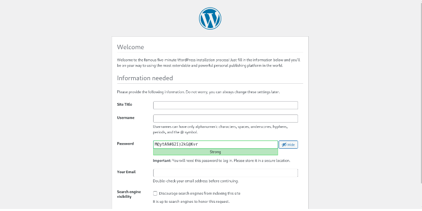

# Consul cluster для service discovery и DNS

## Цель:

> Реализовать consul cluster который выдает доменное имя для веб портала с прошлой ДЗ. Плавающий IP заменить на балансировку через DNS. В случае 
> умирание одного из веб серверов IP должен убираться из DNS.

# Выполнение домашнего задания

> Для того чтобы развернуть стенд, нужно выполнить следующую команду:

```
terraform init
terraform apply -auto-approve

Apply complete! Resources: 16 added, 0 changed, 0 destroyed.

Outputs:

backend-servers-info = {
  "backend-01" = {
    "ip_address" = tolist([
      "10.10.10.30",
    ])
    "nat_ip_address" = tolist([
      "",
    ])
  }
  "backend-02" = {
    "ip_address" = tolist([
      "10.10.10.12",
    ])
    "nat_ip_address" = tolist([
      "",
    ])
  }
}
consul-servers-info = {
  "consul-01" = {
    "ip_address" = tolist([
      "10.10.10.15",
    ])
    "nat_ip_address" = tolist([
      "",
    ])
  }
  "consul-02" = {
    "ip_address" = tolist([
      "10.10.10.19",
    ])
    "nat_ip_address" = tolist([
      "",
    ])
  }
  "consul-03" = {
    "ip_address" = tolist([
      "10.10.10.35",
    ])
    "nat_ip_address" = tolist([
      "",
    ])
  }
}
db-servers-info = {
  "db-01" = {
    "ip_address" = tolist([
      "10.10.10.28",
    ])
    "nat_ip_address" = tolist([
      "",
    ])
  }
}
iscsi-servers-info = {
  "iscsi-01" = {
    "ip_address" = tolist([
      "10.10.10.22",
    ])
    "nat_ip_address" = tolist([
      "",
    ])
  }
}
jump-servers-info = {}
nginx-servers-info = {
  "nginx-01" = {
    "ip_address" = tolist([
      "10.10.10.3",
    ])
    "nat_ip_address" = tolist([
      "89.169.171.44",
    ])
  }
  "nginx-02" = {
    "ip_address" = tolist([
      "10.10.10.31",
    ])
    "nat_ip_address" = tolist([
      "89.169.162.234",
    ])
  }
}

wait 60sec
ansible-playbook ./provision.yml
```

> На всех серверах будут установлены ОС Almalinux 8, настроены смнхронизация времени Chrony, система принудительного контроля доступа SELinux, в качестве 
> firewall будет использоваться NFTables.

>Consul-server развернём на кластере из трёх нод consul-01, consul-02, consul-03. На балансировщиках (nginx-01 и nginx-02) и бэкендах (backend-01 и 
> backend-02) будут установлены клиентские версии Consul. На баланcировщиках также будут установлены и настроены сервис consul-template, которые будут 
> динамически подменять конфигурационные файлы Nginx. На бэкендах будут установлены wordpress. Проверка (check) на доступность сервисов на клиентских 
> серверах будет осуществляться по http.

> Так как на YandexCloud ограничено количество выделяемых публичных IP адресов, в качестве JumpHost, через который будем подключаться по SSH (в частности 
> для Ansible) к другим серверам той же подсети будем использовать сервер nginx-01.

> Список виртуальных машин после запуска стенда:


> Для проверки работы стенда воспользуемся установленным на бэкендах Wordpress:



> Значение IP адреса сайта можно получить от одного из балансировщиков, например, nginx-01:


> Страница Consul открывается в браузере, вводя в адресную строку выше указанный публичный IP адрес балансировщика nginx-01, добавив при этом 
> в конце "ui":

```
http://89.169.171.44/ui
```


> В данном случае, как мы видим, лидером кластера consul является сервер consul-02.

> Подключимся по sss к одному из серверов Consul, например, nginx-02


```
ssh cloud-user@89.169.162.234
```

> Введём команду:

```
consul members
```
> Увидим:


```
Node        Address           Status  Type    Build   Protocol  DC   Partition  Segment
consul-01   10.10.10.17:8301  alive   server  1.17.0  2         dc1  default    <all>
consul-02   10.10.10.25:8301  alive   server  1.17.0  2         dc1  default    <all>
consul-03   10.10.10.4:8301   alive   server  1.17.0  2         dc1  default    <all>
backend-01  10.10.10.8:8301   alive   client  1.17.0  2         dc1  default    <default>
backend-02  10.10.10.16:8301  alive   client  1.17.0  2         dc1  default    <default>
nginx-01    10.10.10.3:8301   alive   client  1.17.0  2         dc1  default    <default>
nginx-02    10.10.10.12:8301  alive   client  1.17.0  2         dc1  default    <default>
```

> Далее набираем:

```
consul catalog services
```
> видим список зарегистрированных consul сервисов:

```
balancer
consul
wordpress
```

> DNS Зона прямого просмотра:

```
[root@nginx-02 ~]# dig @localhost -p 8600 consul-01.node.dc1.consul

; <<>> DiG 9.11.36-RedHat-9.11.36-11.el8_9 <<>> @localhost -p 8600 consul-01.node.dc1.consul
; (2 servers found)
;; global options: +cmd
;; Got answer:
;; ->>HEADER<<- opcode: QUERY, status: NOERROR, id: 14057
;; flags: qr aa rd; QUERY: 1, ANSWER: 1, AUTHORITY: 0, ADDITIONAL: 3
;; WARNING: recursion requested but not available

;; OPT PSEUDOSECTION:
; EDNS: version: 0, flags:; udp: 4096
;; QUESTION SECTION:
;consul-01.node.dc1.consul.	IN	A

;; ANSWER SECTION:
consul-01.node.dc1.consul. 0	IN	A	10.10.10.17

;; ADDITIONAL SECTION:
consul-01.node.dc1.consul. 0	IN	TXT	"consul-network-segment="
consul-01.node.dc1.consul. 0	IN	TXT	"consul-version=1.17.0"

;; Query time: 1 msec
;; SERVER: 127.0.0.1#8600(127.0.0.1)
;; WHEN: Mon Jul 29 10:18:32 MSK 2024
;; MSG SIZE  rcvd: 140
```

> DNS Зона обратного просмотра:

```
[root@nginx-02 ~]# dig @localhost -p 8600 -x 10.10.10.17

; <<>> DiG 9.11.36-RedHat-9.11.36-11.el8_9 <<>> @localhost -p 8600 -x 10.10.10.17
; (2 servers found)
;; global options: +cmd
;; Got answer:
;; ->>HEADER<<- opcode: QUERY, status: NOERROR, id: 48743
;; flags: qr aa rd; QUERY: 1, ANSWER: 1, AUTHORITY: 0, ADDITIONAL: 1
;; WARNING: recursion requested but not available

;; OPT PSEUDOSECTION:
; EDNS: version: 0, flags:; udp: 4096
;; QUESTION SECTION:
;17.10.10.10.in-addr.arpa.	IN	PTR

;; ANSWER SECTION:
17.10.10.10.in-addr.arpa. 0	IN	PTR	consul-01.node.dc1.consul.

;; Query time: 1 msec
;; SERVER: 127.0.0.1#8600(127.0.0.1)
;; WHEN: Mon Jul 29 10:20:12 MSK 2024
;; MSG SIZE  rcvd: 92
```

> Список серверов в домене balancer.service.consul:

```
[root@nginx-02 ~]# dig @127.0.0.1 -p 8600 balancer.service.consul

; <<>> DiG 9.11.36-RedHat-9.11.36-11.el8_9 <<>> @127.0.0.1 -p 8600 balancer.service.consul
; (1 server found)
;; global options: +cmd
;; Got answer:
;; ->>HEADER<<- opcode: QUERY, status: NOERROR, id: 52533
;; flags: qr aa rd; QUERY: 1, ANSWER: 2, AUTHORITY: 0, ADDITIONAL: 1
;; WARNING: recursion requested but not available

;; OPT PSEUDOSECTION:
; EDNS: version: 0, flags:; udp: 4096
;; QUESTION SECTION:
;balancer.service.consul.	IN	A

;; ANSWER SECTION:
balancer.service.consul. 0	IN	A	10.10.10.12          <--- nginx-02
balancer.service.consul. 0	IN	A	10.10.10.3           <--- nginx-01

;; Query time: 1 msec
;; SERVER: 127.0.0.1#8600(127.0.0.1)
;; WHEN: Mon Jul 29 10:21:42 MSK 2024
;; MSG SIZE  rcvd: 84
```

```
[root@nginx-02 ~]# dig @127.0.0.1 -p 8600 balancer.service.consul SRV

; <<>> DiG 9.11.36-RedHat-9.11.36-11.el8_9 <<>> @127.0.0.1 -p 8600 balancer.service.consul SRV
; (1 server found)
;; global options: +cmd
;; Got answer:
;; ->>HEADER<<- opcode: QUERY, status: NOERROR, id: 14589
;; flags: qr aa rd; QUERY: 1, ANSWER: 2, AUTHORITY: 0, ADDITIONAL: 7
;; WARNING: recursion requested but not available

;; OPT PSEUDOSECTION:
; EDNS: version: 0, flags:; udp: 4096
;; QUESTION SECTION:
;balancer.service.consul.	IN	SRV

;; ANSWER SECTION:
balancer.service.consul. 0	IN	SRV	1 1 80 nginx-01.node.dc1.consul.     <--- 10.10.10.3
balancer.service.consul. 0	IN	SRV	1 1 80 nginx-02.node.dc1.consul.     <--- 10.10.10.12

;; ADDITIONAL SECTION:
nginx-01.node.dc1.consul. 0	IN	A	10.10.10.3
nginx-01.node.dc1.consul. 0	IN	TXT	"consul-version=1.17.0"
nginx-01.node.dc1.consul. 0	IN	TXT	"consul-network-segment="
nginx-02.node.dc1.consul. 0	IN	A	10.10.10.12
nginx-02.node.dc1.consul. 0	IN	TXT	"consul-network-segment="
nginx-02.node.dc1.consul. 0	IN	TXT	"consul-version=1.17.0"

;; Query time: 1 msec
;; SERVER: 127.0.0.1#8600(127.0.0.1)
;; WHEN: Mon Jul 29 10:31:31 MSK 2024
;; MSG SIZE  rcvd: 312
```

> Список серверов в домене wordpress.service.consul:

```
[root@nginx-02 ~]# dig @127.0.0.1 -p 8600 wordpress.service.consul

; <<>> DiG 9.11.36-RedHat-9.11.36-11.el8_9 <<>> @127.0.0.1 -p 8600 wordpress.service.consul
; (1 server found)
;; global options: +cmd
;; Got answer:
;; ->>HEADER<<- opcode: QUERY, status: NOERROR, id: 58627
;; flags: qr aa rd; QUERY: 1, ANSWER: 2, AUTHORITY: 0, ADDITIONAL: 1
;; WARNING: recursion requested but not available

;; OPT PSEUDOSECTION:
; EDNS: version: 0, flags:; udp: 4096
;; QUESTION SECTION:
;wordpress.service.consul.	IN	A

;; ANSWER SECTION:
wordpress.service.consul. 0	IN	A	10.10.10.8           <--- backend-01
wordpress.service.consul. 0	IN	A	10.10.10.16          <--- backend-02

;; Query time: 1 msec
;; SERVER: 127.0.0.1#8600(127.0.0.1)
;; WHEN: Mon Jul 29 10:38:21 MSK 2024
;; MSG SIZE  rcvd: 85
```

```
[root@nginx-02 ~]# dig @127.0.0.1 -p 8600 wordpress.service.consul

; <<>> DiG 9.11.36-RedHat-9.11.36-11.el8_9 <<>> @127.0.0.1 -p 8600 wordpress.service.consul
; (1 server found)
;; global options: +cmd
;; Got answer:
;; ->>HEADER<<- opcode: QUERY, status: NOERROR, id: 58627
;; flags: qr aa rd; QUERY: 1, ANSWER: 2, AUTHORITY: 0, ADDITIONAL: 1
;; WARNING: recursion requested but not available

;; OPT PSEUDOSECTION:
; EDNS: version: 0, flags:; udp: 4096
;; QUESTION SECTION:
;wordpress.service.consul.	IN	A

;; ANSWER SECTION:
wordpress.service.consul. 0	IN	A	10.10.10.8           <--- backend-01
wordpress.service.consul. 0	IN	A	10.10.10.16          <--- backend-02

;; Query time: 1 msec
;; SERVER: 127.0.0.1#8600(127.0.0.1)
;; WHEN: Mon Jul 29 10:39:16 MSK 2024
;; MSG SIZE  rcvd: 85
```

```
[root@nginx-02 ~]# dig @127.0.0.1 -p 8600 wordpress.service.consul SRV

; <<>> DiG 9.11.36-RedHat-9.11.36-11.el8_9 <<>> @127.0.0.1 -p 8600 wordpress.service.consul SRV
; (1 server found)
;; global options: +cmd
;; Got answer:
;; ->>HEADER<<- opcode: QUERY, status: NOERROR, id: 6046
;; flags: qr aa rd; QUERY: 1, ANSWER: 2, AUTHORITY: 0, ADDITIONAL: 7
;; WARNING: recursion requested but not available

;; OPT PSEUDOSECTION:
; EDNS: version: 0, flags:; udp: 4096
;; QUESTION SECTION:
;wordpress.service.consul.	IN	SRV

;; ANSWER SECTION:
wordpress.service.consul. 0	IN	SRV	1 1 80 backend-02.node.dc1.consul.     <--- 10.10.10.16
wordpress.service.consul. 0	IN	SRV	1 1 80 backend-01.node.dc1.consul.     <--- 10.10.10.8

;; ADDITIONAL SECTION:
backend-02.node.dc1.consul. 0	IN	A	10.10.10.16
backend-02.node.dc1.consul. 0	IN	TXT	"consul-version=1.17.0"
backend-02.node.dc1.consul. 0	IN	TXT	"consul-network-segment="
backend-01.node.dc1.consul. 0	IN	A	10.10.10.8
backend-01.node.dc1.consul. 0	IN	TXT	"consul-version=1.17.0"
backend-01.node.dc1.consul. 0	IN	TXT	"consul-network-segment="

;; Query time: 1 msec
;; SERVER: 127.0.0.1#8600(127.0.0.1)
;; WHEN: Mon Jul 29 10:40:11 MSK 2024
;; MSG SIZE  rcvd: 317
```
> Вывод списка доступных серверов-балансировщиков в зоне balancer.service.dc1.consul, выполнив команду несколько раз подряд:

```
[root@nginx-02 ~]# dig +short @localhost -p 8600 balancer.service.dc1.consul
10.10.10.12
10.10.10.3
[root@nginx-02 ~]# dig +short @localhost -p 8600 balancer.service.dc1.consul
10.10.10.3
10.10.10.12
```

> На сервере nginx-02 остановим сервис nginx:

```
[root@nginx-02 ~]# systemctl status nginx
● nginx.service - The nginx HTTP and reverse proxy server
   Loaded: loaded (/usr/lib/systemd/system/nginx.service; enabled; vendor preset: disabled)
   Active: active (running) since Sat 2024-07-29 09:24:27 MSK; 1h 30min ago
 Main PID: 18661 (nginx)
    Tasks: 3 (limit: 10868)
   Memory: 5.1M
   CGroup: /system.slice/nginx.service
           ├─18661 nginx: master process /usr/sbin/nginx
           ├─18662 nginx: worker process
           └─18663 nginx: worker process

Jul 29 09:24:27 nginx-02.example.com systemd[1]: Starting The nginx HTTP and reverse proxy server...
Jul 29 09:24:27 nginx-02.example.com nginx[18658]: nginx: the configuration file /etc/nginx/nginx.conf syntax is ok
Jul 29 09:24:27 nginx-02.example.com nginx[18658]: nginx: configuration file /etc/nginx/nginx.conf test is successful
Jul 29 09:24:27 nginx-02.example.com systemd[1]: Started The nginx HTTP and reverse proxy server.
[root@nginx-02 ~]# systemctl stop nginx
[root@nginx-02 ~]# systemctl status nginx
● nginx.service - The nginx HTTP and reverse proxy server
   Loaded: loaded (/usr/lib/systemd/system/nginx.service; enabled; vendor preset: disabled)
   Active: inactive (dead) since Sat 2024-07-29 09:55:28 MSK; 2s ago
 Main PID: 18661 (code=exited, status=0/SUCCESS)

Jul 29 09:24:27 nginx-02.example.com systemd[1]: Starting The nginx HTTP and reverse proxy server...
Jul 29 09:24:27 nginx-02.example.com nginx[18658]: nginx: the configuration file /etc/nginx/nginx.conf syntax is ok
Jul 29 09:24:27 nginx-02.example.com nginx[18658]: nginx: configuration file /etc/nginx/nginx.conf test is successful
Jul 29 09:24:27 nginx-02.example.com systemd[1]: Started The nginx HTTP and reverse proxy server.
Jul 29 10:55:28 nginx-02.example.com systemd[1]: Stopping The nginx HTTP and reverse proxy server...
Jul 29 10:55:28 nginx-02.example.com systemd[1]: nginx.service: Succeeded.
Jul 29 10:55:28 nginx-02.example.com systemd[1]: Stopped The nginx HTTP and reverse proxy server.
```

> Проверяем:

```
[root@nginx-02 ~]# dig @127.0.0.1 -p 8600 balancer.service.consul

; <<>> DiG 9.11.36-RedHat-9.11.36-11.el8_9 <<>> @127.0.0.1 -p 8600 balancer.service.consul
; (1 server found)
;; global options: +cmd
;; Got answer:
;; ->>HEADER<<- opcode: QUERY, status: NOERROR, id: 7144
;; flags: qr aa rd; QUERY: 1, ANSWER: 1, AUTHORITY: 0, ADDITIONAL: 1
;; WARNING: recursion requested but not available

;; OPT PSEUDOSECTION:
; EDNS: version: 0, flags:; udp: 4096
;; QUESTION SECTION:
;balancer.service.consul.	IN	A

;; ANSWER SECTION:
balancer.service.consul. 0	IN	A	10.10.10.3          <--- nginx-01

;; Query time: 1 msec
;; SERVER: 127.0.0.1#8600(127.0.0.1)
;; WHEN: Mon Jul 29 11:05:22 MSK 2024
;; MSG SIZE  rcvd: 68
```

```
[root@nginx-02 ~]# dig @127.0.0.1 -p 8600 balancer.service.consul SRV

; <<>> DiG 9.11.36-RedHat-9.11.36-11.el8_9 <<>> @127.0.0.1 -p 8600 balancer.service.consul SRV
; (1 server found)
;; global options: +cmd
;; Got answer:
;; ->>HEADER<<- opcode: QUERY, status: NOERROR, id: 64826
;; flags: qr aa rd; QUERY: 1, ANSWER: 1, AUTHORITY: 0, ADDITIONAL: 4
;; WARNING: recursion requested but not available

;; OPT PSEUDOSECTION:
; EDNS: version: 0, flags:; udp: 4096
;; QUESTION SECTION:
;balancer.service.consul.	IN	SRV

;; ANSWER SECTION:
balancer.service.consul. 0	IN	SRV	1 1 80 nginx-01.node.dc1.consul.     <--- 10.10.10.3

;; ADDITIONAL SECTION:
nginx-01.node.dc1.consul. 0	IN	A	10.10.10.3
nginx-01.node.dc1.consul. 0	IN	TXT	"consul-version=1.17.0"
nginx-01.node.dc1.consul. 0	IN	TXT	"consul-network-segment="

;; Query time: 1 msec
;; SERVER: 127.0.0.1#8600(127.0.0.1)
;; WHEN: Mon Jul 29 11:07:29 MSK 2024
;; MSG SIZE  rcvd: 182
```

> Список доступных и работающих серверов:

```
[root@nginx-02 ~]# dig +short @localhost -p 8600 balancer.service.dc1.consul
10.10.10.3
[root@nginx-02 ~]# dig +short @localhost -p 8600 balancer.service.dc1.consul
10.10.10.3
[root@nginx-02 ~]# dig +short @localhost -p 8600 balancer.service.dc1.consul
10.10.10.3
```
> Как видим, работает consul сервис "balancer" на сервере nginx-01 с ip адресом 10.10.10.3.


> Включим nginx на сервере nginx-02:

```
[root@nginx-02 ~]# systemctl status nginx
● nginx.service - The nginx HTTP and reverse proxy server
   Loaded: loaded (/usr/lib/systemd/system/nginx.service; enabled; vendor preset: disabled)
   Active: inactive (dead) since Jul 29 10:55:28 MSK; 23min ago
 Main PID: 18661 (code=exited, status=0/SUCCESS)

Jul 29 09:24:27 nginx-02.example.com systemd[1]: Starting The nginx HTTP and reverse proxy server...
Jul 29 09:24:27 nginx-02.example.com nginx[18658]: nginx: the configuration file /etc/nginx/nginx.conf syntax is ok
Jul 29 09:24:27 nginx-02.example.com nginx[18658]: nginx: configuration file /etc/nginx/nginx.conf test is successful
Jul 29 09:24:27 nginx-02.example.com systemd[1]: Started The nginx HTTP and reverse proxy server.
Jul 29 10:55:28 nginx-02.example.com systemd[1]: Stopping The nginx HTTP and reverse proxy server...
Jul 29 10:55:28 nginx-02.example.com systemd[1]: nginx.service: Succeeded.
Jul 29 10:55:28 nginx-02.example.com systemd[1]: Stopped The nginx HTTP and reverse proxy server.

++++++++++++++++++++++++++++++++++++++++++++++++++++++++++++
[root@nginx-02 ~]# systemctl start nginx
[root@nginx-02 ~]# systemctl status nginx
● nginx.service - The nginx HTTP and reverse proxy server
   Loaded: loaded (/usr/lib/systemd/system/nginx.service; enabled; vendor preset: disabled)
   Active: active (running) since Jul 29 11:22:28 MSK; 2s ago
  Process: 25689 ExecStart=/usr/sbin/nginx (code=exited, status=0/SUCCESS)
  Process: 25687 ExecStartPre=/usr/sbin/nginx -t (code=exited, status=0/SUCCESS)
  Process: 25685 ExecStartPre=/usr/bin/rm -f /run/nginx.pid (code=exited, status=0/SUCCESS)
 Main PID: 25690 (nginx)
    Tasks: 3 (limit: 10868)
   Memory: 5.0M
   CGroup: /system.slice/nginx.service
           ├─25690 nginx: master process /usr/sbin/nginx
           ├─25691 nginx: worker process
           └─25692 nginx: worker process

Jul 29 11:22:28 nginx-02.example.com systemd[1]: Starting The nginx HTTP and reverse proxy server...
Jul 29 11:22:28 nginx-02.example.com nginx[25687]: nginx: the configuration file /etc/nginx/nginx.conf syntax is ok
Jul 29 11:22:28 nginx-02.example.com nginx[25687]: nginx: configuration file /etc/nginx/nginx.conf test is successful
Jul 29 11:22:28 nginx-02.example.com systemd[1]: Started The nginx HTTP and reverse proxy server.
```

> Список агентов Consul сервиса:

```
[root@nginx-02 ~]# curl http://localhost:8500/v1/agent/members\?pretty
[
    {
        "Name": "backend-01",
        "Addr": "10.10.10.8",
        "Port": 8301,
        "Tags": {
            "build": "1.17.0:4e3f428b",
            "dc": "dc1",
            "id": "9640d2e3-ca41-3ff5-6a02-a0294f8d446a",
            "role": "node",
            "segment": "",
            "vsn": "2",
            "vsn_max": "3",
            "vsn_min": "2"
        },
        "Status": 1,
        "ProtocolMin": 1,
        "ProtocolMax": 5,
        "ProtocolCur": 2,
        "DelegateMin": 2,
        "DelegateMax": 5,
        "DelegateCur": 4
    },
    {
        "Name": "backend-02",
        "Addr": "10.10.10.16",
        "Port": 8301,
        "Tags": {
            "build": "1.17.0:4e3f428b",
            "dc": "dc1",
            "id": "1590011b-842a-9c3b-1296-1cc015195981",
            "role": "node",
            "segment": "",
            "vsn": "2",
            "vsn_max": "3",
            "vsn_min": "2"
        },
        "Status": 1,
        "ProtocolMin": 1,
        "ProtocolMax": 5,
        "ProtocolCur": 2,
        "DelegateMin": 2,
        "DelegateMax": 5,
        "DelegateCur": 4
    },
    {
        "Name": "nginx-02",
        "Addr": "10.10.10.12",
        "Port": 8301,
        "Tags": {
            "build": "1.17.0:4e3f428b",
            "dc": "dc1",
            "id": "293db24c-66f6-01ac-2538-0f5f0233e7ff",
            "role": "node",
            "segment": "",
            "vsn": "2",
            "vsn_max": "3",
            "vsn_min": "2"
        },
        "Status": 1,
        "ProtocolMin": 1,
        "ProtocolMax": 5,
        "ProtocolCur": 2,
        "DelegateMin": 2,
        "DelegateMax": 5,
        "DelegateCur": 4
    },
    {
        "Name": "consul-03",
        "Addr": "10.10.10.4",
        "Port": 8301,
        "Tags": {
            "acls": "0",
            "build": "1.17.0:4e3f428b",
            "dc": "dc1",
            "expect": "3",
            "ft_fs": "1",
            "ft_si": "1",
            "grpc_tls_port": "8503",
            "id": "3617ccf6-1fa8-1969-4a05-84ab29af1f52",
            "port": "8300",
            "raft_vsn": "3",
            "role": "consul",
            "segment": "",
            "vsn": "2",
            "vsn_max": "3",
            "vsn_min": "2",
            "wan_join_port": "8302"
        },
        "Status": 1,
        "ProtocolMin": 1,
        "ProtocolMax": 5,
        "ProtocolCur": 2,
        "DelegateMin": 2,
        "DelegateMax": 5,
        "DelegateCur": 4
    },
    {
        "Name": "consul-01",
        "Addr": "10.10.10.17",
        "Port": 8301,
        "Tags": {
            "acls": "0",
            "build": "1.17.0:4e3f428b",
            "dc": "dc1",
            "expect": "3",
            "ft_fs": "1",
            "ft_si": "1",
            "grpc_tls_port": "8503",
            "id": "6e5c4ee7-6f16-197a-4868-435c1e011b48",
            "port": "8300",
            "raft_vsn": "3",
            "role": "consul",
            "segment": "",
            "vsn": "2",
            "vsn_max": "3",
            "vsn_min": "2",
            "wan_join_port": "8302"
        },
        "Status": 1,
        "ProtocolMin": 1,
        "ProtocolMax": 5,
        "ProtocolCur": 2,
        "DelegateMin": 2,
        "DelegateMax": 5,
        "DelegateCur": 4
    },
    {
        "Name": "nginx-01",
        "Addr": "10.10.10.3",
        "Port": 8301,
        "Tags": {
            "build": "1.17.0:4e3f428b",
            "dc": "dc1",
            "id": "a275e7d2-8055-2c7a-ab61-f36a79da2d9c",
            "role": "node",
            "segment": "",
            "vsn": "2",
            "vsn_max": "3",
            "vsn_min": "2"
        },
        "Status": 1,
        "ProtocolMin": 1,
        "ProtocolMax": 5,
        "ProtocolCur": 2,
        "DelegateMin": 2,
        "DelegateMax": 5,
        "DelegateCur": 4
    },
    {
        "Name": "consul-02",
        "Addr": "10.10.10.25",
        "Port": 8301,
        "Tags": {
            "acls": "0",
            "build": "1.17.0:4e3f428b",
            "dc": "dc1",
            "expect": "3",
            "ft_fs": "1",
            "ft_si": "1",
            "grpc_tls_port": "8503",
            "id": "d399b1ac-9fa6-916b-721b-b767ef4f4ab5",
            "port": "8300",
            "raft_vsn": "3",
            "role": "consul",
            "segment": "",
            "vsn": "2",
            "vsn_max": "3",
            "vsn_min": "2",
            "wan_join_port": "8302"
        },
        "Status": 1,
        "ProtocolMin": 1,
        "ProtocolMax": 5,
        "ProtocolCur": 2,
        "DelegateMin": 2,
        "DelegateMax": 5,
        "DelegateCur": 4
    }
]
```

> Текущее состояние агента на сервере nginx-02:

```
[root@nginx-02 ~]# curl http://localhost:8500/v1/agent/checks\?pretty
{
    "service:balancer": {
        "Node": "nginx-02",
        "CheckID": "service:balancer",
        "Name": "http",
        "Status": "passing",
        "Notes": "",
        "Output": "HTTP GET http://localhost:80/status: 200 OK Output: Active connections: 1 \nserver accepts handled requests\n 75 75 75 \nReading: 0 Writing: 1 Waiting: 0 \n",
        "ServiceID": "balancer",
        "ServiceName": "balancer",
        "ServiceTags": [
            "balancer"
        ],
        "Type": "http",
        "Interval": "5s",
        "Timeout": "2s",
        "ExposedPort": 0,
        "Definition": {},
        "CreateIndex": 0,
        "ModifyIndex": 0
    }
}
```

> Список запущенных consul сервисов на текущей ноде nginx-02:

```
[root@nginx-02 ~]# curl http://localhost:8500/v1/agent/services\?pretty
{
    "balancer": {
        "ID": "balancer",
        "Service": "balancer",
        "Tags": [
            "balancer"
        ],
        "Meta": {},
        "Port": 80,
        "Address": "",
        "TaggedAddresses": {
            "wan": {
                "Address": "89.169.162.234",
                "Port": 80
            }
        },
        "Weights": {
            "Passing": 1,
            "Warning": 1
        },
        "EnableTagOverride": false,
        "Datacenter": "dc1"
    }
}
```

> В данном случае на сервере nginx-02 запущен сервис "balancer".

> Список зарегистрированных сервисов:

```
[root@nginx-02 ~]# curl http://localhost:8500/v1/catalog/services\?pretty
{
    "balancer": [
        "balancer"
    ],
    "consul": [],
    "wordpress": [
        "wordpress"
    ]
}
```

> Характеристики сервиса "balancer":

```
[root@nginx-02 ~]# curl http://localhost:8500/v1/catalog/service/balancer\?pretty
[
    {
        "ID": "a275e7d2-8055-2c7a-ab61-f36a79da2d9c",
        "Node": "nginx-01",
        "Address": "10.10.10.3",
        "Datacenter": "dc1",
        "TaggedAddresses": {
            "lan": "10.10.10.3",
            "lan_ipv4": "10.10.10.3",
            "wan": "10.10.10.3",
            "wan_ipv4": "10.10.10.3"
        },
        "NodeMeta": {
            "consul-network-segment": "",
            "consul-version": "1.17.0"
        },
        "ServiceKind": "",
        "ServiceID": "balancer",
        "ServiceName": "balancer",
        "ServiceTags": [
            "balancer"
        ],
        "ServiceAddress": "",
        "ServiceTaggedAddresses": {
            "wan": {
                "Address": "89.169.171.44",
                "Port": 80
            }
        },
        "ServiceWeights": {
            "Passing": 1,
            "Warning": 1
        },
        "ServiceMeta": {},
        "ServicePort": 80,
        "ServiceSocketPath": "",
        "ServiceEnableTagOverride": false,
        "ServiceProxy": {
            "Mode": "",
            "MeshGateway": {},
            "Expose": {}
        },
        "ServiceConnect": {},
        "ServiceLocality": null,
        "CreateIndex": 32,
        "ModifyIndex": 32
    },
    {
        "ID": "293db24c-66f6-01ac-2538-0f5f0233e7ff",
        "Node": "nginx-02",
        "Address": "10.10.10.12",
        "Datacenter": "dc1",
        "TaggedAddresses": {
            "lan": "10.10.10.12",
            "lan_ipv4": "10.10.10.12",
            "wan": "10.10.10.12",
            "wan_ipv4": "10.10.10.12"
        },
        "NodeMeta": {
            "consul-network-segment": "",
            "consul-version": "1.17.0"
        },
        "ServiceKind": "",
        "ServiceID": "balancer",
        "ServiceName": "balancer",
        "ServiceTags": [
            "balancer"
        ],
        "ServiceAddress": "",
        "ServiceTaggedAddresses": {
            "wan": {
                "Address": "89.169.171.44",
                "Port": 80
            }
        },
        "ServiceWeights": {
            "Passing": 1,
            "Warning": 1
        },
        "ServiceMeta": {},
        "ServicePort": 80,
        "ServiceSocketPath": "",
        "ServiceEnableTagOverride": false,
        "ServiceProxy": {
            "Mode": "",
            "MeshGateway": {},
            "Expose": {}
        },
        "ServiceConnect": {},
        "ServiceLocality": null,
        "CreateIndex": 36,
        "ModifyIndex": 36
    }
]
```

> Характеристики сервиса "wordpress":

```
[root@nginx-02 ~]# curl http://localhost:8500/v1/catalog/service/wordpress\?pretty
[
    {
        "ID": "9640d2e3-ca41-3ff5-6a02-a0294f8d446a",
        "Node": "backend-01",
        "Address": "10.10.10.8",
        "Datacenter": "dc1",
        "TaggedAddresses": {
            "lan": "10.10.10.8",
            "lan_ipv4": "10.10.10.8",
            "wan": "10.10.10.8",
            "wan_ipv4": "10.10.10.8"
        },
        "NodeMeta": {
            "consul-network-segment": "",
            "consul-version": "1.17.0"
        },
        "ServiceKind": "",
        "ServiceID": "wordpress",
        "ServiceName": "wordpress",
        "ServiceTags": [
            "wordpress"
        ],
        "ServiceAddress": "",
        "ServiceWeights": {
            "Passing": 1,
            "Warning": 1
        },
        "ServiceMeta": {},
        "ServicePort": 80,
        "ServiceSocketPath": "",
        "ServiceEnableTagOverride": false,
        "ServiceProxy": {
            "Mode": "",
            "MeshGateway": {},
            "Expose": {}
        },
        "ServiceConnect": {},
        "ServiceLocality": null,
        "CreateIndex": 55,
        "ModifyIndex": 55
    },
    {
        "ID": "1590011b-842a-9c3b-1296-1cc015195981",
        "Node": "backend-02",
        "Address": "10.10.10.16",
        "Datacenter": "dc1",
        "TaggedAddresses": {
            "lan": "10.10.10.16",
            "lan_ipv4": "10.10.10.16",
            "wan": "10.10.10.16",
            "wan_ipv4": "10.10.10.16"
        },
        "NodeMeta": {
            "consul-network-segment": "",
            "consul-version": "1.17.0"
        },
        "ServiceKind": "",
        "ServiceID": "wordpress",
        "ServiceName": "wordpress",
        "ServiceTags": [
            "wordpress"
        ],
        "ServiceAddress": "",
        "ServiceWeights": {
            "Passing": 1,
            "Warning": 1
        },
        "ServiceMeta": {},
        "ServicePort": 80,
        "ServiceSocketPath": "",
        "ServiceEnableTagOverride": false,
        "ServiceProxy": {
            "Mode": "",
            "MeshGateway": {},
            "Expose": {}
        },
        "ServiceConnect": {},
        "ServiceLocality": null,
        "CreateIndex": 188,
        "ModifyIndex": 188
    }
]
```

> Работа с базой данных Consul через HTTP API:

> Добавим ключ "nginx/config/workers" со значением, например, число "12345":

```
[root@nginx-02 ~]# curl -XPUT http://localhost:8500/v1/kv/nginx/config/workers -d 12345
true
```

> Получить значение по ключу "nginx/config/workers":

```
[root@nginx-02 ~]# curl -XGET http://localhost:8500/v1/kv/nginx/config/workers
[{"LockIndex":0,"Key":"nginx/config/workers","Flags":0,"Value":"MTIzNDU=","CreateIndex":1939,"ModifyIndex":1939}]
```

> или более наглядно:

```
[root@nginx-02 ~]# curl -XGET http://localhost:8500/v1/kv/nginx/config/workers\?pretty
[
    {
        "LockIndex": 0,
        "Key": "nginx/config/workers",
        "Flags": 0,
        "Value": "MTIzNDU=",          <--- GET ENCRYPT VALUE
        "CreateIndex": 1939,
        "ModifyIndex": 1939
    }
]
```
> В браузере:


> Удалить ключ "nginx/config/workers":

```
[root@nginx-02 ~]# curl -XDELETE http://localhost:8500/v1/kv/nginx/config/workers
true
```

> Работать с базой даннфх можно и с помощью команды Consul.

> Добавить ключ "nginx/config/workers" со значением "15":

```
[root@nginx-02 ~]# consul kv put nginx/config/workers 15
Success! Data written to: nginx/config/workers
```

> Получить значение:

```
[root@nginx-02 ~]# consul kv get nginx/config/workers
15
```

> Удалить ключ "nginx/config/workers":

```
[root@nginx-02 ~]# consul kv delete nginx/config/workers
Success! Deleted key: nginx/config/workers
```

> Конфигурационный файл nginx, который постоянно генерируется с помощью сервиса consul-template:

```
[root@nginx-02 ~]# cat /etc/nginx/conf.d/upstream-wordpress.conf 
upstream @backend {
  server 10.10.10.8:80;           <--- backend-01
  server 10.10.10.16:80;          <--- backend-02
}
```

> Подключимся по ssh к серверу backend-01:

```
ssh cloud-user@10.10.10.8 -J cloud-user@89.169.171.44
```


> Отключим nginx

> Снова смотрим конфигурационный файл nginx на балансировщике nginx-02:

```
[root@nginx-02 ~]# cat /etc/nginx/conf.d/upstream-wordpress.conf 
upstream @backend {
  server 10.10.10.16:80;          <--- backend-02
}
```

> Как видим, nginx сервис на балансировшике теперь направляет пакеты только на работающий backend-02.

> Снова включим nginx на backend-01

```
[root@backend-01 ~]# systemctl start nginx
[root@backend-01 ~]# systemctl status nginx
● nginx.service - The nginx HTTP and reverse proxy server
   Loaded: loaded (/usr/lib/systemd/system/nginx.service; enabled; vendor preset: disabled)
  Drop-In: /usr/lib/systemd/system/nginx.service.d
           └─php-fpm.conf
   Active: inactive (running) since Mon 2024-07-29 14:32:41 MSK; 6min ago
 Main PID: 8242 (code=exited, status=0/SUCCESS)

Jul 29 14:32:41 backend-01.example.com systemd[1]: Starting The nginx HTTP and reverse proxy server...
..............................................
```

> Снова проверим конфигурационный файл nginx на балансировщике nginx-02:

```
[root@nginx-02 ~]# cat /etc/nginx/conf.d/upstream-wordpress.conf 
upstream @backend {
  server 10.10.10.8:80;           <--- backend-01
  server 10.10.10.16:80;          <--- backend-02
}
```

> Теперь пакеты снова направляются на оба бэкенда (backend-01 и backend-02).

> Можно сделать вывод, что развёрнутая система с установленным и настроенным consul сервисом работает должным образом.

## Удаление стенда

> Удалить развернутый стенд командой:

```
terraform destroy -auto-approve
```