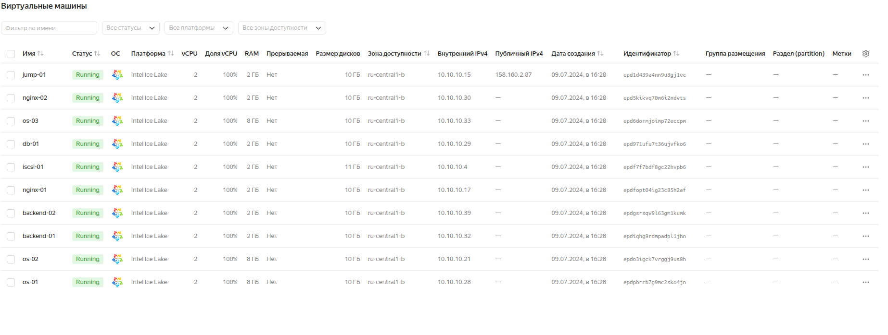
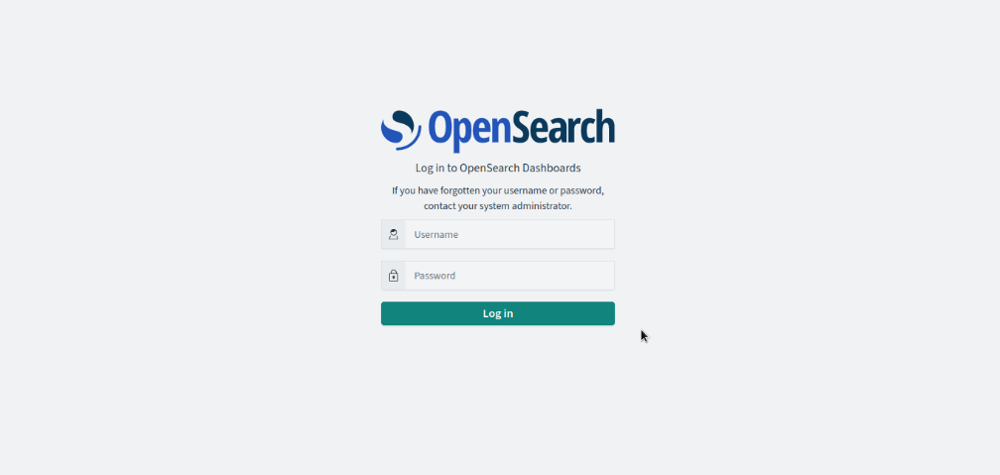
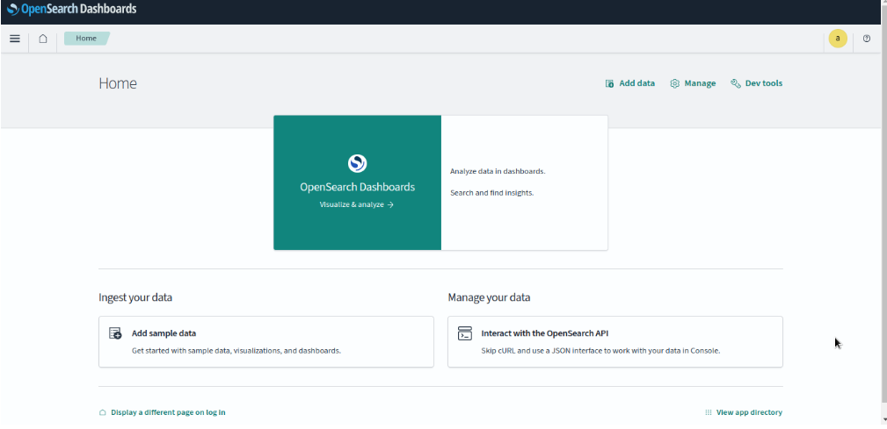
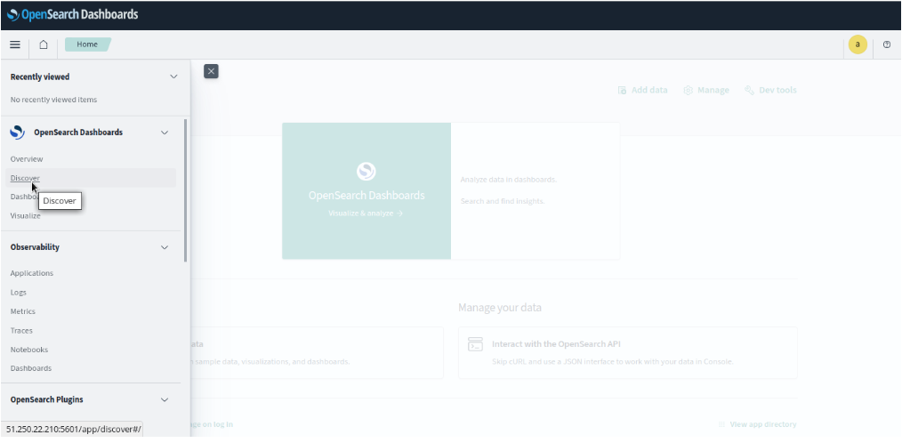
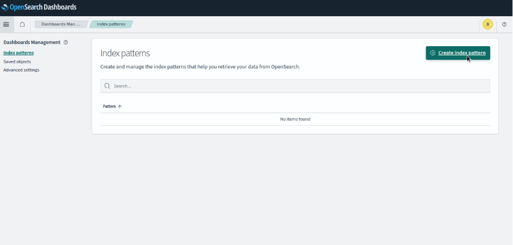
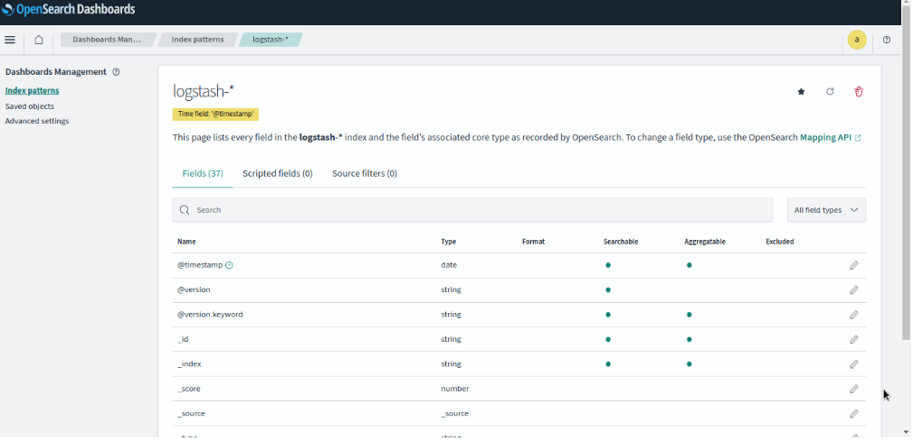

# Настроить централизорованный сбор логов в кластер elasticsearch

## Цель:

1. Развернуть кластер elasticsearch (минимум 3 вм)
2. Настроить сбор логов со всех серверов проекта (веб-сервера, балансеры, базы данных)

## Создание стенда

> Стенд будем разворачивать с помощью Terraform на YandexCloud, настройку серверов будем выполнять с помощью Ansible.


```
terraform apply -auto-approve

ansible-playbook ./provision.yml \
--extra-vars "admin_password=admin@Otus1234 \
kibanaserver_password=kibana@Otus1234 \
logstash_password=logstash@Otus1234"
```

> На всех серверах будут установлены ОС Almalinux 8, настроены смнхронизация времени Chrony, система принудительного контроля доступа SELinux, в качестве 
> firewall будет использоваться NFTables.

> Стенд был взят из keepalived_hw4 Для централизованного сбора логов со всех серверов данного стенда создадим OpenSearch кластер, состоящий из серверов os-01, os-02 и os-03. В данном случае с балансировщиков и бэкендов для статического хранения файлов сайта будем собирать логи работы nginx, а с серверов хранения баз данных - логи mysql.

> Для визуализации данных логов будем использовать OpenSearch Dashboard. В данном стенде OpenSearch Dashboard для удобства будем устанавливать на сервер 
> Jump-01, так он имеет публичный IP адрес.

> Для установки OpenSearch и OpenSearch Dashboard был склонирован из репозитория https://github.com/opensearch-project/ansible-playbook с внесением небольших
> изменений под свой проект.

> Для сбора логов со всех серверов будем использовать Logstash, которые передают логи в свою очередь OpenSearch. Устанавливать их будем на тех же серверах, где
> устанавливается OpenSearch, то есть os-01, os-02, os-03.

> В качестве агентов на всех серверах будем использовать FileBeat.

> Так как на YandexCloud ограничено количество выделяемых публичных IP адресов, в дополнение к этому стенду создадим ещё один сервер jump-01 в качестве
> JumpHost, через который будем подключаться по SSH (в частности для Ansible) к другим серверам той же подсети.

> Список виртуальных машин после запуска стенда:



> Для проверки работы стенда воспользуемся отображением простой страницы собственноручно созданного сайта на PHP, имитирующий продажу новых и подержанных 
> автомобилей:


> Значение IP адреса сайта получен от балансировщика от YandexCloud:


> Страница OpenSearch Dashboard открывается в браузере, вводя в адресную строку публичный IP адрес сервера jump-01 с портом 5601:



> Вводим логин и пароль и кликаем по кнопке "Log In":


> Стартовая страница:



> Кликаем на "Главное меню", выбираем "Discover":



> Кликаем по кнопке "Create index pattern":





> Можно делать вывод, что OpenSearch кластер корректно функционирует, собирает логи со всех серверов данного стенда.

## Удаление стенда

> Удалить развернутый стенд командой:

```
terraform destroy -auto-approve
```


