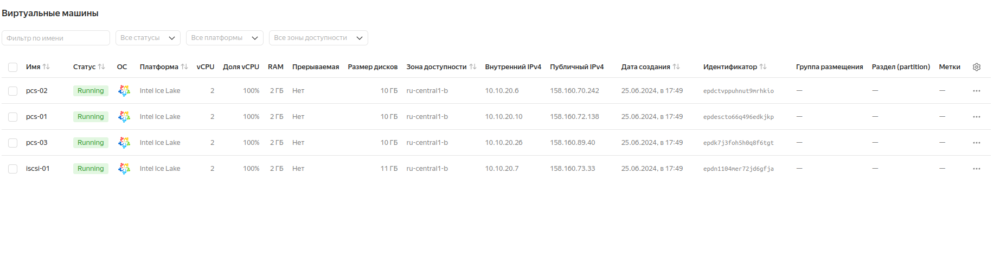

# HW2 ISCSI, multipath и кластерные файловые системы: GFS2

## Цель:

1. виртуалка с iscsi
2. 1 виртуалка - Nginx - с публичным IP адресом
3. 3 виртуальные машины с разделяемой файловой системой GFS2 поверх cLVM


## Выполнение домашнего задания
### Создание стенда

> Стенд будем разворачивать с помощью Terraform на YandexCloud, настройку серверов будем выполнять с помощью Ansible.

### 

```
terraform init
terraform apply

ansible-playbook ./provision.yml
______________________________________________________________________________________________________________________

iscsi-01                   : ok=25   changed=20   unreachable=0    failed=0    skipped=14   rescued=0    ignored=0   
pcs-01                     : ok=69   changed=51   unreachable=0    failed=0    skipped=9    rescued=0    ignored=0   
pcs-02                     : ok=44   changed=34   unreachable=0    failed=0    skipped=13   rescued=0    ignored=0   
pcs-03                     : ok=44   changed=34   unreachable=0    failed=0    skipped=13   rescued=0    ignored=0   
```




> На всех серверах будут установлены ОС Almalinux 8, настроены смнхронизация времени Chrony,
> в качестве firewall будет использоваться NFTables.

## iSCSI-target
> Сервер iscsi-01 будет служить iSCSI таргетом. В нём будут настроены три типа таргета:

- fileio,
- block,
- ramdisk.

> В качестве fileio таргета будет файл /var/iSCSI/file0.IMG размером 1 ГБ.
> Для block таргета - блочное устройство, то есть отдельно созданный диск /dev/vdb размером 1 ГБ.
> Для ramdisk таргета выделим 1 ГБ оперативной памяти, которые могут использоваться другим сервером в качестве swap.
> Для каждого устройства таргета настроены свои IQN-LUNы, для каждого сервера iSCSI инициатора настроены свои ACL доступы:

```
[root@iscsi-01 ~]# targetcli ls
o- / ......................................................................................................................... [...]
  o- backstores .............................................................................................................. [...]
  | o- block .................................................................................................. [Storage Objects: 1]
  | | o- block0 ........................................................................... [/dev/vdb (1.0GiB) write-thru activated]
  | |   o- alua ................................................................................................... [ALUA Groups: 1]
  | |     o- default_tg_pt_gp ....................................................................... [ALUA state: Active/optimized]
  | o- fileio ................................................................................................. [Storage Objects: 1]
  | | o- file0 ................................................................ [/var/iSCSI/file0.IMG (1.0GiB) write-back activated]
  | |   o- alua ................................................................................................... [ALUA Groups: 1]
  | |     o- default_tg_pt_gp ....................................................................... [ALUA state: Active/optimized]
  | o- pscsi .................................................................................................. [Storage Objects: 0]
  | o- ramdisk ................................................................................................ [Storage Objects: 1]
  |   o- ram0 ................................................................................................. [(1.0GiB) activated]
  |     o- alua ................................................................................................... [ALUA Groups: 1]
  |       o- default_tg_pt_gp ....................................................................... [ALUA state: Active/optimized]
  o- iscsi ............................................................................................................ [Targets: 1]
  | o- iqn.2024-06.local.otus:storage.target00 ........................................................................... [TPGs: 1]
  |   o- tpg1 ............................................................................................... [no-gen-acls, no-auth]
  |     o- acls .......................................................................................................... [ACLs: 3]
  |     | o- iqn.2024-06.local.maikltim:pcs-01 .................................................................... [Mapped LUNs: 3]
  |     | | o- mapped_lun0 ................................................................................ [lun0 fileio/file0 (rw)]
  |     | | o- mapped_lun1 ................................................................................ [lun1 block/block0 (rw)]
  |     | | o- mapped_lun2 ................................................................................ [lun2 ramdisk/ram0 (rw)]
  |     | o- iqn.2024-06.local.maikltim:pcs-02 .................................................................... [Mapped LUNs: 3]
  |     | | o- mapped_lun0 ................................................................................ [lun0 fileio/file0 (rw)]
  |     | | o- mapped_lun1 ................................................................................ [lun1 block/block0 (rw)]
  |     | | o- mapped_lun2 ................................................................................ [lun2 ramdisk/ram0 (rw)]
  |     | o- iqn.2024-06.local.maikltim:pcs-03 .................................................................... [Mapped LUNs: 3]
  |     |   o- mapped_lun0 ................................................................................ [lun0 fileio/file0 (rw)]
  |     |   o- mapped_lun1 ................................................................................ [lun1 block/block0 (rw)]
  |     |   o- mapped_lun2 ................................................................................ [lun2 ramdisk/ram0 (rw)]
  |     o- luns .......................................................................................................... [LUNs: 3]
  |     | o- lun0 ......................................................... [fileio/file0 (/var/iSCSI/file0.IMG) (default_tg_pt_gp)]
  |     | o- lun1 ..................................................................... [block/block0 (/dev/vdb) (default_tg_pt_gp)]
  |     | o- lun2 ................................................................................ [ramdisk/ram0 (default_tg_pt_gp)]
  |     o- portals .................................................................................................... [Portals: 1]
  |       o- 0.0.0.0:3260 ..................................................................................................... [OK]
  o- loopback ......................................................................................................... [Targets: 0]
```
### iSCSI-initiator

> Для PCS кластера будут использоваться сервера pcs-01, pcs-02, pcs-03, что в свою очередь будут служить iSCSI инициаторами.
```
[root@pcs-01 ~]# cat /etc/iscsi/initiatorname.iscsi
InitiatorName=iqn.2024-06.local.maikltim:pcs-01
```

> Информация по сессии:
```
[root@pcs-01 ~]# iscsiadm -m session -P3
iSCSI Transport Class version 2.0-870
version 6.2.1.4-1
Target: iqn.2024-06.local.otus:storage.target00 (non-flash)
        Current Portal: 10.10.20.7:3260,1
        Persistent Portal: 10.10.20.7:3260,1
                **********
                Interface:
                **********
                Iface Name: default
                Iface Transport: tcp
                Iface Initiatorname: iqn.2024-06.local.maikltim:pcs-01
                Iface IPaddress: 10.10.20.10
                Iface HWaddress: default
                Iface Netdev: default
                SID: 1
                iSCSI Connection State: LOGGED IN
                iSCSI Session State: LOGGED_IN
                Internal iscsid Session State: NO CHANGE
                *********
                Timeouts:
                *********
                Recovery Timeout: 5
                Target Reset Timeout: 30
                LUN Reset Timeout: 30
                Abort Timeout: 15
                *****
                CHAP:
                *****
                username: <empty>
                password: ********
                username_in: <empty>
                password_in: ********
                ************************
                Negotiated iSCSI params:
                ************************
                HeaderDigest: None
                DataDigest: None
                MaxRecvDataSegmentLength: 262144
                MaxXmitDataSegmentLength: 262144
                FirstBurstLength: 65536
                MaxBurstLength: 262144
                ImmediateData: Yes
                InitialR2T: Yes
                MaxOutstandingR2T: 1
                ************************
                Attached SCSI devices:
                ************************
                Host Number: 0  State: running
                scsi0 Channel 00 Id 0 Lun: 0
                        Attached scsi disk sda          State: running
                scsi0 Channel 00 Id 0 Lun: 1
                        Attached scsi disk sdb          State: running
                scsi0 Channel 00 Id 0 Lun: 2
                        Attached scsi disk sdc          State: running
```
```
[root@pcs-01 ~]# iscsiadm -m node -T iqn.2024-06.local.otus:storage.target00
# BEGIN RECORD 2.1.4
node.name = iqn.2024-06.local.otus:storage.target00
node.tpgt = 1
node.startup = automatic
node.leading_login = No
iface.iscsi_ifacename = default
iface.net_ifacename = <empty>
iface.ipaddress = <empty>
iface.prefix_len = 0
iface.hwaddress = <empty>
iface.transport_name = tcp
iface.initiatorname = <empty>
iface.state = <empty>
iface.vlan_id = 0
iface.vlan_priority = 0
iface.vlan_state = <empty>
iface.iface_num = 0
iface.mtu = 0
iface.port = 0
iface.bootproto = <empty>
iface.subnet_mask = <empty>
iface.gateway = <empty>
iface.dhcp_alt_client_id_state = <empty>
iface.dhcp_alt_client_id = <empty>
iface.dhcp_dns = <empty>
iface.dhcp_learn_iqn = <empty>
iface.dhcp_req_vendor_id_state = <empty>
iface.dhcp_vendor_id_state = <empty>
iface.dhcp_vendor_id = <empty>
iface.dhcp_slp_da = <empty>
iface.fragmentation = <empty>
iface.gratuitous_arp = <empty>
iface.incoming_forwarding = <empty>
iface.tos_state = <empty>
iface.tos = 0
iface.ttl = 0
iface.delayed_ack = <empty>
iface.tcp_nagle = <empty>
iface.tcp_wsf_state = <empty>
iface.tcp_wsf = 0
iface.tcp_timer_scale = 0
iface.tcp_timestamp = <empty>
iface.redirect = <empty>
iface.def_task_mgmt_timeout = 0
iface.header_digest = <empty>
iface.data_digest = <empty>
iface.immediate_data = <empty>
iface.initial_r2t = <empty>
iface.data_seq_inorder = <empty>
iface.data_pdu_inorder = <empty>
iface.erl = 0
iface.max_receive_data_len = 0
iface.first_burst_len = 0
iface.max_outstanding_r2t = 0
iface.max_burst_len = 0
iface.chap_auth = <empty>
iface.bidi_chap = <empty>
iface.strict_login_compliance = <empty>
iface.discovery_auth = <empty>
iface.discovery_logout = <empty>
node.discovery_address = 10.10.20.7
node.discovery_port = 3260
node.discovery_type = send_targets
node.session.initial_cmdsn = 0
node.session.initial_login_retry_max = 8
node.session.xmit_thread_priority = -20
node.session.cmds_max = 128
node.session.queue_depth = 32
node.session.nr_sessions = 1
node.session.auth.authmethod = None
node.session.auth.username = <empty>
node.session.auth.password = <empty>
node.session.auth.username_in = <empty>
node.session.auth.password_in = <empty>
node.session.auth.chap_algs = MD5
node.session.timeo.replacement_timeout = 120
node.session.err_timeo.abort_timeout = 15
node.session.err_timeo.lu_reset_timeout = 30
node.session.err_timeo.tgt_reset_timeout = 30
node.session.err_timeo.host_reset_timeout = 60
node.session.iscsi.FastAbort = Yes
node.session.iscsi.InitialR2T = No
node.session.iscsi.ImmediateData = Yes
node.session.iscsi.FirstBurstLength = 262144
node.session.iscsi.MaxBurstLength = 16776192
node.session.iscsi.DefaultTime2Retain = 0
node.session.iscsi.DefaultTime2Wait = 2
node.session.iscsi.MaxConnections = 1
node.session.iscsi.MaxOutstandingR2T = 1
node.session.iscsi.ERL = 0
node.session.scan = auto
node.session.reopen_max = 0
node.conn[0].address = 10.10.20.7
node.conn[0].port = 3260
node.conn[0].startup = manual
node.conn[0].tcp.window_size = 524288
node.conn[0].tcp.type_of_service = 0
node.conn[0].timeo.logout_timeout = 15
node.conn[0].timeo.login_timeout = 15
node.conn[0].timeo.auth_timeout = 45
node.conn[0].timeo.noop_out_interval = 5
node.conn[0].timeo.noop_out_timeout = 5
node.conn[0].iscsi.MaxXmitDataSegmentLength = 0
node.conn[0].iscsi.MaxRecvDataSegmentLength = 262144
node.conn[0].iscsi.HeaderDigest = None
node.conn[0].iscsi.DataDigest = None
node.conn[0].iscsi.IFMarker = No
node.conn[0].iscsi.OFMarker = No
# END RECORD
```

### Список scsi-устройств:

```
[root@pcs-01 ~]# lsscsi
[0:0:0:0]    disk    LIO-ORG  file0            4.0   /dev/sda 
[0:0:0:1]    disk    LIO-ORG  block0           4.0   /dev/sdb 
[0:0:0:2]    disk    LIO-ORG  ram0             4.0   /dev/sdc 
```

## Multipath

> Информация по настройке Multipath:
```
[root@pcs-01 ~]# cat /etc/multipath.conf
defaults {
  user_friendly_names yes
  find_multipaths yes
  path_selector "round-robin 0"
  path_grouping_policy failover
  failback immediate
}
blacklist {
  devnode "^(ram|raw|loop|fd|md|dm-|sr|scd|st)[0-9]*"
  devnode "^hd[a-z]"
}
multipaths {
  multipath {
    wwid 360014052e1722a080fd45d49d80f0c0e
    alias otusFileio
  }
  multipath {
    wwid 3600140595993ab3a06e427a9f9a6df64
    alias otusBlock
  }
  multipath {
    wwid 36001405a1f89445a4aa4b3da03a3da67
    alias otusRamdisk
  }
}
```

```
[root@pcs-01 ~]# multipath -ll
otusBlock (3600140595993ab3a06e427a9f9a6df64) dm-1 LIO-ORG,block0
size=1.0G features='0' hwhandler='1 alua' wp=rw
`-+- policy='round-robin 0' prio=50 status=active
  `- 0:0:0:1 sdb 8:16 active ready running
otusFileio (360014052e1722a080fd45d49d80f0c0e) dm-0 LIO-ORG,file0
size=1.0G features='0' hwhandler='1 alua' wp=rw
`-+- policy='round-robin 0' prio=50 status=active
  `- 0:0:0:0 sda 8:0  active ready running
otusRamdisk (36001405a1f89445a4aa4b3da03a3da67) dm-2 LIO-ORG,ram0
size=1.0G features='0' hwhandler='1 alua' wp=rw
`-+- policy='round-robin 0' prio=50 status=active
  `- 0:0:0:2 sdc 8:32 active ready running
```

> Вся информация по настройке Multipath получена с сервера pcs-01, также аналогично можно получить по серверам pcs-02 и pcs-03.

## PCS-кластер

> Так как PCS кластер разворачиваем в облаке YandexCloud, то stonith выключен, то есть stonith-enabled=false. В облаке YandexCloud
> отсутствуют fence-агенты. В производственной среде при использовании кластера PCS не рекомендуется отключать stonith, а
> необходимо всегда использовать fence агенты, в зависимости от среды виртуализации.

> Информация о настройках PCS кластера:
```
[root@pcs-01 ~]# cat /etc/corosync/corosync.conf
totem {
    version: 2
    cluster_name: hacluster
    transport: knet
    crypto_cipher: aes256
    crypto_hash: sha256
    cluster_uuid: 9fadb935ecf84231a8672d3291c9d5d6
}

nodelist {
    node {
        ring0_addr: pcs-01.mydomain.test
        name: pcs-01.mydomain.test
        nodeid: 1
    }

    node {
        ring0_addr: pcs-02.mydomain.test
        name: pcs-02.mydomain.test
        nodeid: 2
    }

    node {
        ring0_addr: pcs-03.mydomain.test
        name: pcs-03.mydomain.test
        nodeid: 3
    }
}

quorum {
    provider: corosync_votequorum
}

logging {
    to_logfile: yes
    logfile: /var/log/cluster/corosync.log
    to_syslog: yes
    timestamp: on
}
```

```
[root@pcs-01 ~]# pcs config
Cluster Name: hacluster
Corosync Nodes:
 pcs-01.mydomain.test pcs-02.mydomain.test pcs-03.mydomain.test
Pacemaker Nodes:
 pcs-01.mydomain.test pcs-02.mydomain.test pcs-03.mydomain.test

Resources:
  Clone: dlm-clone
    Meta Attributes: dlm-clone-meta_attributes
      interleave=true
      ordered=true
    Resource: dlm (class=systemd type=dlm)
      Operations:
        monitor: dlm-monitor-interval-10s
          interval=10s
          on-fail=ignore
        start: dlm-start-interval-0s
          interval=0s
          timeout=100
        stop: dlm-stop-interval-0s
          interval=0s
          timeout=100
  Clone: lvmlockd-clone
    Meta Attributes: lvmlockd-clone-meta_attributes
      interleave=true
      ordered=true
    Resource: lvmlockd (class=ocf provider=heartbeat type=lvmlockd)
      Operations:
        monitor: lvmlockd-monitor-interval-10s
          interval=10s
          on-fail=ignore
        start: lvmlockd-start-interval-0s
          interval=0s
          timeout=90s
        stop: lvmlockd-stop-interval-0s
          interval=0s
          timeout=90s
  Clone: fileio_cluster_vg-clone
    Meta Attributes: fileio_cluster_vg-clone-meta_attributes
      interleave=true
      ordered=true
    Resource: fileio_cluster_vg (class=ocf provider=heartbeat type=LVM-activate)
      Attributes: fileio_cluster_vg-instance_attributes
        activation_mode=shared
        lvname=file0_cluster_lv
        vg_access_mode=lvmlockd
        vgname=fileio_cluster_vg
      Operations:
        monitor: fileio_cluster_vg-monitor-interval-30s
          interval=30s
          on-fail=ignore
        start: fileio_cluster_vg-start-interval-0s
          interval=0s
          timeout=90s
        stop: fileio_cluster_vg-stop-interval-0s
          interval=0s
          timeout=90s
  Clone: block_cluster_vg-clone
    Meta Attributes: block_cluster_vg-clone-meta_attributes
      interleave=true
      ordered=true
    Resource: block_cluster_vg (class=ocf provider=heartbeat type=LVM-activate)
      Attributes: block_cluster_vg-instance_attributes
        activation_mode=shared
        lvname=block0_cluster_lv
        vg_access_mode=lvmlockd
        vgname=block_cluster_vg
      Operations:
        monitor: block_cluster_vg-monitor-interval-30s
          interval=30s
          on-fail=ignore
        start: block_cluster_vg-start-interval-0s
          interval=0s
          timeout=90s
        stop: block_cluster_vg-stop-interval-0s
          interval=0s
          timeout=90s
  Clone: ramdisk_cluster_vg-clone
    Meta Attributes: ramdisk_cluster_vg-clone-meta_attributes
      interleave=true
      ordered=true
    Resource: ramdisk_cluster_vg (class=ocf provider=heartbeat type=LVM-activate)
      Attributes: ramdisk_cluster_vg-instance_attributes
        activation_mode=shared
        lvname=ram0_cluster_lv
        vg_access_mode=lvmlockd
        vgname=ramdisk_cluster_vg
      Operations:
        monitor: ramdisk_cluster_vg-monitor-interval-30s
          interval=30s
          on-fail=ignore
        start: ramdisk_cluster_vg-start-interval-0s
          interval=0s
          timeout=90s
        stop: ramdisk_cluster_vg-stop-interval-0s
          interval=0s
          timeout=90s
  Clone: fileio_cluster_fs-clone
    Meta Attributes: fileio_cluster_fs-clone-meta_attributes
      interleave=true
    Resource: fileio_cluster_fs (class=ocf provider=heartbeat type=Filesystem)
      Attributes: fileio_cluster_fs-instance_attributes
        device=/dev/fileio_cluster_vg/file0_cluster_lv
        directory=/mnt/lvm_cluster_file0
        fstype=gfs2
        options=noatime
      Operations:
        monitor: fileio_cluster_fs-monitor-interval-20s
          interval=20s
          on-fail=ignore
        start: fileio_cluster_fs-start-interval-0s
          interval=0s
          timeout=60s
        stop: fileio_cluster_fs-stop-interval-0s
          interval=0s
          timeout=60s
  Clone: block_cluster_fs-clone
    Meta Attributes: block_cluster_fs-clone-meta_attributes
      interleave=true
    Resource: block_cluster_fs (class=ocf provider=heartbeat type=Filesystem)
      Attributes: block_cluster_fs-instance_attributes
        device=/dev/block_cluster_vg/block0_cluster_lv
        directory=/mnt/lvm_cluster_block0
        fstype=gfs2
        options=noatime
      Operations:
        monitor: block_cluster_fs-monitor-interval-20s
          interval=20s
          on-fail=ignore
        start: block_cluster_fs-start-interval-0s
          interval=0s
          timeout=60s
        stop: block_cluster_fs-stop-interval-0s
          interval=0s
          timeout=60s

Stonith Devices:
Fencing Levels:

Location Constraints:
Ordering Constraints:
  start dlm-clone then start lvmlockd-clone (kind:Mandatory) (id:order-dlm-clone-lvmlockd-clone-mandatory)
  start lvmlockd-clone then start fileio_cluster_vg-clone (kind:Mandatory) (id:order-lvmlockd-clone-fileio_cluster_vg-clone-mandatory)
  start lvmlockd-clone then start block_cluster_vg-clone (kind:Mandatory) (id:order-lvmlockd-clone-block_cluster_vg-clone-mandatory)
  start lvmlockd-clone then start ramdisk_cluster_vg-clone (kind:Mandatory) (id:order-lvmlockd-clone-ramdisk_cluster_vg-clone-mandatory)
  start fileio_cluster_vg-clone then start fileio_cluster_fs-clone (kind:Mandatory) (id:order-fileio_cluster_vg-clone-fileio_cluster_fs-clone-mandatory)
  start block_cluster_vg-clone then start block_cluster_fs-clone (kind:Mandatory) (id:order-block_cluster_vg-clone-block_cluster_fs-clone-mandatory)
Colocation Constraints:
  fileio_cluster_vg-clone with lvmlockd-clone (score:INFINITY) (id:colocation-fileio_cluster_vg-clone-lvmlockd-clone-INFINITY)
  block_cluster_vg-clone with lvmlockd-clone (score:INFINITY) (id:colocation-block_cluster_vg-clone-lvmlockd-clone-INFINITY)
  ramdisk_cluster_vg-clone with lvmlockd-clone (score:INFINITY) (id:colocation-ramdisk_cluster_vg-clone-lvmlockd-clone-INFINITY)
  fileio_cluster_fs-clone with fileio_cluster_vg-clone (score:INFINITY) (id:colocation-fileio_cluster_fs-clone-fileio_cluster_vg-clone-INFINITY)
  block_cluster_fs-clone with block_cluster_vg-clone (score:INFINITY) (id:colocation-block_cluster_fs-clone-block_cluster_vg-clone-INFINITY)
Ticket Constraints:

Alerts:
 No alerts defined

Resources Defaults:
  No defaults set
Operations Defaults:
  No defaults set

Cluster Properties:
 cluster-infrastructure: corosync
 cluster-name: hacluster
 dc-version: 2.1.7-5.el8_10-0f7f88312
 have-watchdog: false
 no-quorum-policy: freeze
 stonith-enabled: false

Tags:
 No tags defined

Quorum:
  Options:
```

```
[root@pcs-01 ~]# pcs status
Cluster name: hacluster
Cluster Summary:
  * Stack: corosync (Pacemaker is running)
  * Current DC: pcs-01.mydomain.test (version 2.1.7-5.el8_10-0f7f88312) - partition with quorum
  * Last updated: Tue Jun 25 18:15:06 2024 on pcs-01.mydomain.test
  * Last change:  Tue Jun 25 18:02:28 2024 by root via root on pcs-01.mydomain.test
  * 3 nodes configured
  * 21 resource instances configured

Node List:
  * Online: [ pcs-01.mydomain.test pcs-02.mydomain.test pcs-03.mydomain.test ]

Full List of Resources:
  * Clone Set: dlm-clone [dlm]:
    * Started: [ pcs-01.mydomain.test pcs-02.mydomain.test pcs-03.mydomain.test ]
  * Clone Set: lvmlockd-clone [lvmlockd]:
    * Started: [ pcs-01.mydomain.test pcs-02.mydomain.test pcs-03.mydomain.test ]
  * Clone Set: fileio_cluster_vg-clone [fileio_cluster_vg]:
    * Started: [ pcs-01.mydomain.test pcs-02.mydomain.test pcs-03.mydomain.test ]
  * Clone Set: block_cluster_vg-clone [block_cluster_vg]:
    * Started: [ pcs-01.mydomain.test pcs-02.mydomain.test pcs-03.mydomain.test ]
  * Clone Set: ramdisk_cluster_vg-clone [ramdisk_cluster_vg]:
    * Started: [ pcs-01.mydomain.test pcs-02.mydomain.test pcs-03.mydomain.test ]
  * Clone Set: fileio_cluster_fs-clone [fileio_cluster_fs]:
    * Started: [ pcs-01.mydomain.test pcs-02.mydomain.test pcs-03.mydomain.test ]
  * Clone Set: block_cluster_fs-clone [block_cluster_fs]:
    * Started: [ pcs-01.mydomain.test pcs-02.mydomain.test pcs-03.mydomain.test ]

Daemon Status:
  corosync: active/enabled
  pacemaker: active/enabled
  pcsd: active/enabled
```

```
[root@pcs-01 ~]# pcs status cluster
Cluster Status:
 Cluster Summary:
   * Stack: corosync (Pacemaker is running)
   * Current DC: pcs-01.mydomain.test (version 2.1.7-5.el8_10-0f7f88312) - partition with quorum
   * Last updated: Tue Jun 25 18:15:29 2024 on pcs-01.mydomain.test
   * Last change:  Tue Jun 25 18:02:28 2024 by root via root on pcs-01.mydomain.test
   * 3 nodes configured
   * 21 resource instances configured
 Node List:
   * Online: [ pcs-01.mydomain.test pcs-02.mydomain.test pcs-03.mydomain.test ]

PCSD Status:
  pcs-02.mydomain.test: Online
  pcs-01.mydomain.test: Online
  pcs-03.mydomain.test: Online
```

## LVM2
> В операционных системах семейства redhat 8 вместо cLVM, который использовался в ОС семейства redhat 7, используется LVM2-Lock
> Информация о настройках LVM:

- LVM группы:

```
[root@pcs-01 ~]# vgdisplay
  --- Volume group ---
  VG Name               ramdisk_cluster_vg
  System ID             
  Format                lvm2
  Metadata Areas        1
  Metadata Sequence No  3
  VG Access             read/write
  VG Status             resizable
  MAX LV                0
  Cur LV                1
  Open LV               0
  Max PV                0
  Cur PV                1
  Act PV                1
  VG Size               1020.00 MiB
  PE Size               4.00 MiB
  Total PE              255
  Alloc PE / Size       255 / 1020.00 MiB
  Free  PE / Size       0 / 0   
  VG UUID               FCns9O-0tAE-pDwJ-7Q17-c5Cy-SmBp-bcLT0e
   
  --- Volume group ---
  VG Name               block_cluster_vg
  System ID             
  Format                lvm2
  Metadata Areas        1
  Metadata Sequence No  3
  VG Access             read/write
  VG Status             resizable
  MAX LV                0
  Cur LV                1
  Open LV               1
  Max PV                0
  Cur PV                1
  Act PV                1
  VG Size               1020.00 MiB
  PE Size               4.00 MiB
  Total PE              255
  Alloc PE / Size       255 / 1020.00 MiB
  Free  PE / Size       0 / 0   
  VG UUID               i3VZwW-etYh-imC9-B7hm-aQvA-tuUo-atlkuR
   
  --- Volume group ---
  VG Name               fileio_cluster_vg
  System ID             
  Format                lvm2
  Metadata Areas        1
  Metadata Sequence No  3
  VG Access             read/write
  VG Status             resizable
  MAX LV                0
  Cur LV                1
  Open LV               1
  Max PV                0
  Cur PV                1
  Act PV                1
  VG Size               1016.00 MiB
  PE Size               4.00 MiB
  Total PE              254
  Alloc PE / Size       254 / 1016.00 MiB
  Free  PE / Size       0 / 0   
  VG UUID               PQFKJh-XhBI-m2VY-sTDe-Nndv-YYah-bCnYm3
   
```
- логические тома:
```
[root@pcs-01 ~]# lvdisplay
  --- Logical volume ---
  LV Path                /dev/ramdisk_cluster_vg/ram0_cluster_lv
  LV Name                ram0_cluster_lv
  VG Name                ramdisk_cluster_vg
  LV UUID                O1eQnb-k7Xl-cQN0-MOUm-ao2X-ExCA-sVZrRP
  LV Write Access        read/write
  LV Creation host, time pcs-01.mydomain.test, 2024-06-25 18:01:25 +0300
  LV Status              available
  # open                 0
  LV Size                1020.00 MiB
  Current LE             255
  Segments               1
  Allocation             inherit
  Read ahead sectors     auto
  - currently set to     8192
  Block device           253:5
   
  --- Logical volume ---
  LV Path                /dev/block_cluster_vg/block0_cluster_lv
  LV Name                block0_cluster_lv
  VG Name                block_cluster_vg
  LV UUID                Ci1Lwj-wUJH-B64H-YdiM-K431-y14T-PyMdN2
  LV Write Access        read/write
  LV Creation host, time pcs-01.mydomain.test, 2024-06-25 18:01:22 +0300
  LV Status              available
  # open                 1
  LV Size                1020.00 MiB
  Current LE             255
  Segments               1
  Allocation             inherit
  Read ahead sectors     auto
  - currently set to     8192
  Block device           253:4
   
  --- Logical volume ---
  LV Path                /dev/fileio_cluster_vg/file0_cluster_lv
  LV Name                file0_cluster_lv
  VG Name                fileio_cluster_vg
  LV UUID                9NGNic-Jddz-sVZU-iInh-h5Me-OTQ7-rW01XE
  LV Write Access        read/write
  LV Creation host, time pcs-01.mydomain.test, 2024-06-25 18:01:20 +0300
  LV Status              available
  # open                 1
  LV Size                1016.00 MiB
  Current LE             254
  Segments               1
  Allocation             inherit
  Read ahead sectors     auto
  - currently set to     32768
  Block device           253:3
```

## GFS2

> Структура блочных устройств:
```
[root@pcs-01 ~]# lsblk -f
NAME                                   FSTYPE      LABEL                 UUID                                   MOUNTPOINT
sda                                                                                                             
`-otusFileio                           LVM2_member                       5JSJhQ-s8x4-Fvn0-NPfn-SSq6-wjYG-7LUnHh 
  `-fileio_cluster_vg-file0_cluster_lv gfs2        hacluster:gfs2-fileio 80c16400-1cc6-4cbc-8675-cd92c38645d0   /mnt/lvm_cluster_file0
sdb                                                                                                             
`-otusBlock                            LVM2_member                       msZ16D-ai8k-5bu3-kxkQ-JF4I-IWwm-wGoe4w 
  `-block_cluster_vg-block0_cluster_lv gfs2        hacluster:gfs2-block  3bebe5e6-7e3a-41b7-98d6-ecc8c54cb9b8   /mnt/lvm_cluster_block0
sdc                                                                                                             
`-otusRamdisk                          LVM2_member                       HEKBGy-NIx5-N3Jb-1Jnc-jKfP-F0CR-etbgHM 
  `-ramdisk_cluster_vg-ram0_cluster_lv                                                                          
vda                                                                                                             
|-vda1                                                                                                          
`-vda2                                 xfs                               317d8fdf-b404-4f87-a680-4f79aaae1797   /
```

```
[root@pcs-01 ~]# cat /sys/kernel/debug/gfs2/hacluster\:gfs2-fileio/glocks
G:  s:EX n:9/1 f:Iqb t:EX d:EX/0 a:0 v:0 r:3 m:200
 H: s:EX f:ecH e:0 p:9492 [(ended)] gfs2_glock_nq_num+0x69/0xc0 [gfs2]
G:  s:SH n:5/81b f:Iqob t:SH d:EX/0 a:0 v:0 r:3 m:200
 H: s:SH f:EH e:0 p:9492 [(ended)] gfs2_inode_lookup+0x253/0x3c0 [gfs2]
 I: n:2/2075 t:8 f:0x00 d:0x00000200 s:8388608
G:  s:UN n:3/11021 f:on t:UN d:EX/0 a:0 v:0 r:2 m:200
G:  s:SH n:5/1b3a f:Iqob t:SH d:EX/0 a:0 v:0 r:3 m:200
 H: s:SH f:EH e:0 p:9492 [(ended)] gfs2_inode_lookup+0x253/0x3c0 [gfs2]
 I: n:20/6970 t:4 f:0x00 d:0x00000001 s:3864
G:  s:UN n:3/81a f:on t:UN d:EX/0 a:0 v:0 r:2 m:200
G:  s:SH n:1/2 f:Ib t:SH d:EX/0 a:0 v:0 r:3 m:200
G:  s:SH n:5/1932 f:Iqob t:SH d:EX/0 a:0 v:0 r:3 m:200
 H: s:SH f:EH e:0 p:9492 [(ended)] gfs2_inode_lookup+0x253/0x3c0 [gfs2]
 I: n:12/6450 t:8 f:0x00 d:0x00000200 s:1048576
G:  s:SH n:2/819 f:Iob t:SH d:EX/0 a:0 v:0 r:3 m:200
 I: n:5/2073 t:4 f:0x00 d:0x00000201 s:3864
G:  s:UN n:1/3 f: t:UN d:EX/0 a:0 v:0 r:2 m:200
G:  s:UN n:2/1a34 f:on t:UN d:EX/0 a:0 v:0 r:2 m:200
G:  s:SH n:5/1931 f:Iqob t:SH d:EX/0 a:0 v:0 r:3 m:200
 H: s:SH f:EH e:0 p:9492 [(ended)] gfs2_inode_lookup+0x253/0x3c0 [gfs2]
 I: n:11/6449 t:8 f:0x00 d:0x00000201 s:24
G:  s:SH n:5/1024 f:Iqob t:SH d:EX/0 a:0 v:0 r:3 m:200
 H: s:SH f:EH e:0 p:9492 [(ended)] gfs2_inode_lookup+0x253/0x3c0 [gfs2]
 I: n:3/4132 t:8 f:0x00 d:0x00000000 s:0
G:  s:EX n:2/1931 f:Iqob t:EX d:EX/0 a:0 v:0 r:4 m:200
 H: s:EX f:H e:0 p:9492 [(ended)] init_journal+0x764/0x950 [gfs2]
 I: n:11/6449 t:8 f:0x00 d:0x00000201 s:24
G:  s:SH n:5/819 f:Iqob t:SH d:EX/0 a:0 v:0 r:3 m:200
 H: s:SH f:EH e:0 p:9492 [(ended)] gfs2_inode_lookup+0x253/0x3c0 [gfs2]
 I: n:5/2073 t:4 f:0x00 d:0x00000201 s:3864
G:  s:SH n:5/1a34 f:Iqob t:SH d:EX/0 a:0 v:0 r:3 m:200
 H: s:SH f:EH e:0 p:9492 [(ended)] gfs2_inode_lookup+0x253/0x3c0 [gfs2]
 I: n:14/6708 t:8 f:0x00 d:0x00000000 s:0
G:  s:SH n:2/818 f:ILob t:SH d:EX/0 a:0 v:0 r:3 m:200
 I: n:4/2072 t:4 f:0x00 d:0x00000201 s:3864
G:  s:UN n:2/1024 f:on t:UN d:EX/0 a:0 v:0 r:2 m:200
G:  s:EX n:2/1932 f:Iqob t:EX d:EX/0 a:0 v:0 r:4 m:200
 H: s:EX f:H e:0 p:9492 [(ended)] gfs2_fill_super+0x967/0xb40 [gfs2]
 I: n:12/6450 t:8 f:0x00 d:0x00000200 s:1048576
G:  s:SH n:5/1b39 f:Iqob t:SH d:EX/0 a:0 v:0 r:3 m:200
 H: s:SH f:EH e:0 p:9492 [(ended)] gfs2_inode_lookup+0x253/0x3c0 [gfs2]
 I: n:19/6969 t:8 f:0x00 d:0x00000000 s:0
G:  s:UN n:3/1023 f:on t:UN d:EX/0 a:0 v:0 r:2 m:200
G:  s:UN n:3/20816 f:on t:UN d:EX/0 a:0 v:0 r:2 m:200
G:  s:SH n:2/1021 f:ILb t:SH d:EX/0 a:0 v:0 r:2 m:200
G:  s:SH n:5/1b37 f:Iqob t:SH d:EX/0 a:0 v:0 r:3 m:200
 H: s:SH f:EH e:0 p:9492 [(ended)] gfs2_inode_lookup+0x253/0x3c0 [gfs2]
 I: n:17/6967 t:8 f:0x00 d:0x00000201 s:24
G:  s:UN n:2/182a f:on t:UN d:EX/0 a:0 v:0 r:2 m:200
G:  s:UN n:3/11 f:on t:UN d:EX/0 a:0 v:0 r:2 m:200
G:  s:SH n:5/182a f:Iqob t:SH d:EX/0 a:0 v:0 r:3 m:200
 H: s:SH f:EH e:0 p:9492 [(ended)] gfs2_inode_lookup+0x253/0x3c0 [gfs2]
 I: n:8/6186 t:8 f:0x00 d:0x00000000 s:0
G:  s:SH n:5/12 f:Iqob t:SH d:EX/0 a:0 v:0 r:3 m:200
 H: s:SH f:EH e:0 p:9492 [(ended)] gfs2_inode_lookup+0x253/0x3c0 [gfs2]
 I: n:1/18 t:8 f:0x00 d:0xff2549f1 s:0
G:  s:UN n:3/3000b f:on t:UN d:EX/0 a:0 v:0 r:2 m:200
G:  s:UN n:3/182c f:on t:UN d:EX/0 a:0 v:0 r:2 m:200
G:  s:SH n:2/1b38 f:Iob t:SH d:EX/0 a:0 v:0 r:3 m:200
 I: n:18/6968 t:8 f:0x00 d:0x00000201 s:672
G:  s:SH n:4/0 f:Ib t:SH d:EX/0 a:0 v:0 r:2 m:200
G:  s:UN n:2/12 f:on t:UN d:EX/0 a:0 v:0 r:2 m:200
G:  s:SH n:2/1b3a f:ILob t:SH d:EX/0 a:0 v:0 r:3 m:200
 I: n:20/6970 t:4 f:0x00 d:0x00000001 s:3864
G:  s:SH n:5/818 f:Iqob t:SH d:EX/0 a:0 v:0 r:3 m:200
 H: s:SH f:EH e:0 p:9492 [(ended)] gfs2_inode_lookup+0x253/0x3c0 [gfs2]
 I: n:4/2072 t:4 f:0x00 d:0x00000201 s:3864
G:  s:UN n:2/1b39 f:on t:UN d:EX/0 a:0 v:0 r:2 m:200
G:  s:SH n:1/1 f:Iqb t:SH d:EX/0 a:0 v:0 r:3 m:200
 H: s:SH f:eEH e:0 p:9492 [(ended)] gfs2_glock_nq_num+0x69/0xc0 [gfs2]
G:  s:SH n:2/81b f:Iqobn t:SH d:EX/0 a:0 v:0 r:4 m:200
 H: s:SH f:eEcH e:0 p:9492 [(ended)] init_journal+0x517/0x950 [gfs2]
 I: n:2/2075 t:8 f:0x00 d:0x00000200 s:8388608
G:  s:SH n:5/1b38 f:Iqob t:SH d:EX/0 a:0 v:0 r:3 m:200
 H: s:SH f:EH e:0 p:9492 [(ended)] gfs2_inode_lookup+0x253/0x3c0 [gfs2]
 I: n:18/6968 t:8 f:0x00 d:0x00000201 s:672
G:  s:UN n:2/1b37 f:ILon t:UN d:EX/0 a:0 v:0 r:2 m:200
```

```
[root@pcs-01 ~]# cat /sys/kernel/debug/gfs2/hacluster\:gfs2-fileio/glocks
G:  s:EX n:9/1 f:Iqb t:EX d:EX/0 a:0 v:0 r:3 m:200
 H: s:EX f:ecH e:0 p:9492 [(ended)] gfs2_glock_nq_num+0x69/0xc0 [gfs2]
G:  s:SH n:5/81b f:Iqob t:SH d:EX/0 a:0 v:0 r:3 m:200
 H: s:SH f:EH e:0 p:9492 [(ended)] gfs2_inode_lookup+0x253/0x3c0 [gfs2]
 I: n:2/2075 t:8 f:0x00 d:0x00000200 s:8388608
G:  s:UN n:3/11021 f:on t:UN d:EX/0 a:0 v:0 r:2 m:200
G:  s:SH n:5/1b3a f:Iqob t:SH d:EX/0 a:0 v:0 r:3 m:200
 H: s:SH f:EH e:0 p:9492 [(ended)] gfs2_inode_lookup+0x253/0x3c0 [gfs2]
 I: n:20/6970 t:4 f:0x00 d:0x00000001 s:3864
G:  s:UN n:3/81a f:on t:UN d:EX/0 a:0 v:0 r:2 m:200
G:  s:SH n:1/2 f:Ib t:SH d:EX/0 a:0 v:0 r:3 m:200
G:  s:SH n:5/1932 f:Iqob t:SH d:EX/0 a:0 v:0 r:3 m:200
 H: s:SH f:EH e:0 p:9492 [(ended)] gfs2_inode_lookup+0x253/0x3c0 [gfs2]
 I: n:12/6450 t:8 f:0x00 d:0x00000200 s:1048576
G:  s:SH n:2/819 f:Iob t:SH d:EX/0 a:0 v:0 r:3 m:200
 I: n:5/2073 t:4 f:0x00 d:0x00000201 s:3864
G:  s:UN n:1/3 f: t:UN d:EX/0 a:0 v:0 r:2 m:200
G:  s:UN n:2/1a34 f:on t:UN d:EX/0 a:0 v:0 r:2 m:200
G:  s:SH n:5/1931 f:Iqob t:SH d:EX/0 a:0 v:0 r:3 m:200
 H: s:SH f:EH e:0 p:9492 [(ended)] gfs2_inode_lookup+0x253/0x3c0 [gfs2]
 I: n:11/6449 t:8 f:0x00 d:0x00000201 s:24
G:  s:SH n:5/1024 f:Iqob t:SH d:EX/0 a:0 v:0 r:3 m:200
 H: s:SH f:EH e:0 p:9492 [(ended)] gfs2_inode_lookup+0x253/0x3c0 [gfs2]
 I: n:3/4132 t:8 f:0x00 d:0x00000000 s:0
G:  s:EX n:2/1931 f:Iqob t:EX d:EX/0 a:0 v:0 r:4 m:200
 H: s:EX f:H e:0 p:9492 [(ended)] init_journal+0x764/0x950 [gfs2]
 I: n:11/6449 t:8 f:0x00 d:0x00000201 s:24
G:  s:SH n:5/819 f:Iqob t:SH d:EX/0 a:0 v:0 r:3 m:200
 H: s:SH f:EH e:0 p:9492 [(ended)] gfs2_inode_lookup+0x253/0x3c0 [gfs2]
 I: n:5/2073 t:4 f:0x00 d:0x00000201 s:3864
G:  s:SH n:5/1a34 f:Iqob t:SH d:EX/0 a:0 v:0 r:3 m:200
 H: s:SH f:EH e:0 p:9492 [(ended)] gfs2_inode_lookup+0x253/0x3c0 [gfs2]
 I: n:14/6708 t:8 f:0x00 d:0x00000000 s:0
G:  s:SH n:2/818 f:ILob t:SH d:EX/0 a:0 v:0 r:3 m:200
 I: n:4/2072 t:4 f:0x00 d:0x00000201 s:3864
G:  s:UN n:2/1024 f:on t:UN d:EX/0 a:0 v:0 r:2 m:200
G:  s:EX n:2/1932 f:Iqob t:EX d:EX/0 a:0 v:0 r:4 m:200
 H: s:EX f:H e:0 p:9492 [(ended)] gfs2_fill_super+0x967/0xb40 [gfs2]
 I: n:12/6450 t:8 f:0x00 d:0x00000200 s:1048576
G:  s:SH n:5/1b39 f:Iqob t:SH d:EX/0 a:0 v:0 r:3 m:200
 H: s:SH f:EH e:0 p:9492 [(ended)] gfs2_inode_lookup+0x253/0x3c0 [gfs2]
 I: n:19/6969 t:8 f:0x00 d:0x00000000 s:0
G:  s:UN n:3/1023 f:on t:UN d:EX/0 a:0 v:0 r:2 m:200
G:  s:UN n:3/20816 f:on t:UN d:EX/0 a:0 v:0 r:2 m:200
G:  s:SH n:2/1021 f:ILb t:SH d:EX/0 a:0 v:0 r:2 m:200
G:  s:SH n:5/1b37 f:Iqob t:SH d:EX/0 a:0 v:0 r:3 m:200
 H: s:SH f:EH e:0 p:9492 [(ended)] gfs2_inode_lookup+0x253/0x3c0 [gfs2]
 I: n:17/6967 t:8 f:0x00 d:0x00000201 s:24
G:  s:UN n:2/182a f:on t:UN d:EX/0 a:0 v:0 r:2 m:200
G:  s:UN n:3/11 f:on t:UN d:EX/0 a:0 v:0 r:2 m:200
G:  s:SH n:5/182a f:Iqob t:SH d:EX/0 a:0 v:0 r:3 m:200
 H: s:SH f:EH e:0 p:9492 [(ended)] gfs2_inode_lookup+0x253/0x3c0 [gfs2]
 I: n:8/6186 t:8 f:0x00 d:0x00000000 s:0
G:  s:SH n:5/12 f:Iqob t:SH d:EX/0 a:0 v:0 r:3 m:200
 H: s:SH f:EH e:0 p:9492 [(ended)] gfs2_inode_lookup+0x253/0x3c0 [gfs2]
 I: n:1/18 t:8 f:0x00 d:0xff2549f1 s:0
G:  s:UN n:3/3000b f:on t:UN d:EX/0 a:0 v:0 r:2 m:200
G:  s:UN n:3/182c f:on t:UN d:EX/0 a:0 v:0 r:2 m:200
G:  s:SH n:2/1b38 f:Iob t:SH d:EX/0 a:0 v:0 r:3 m:200
 I: n:18/6968 t:8 f:0x00 d:0x00000201 s:672
G:  s:SH n:4/0 f:Ib t:SH d:EX/0 a:0 v:0 r:2 m:200
G:  s:UN n:2/12 f:on t:UN d:EX/0 a:0 v:0 r:2 m:200
G:  s:SH n:2/1b3a f:ILob t:SH d:EX/0 a:0 v:0 r:3 m:200
 I: n:20/6970 t:4 f:0x00 d:0x00000001 s:3864
G:  s:SH n:5/818 f:Iqob t:SH d:EX/0 a:0 v:0 r:3 m:200
 H: s:SH f:EH e:0 p:9492 [(ended)] gfs2_inode_lookup+0x253/0x3c0 [gfs2]
 I: n:4/2072 t:4 f:0x00 d:0x00000201 s:3864
G:  s:UN n:2/1b39 f:on t:UN d:EX/0 a:0 v:0 r:2 m:200
G:  s:SH n:1/1 f:Iqb t:SH d:EX/0 a:0 v:0 r:3 m:200
 H: s:SH f:eEH e:0 p:9492 [(ended)] gfs2_glock_nq_num+0x69/0xc0 [gfs2]
G:  s:SH n:2/81b f:Iqobn t:SH d:EX/0 a:0 v:0 r:4 m:200
 H: s:SH f:eEcH e:0 p:9492 [(ended)] init_journal+0x517/0x950 [gfs2]
 I: n:2/2075 t:8 f:0x00 d:0x00000200 s:8388608
G:  s:SH n:5/1b38 f:Iqob t:SH d:EX/0 a:0 v:0 r:3 m:200
 H: s:SH f:EH e:0 p:9492 [(ended)] gfs2_inode_lookup+0x253/0x3c0 [gfs2]
 I: n:18/6968 t:8 f:0x00 d:0x00000201 s:672
G:  s:UN n:2/1b37 f:ILon t:UN d:EX/0 a:0 v:0 r:2 m:200
[root@pcs-01 ~]# cat /sys/kernel/debug/gfs2/hacluster\:gfs2-block/glocks
G:  s:SH n:5/12 f:Iqob t:SH d:EX/0 a:0 v:0 r:3 m:200
 H: s:SH f:EH e:0 p:9882 [(ended)] gfs2_inode_lookup+0x253/0x3c0 [gfs2]
 I: n:1/18 t:8 f:0x00 d:0x00000200 s:8388608
G:  s:UN n:2/1b39 f:on t:UN d:EX/0 a:0 v:0 r:2 m:200
G:  s:UN n:2/81b f:on t:UN d:EX/0 a:0 v:0 r:2 m:200
G:  s:UN n:3/20a16 f:on t:UN d:EX/0 a:0 v:0 r:2 m:200
G:  s:UN n:2/1a34 f:on t:UN d:EX/0 a:0 v:0 r:2 m:200
G:  s:SH n:5/1b3a f:Iqob t:SH d:EX/0 a:0 v:0 r:3 m:200
 H: s:SH f:EH e:0 p:9882 [(ended)] gfs2_inode_lookup+0x253/0x3c0 [gfs2]
 I: n:20/6970 t:4 f:0x00 d:0x00000001 s:3864
G:  s:UN n:2/1931 f:on t:UN d:EX/0 a:0 v:0 r:2 m:200
G:  s:SH n:2/1b38 f:Iob t:SH d:EX/0 a:0 v:0 r:3 m:200
 I: n:18/6968 t:8 f:0x00 d:0x00000201 s:672
G:  s:SH n:5/1b39 f:Iqob t:SH d:EX/0 a:0 v:0 r:3 m:200
 H: s:SH f:EH e:0 p:9882 [(ended)] gfs2_inode_lookup+0x253/0x3c0 [gfs2]
 I: n:19/6969 t:8 f:0x00 d:0xff2549f1 s:0
G:  s:SH n:1/2 f:Ib t:SH d:EX/0 a:0 v:0 r:3 m:200
G:  s:SH n:2/818 f:ILob t:SH d:EX/0 a:0 v:0 r:3 m:200
 I: n:4/2072 t:4 f:0x00 d:0x00000201 s:3864
G:  s:UN n:3/3030b f:on t:UN d:EX/0 a:0 v:0 r:2 m:200
G:  s:SH n:5/1b38 f:Iqob t:SH d:EX/0 a:0 v:0 r:3 m:200
 H: s:SH f:EH e:0 p:9882 [(ended)] gfs2_inode_lookup+0x253/0x3c0 [gfs2]
 I: n:18/6968 t:8 f:0x00 d:0x00000201 s:672
G:  s:SH n:5/182a f:Iqob t:SH d:EX/0 a:0 v:0 r:3 m:200
 H: s:SH f:EH e:0 p:9882 [(ended)] gfs2_inode_lookup+0x253/0x3c0 [gfs2]
 I: n:8/6186 t:8 f:0x00 d:0x00000201 s:24
G:  s:UN n:2/1b37 f:ILon t:UN d:EX/0 a:0 v:0 r:2 m:200
G:  s:SH n:2/12 f:Iqobn t:SH d:EX/0 a:0 v:0 r:4 m:200
 H: s:SH f:eEcH e:0 p:9882 [(ended)] init_journal+0x517/0x950 [gfs2]
 I: n:1/18 t:8 f:0x00 d:0x00000200 s:8388608
G:  s:SH n:5/182b f:Iqob t:SH d:EX/0 a:0 v:0 r:3 m:200
 H: s:SH f:EH e:0 p:9882 [(ended)] gfs2_inode_lookup+0x253/0x3c0 [gfs2]
 I: n:9/6187 t:8 f:0x00 d:0x00000200 s:1048576
G:  s:SH n:5/819 f:Iqob t:SH d:EX/0 a:0 v:0 r:3 m:200
 H: s:SH f:EH e:0 p:9882 [(ended)] gfs2_inode_lookup+0x253/0x3c0 [gfs2]
 I: n:5/2073 t:4 f:0x00 d:0x00000201 s:3864
G:  s:SH n:5/1b37 f:Iqob t:SH d:EX/0 a:0 v:0 r:3 m:200
 H: s:SH f:EH e:0 p:9882 [(ended)] gfs2_inode_lookup+0x253/0x3c0 [gfs2]
 I: n:17/6967 t:8 f:0x00 d:0x00000201 s:24
G:  s:UN n:2/1024 f:on t:UN d:EX/0 a:0 v:0 r:2 m:200
G:  s:SH n:5/1931 f:Iqob t:SH d:EX/0 a:0 v:0 r:3 m:200
 H: s:SH f:EH e:0 p:9882 [(ended)] gfs2_inode_lookup+0x253/0x3c0 [gfs2]
 I: n:11/6449 t:8 f:0x00 d:0xff2549f1 s:0
G:  s:UN n:3/11 f:on t:UN d:EX/0 a:0 v:0 r:2 m:200
G:  s:SH n:4/0 f:Ib t:SH d:EX/0 a:0 v:0 r:2 m:200
G:  s:SH n:5/1a34 f:Iqob t:SH d:EX/0 a:0 v:0 r:3 m:200
 H: s:SH f:EH e:0 p:9882 [(ended)] gfs2_inode_lookup+0x253/0x3c0 [gfs2]
 I: n:14/6708 t:8 f:0x00 d:0x00000000 s:0
G:  s:SH n:2/1021 f:ILb t:SH d:EX/0 a:0 v:0 r:2 m:200
G:  s:EX n:2/182b f:Iqob t:EX d:EX/0 a:0 v:0 r:4 m:200
 H: s:EX f:H e:0 p:9882 [(ended)] gfs2_fill_super+0x967/0xb40 [gfs2]
 I: n:9/6187 t:8 f:0x00 d:0x00000200 s:1048576
G:  s:UN n:3/1023 f:on t:UN d:EX/0 a:0 v:0 r:2 m:200
G:  s:UN n:1/3 f: t:UN d:EX/0 a:0 v:0 r:2 m:200
G:  s:UN n:3/182c f:on t:UN d:EX/0 a:0 v:0 r:2 m:200
G:  s:SH n:5/1024 f:Iqob t:SH d:EX/0 a:0 v:0 r:3 m:200
 H: s:SH f:EH e:0 p:9882 [(ended)] gfs2_inode_lookup+0x253/0x3c0 [gfs2]
 I: n:3/4132 t:8 f:0x00 d:0xffffffff s:0
G:  s:EX n:9/0 f:Iqb t:EX d:EX/0 a:0 v:0 r:3 m:200
 H: s:EX f:ecH e:0 p:9882 [(ended)] gfs2_glock_nq_num+0x69/0xc0 [gfs2]
G:  s:SH n:2/819 f:Iob t:SH d:EX/0 a:0 v:0 r:3 m:200
 I: n:5/2073 t:4 f:0x00 d:0x00000201 s:3864
G:  s:UN n:3/81a f:on t:UN d:EX/0 a:0 v:0 r:2 m:200
G:  s:EX n:2/182a f:Iqob t:EX d:EX/0 a:0 v:0 r:4 m:200
 H: s:EX f:H e:0 p:9882 [(ended)] init_journal+0x764/0x950 [gfs2]
 I: n:8/6186 t:8 f:0x00 d:0x00000201 s:24
G:  s:SH n:1/1 f:Iqb t:SH d:EX/0 a:0 v:0 r:3 m:200
 H: s:SH f:eEH e:0 p:9882 [(ended)] gfs2_glock_nq_num+0x69/0xc0 [gfs2]
G:  s:SH n:5/81b f:Iqob t:SH d:EX/0 a:0 v:0 r:3 m:200
 H: s:SH f:EH e:0 p:9882 [(ended)] gfs2_inode_lookup+0x253/0x3c0 [gfs2]
 I: n:2/2075 t:8 f:0x00 d:0xff2549f1 s:0
G:  s:SH n:5/818 f:Iqob t:SH d:EX/0 a:0 v:0 r:3 m:200
 H: s:SH f:EH e:0 p:9882 [(ended)] gfs2_inode_lookup+0x253/0x3c0 [gfs2]
 I: n:4/2072 t:4 f:0x00 d:0x00000201 s:3864
G:  s:UN n:3/11121 f:on t:UN d:EX/0 a:0 v:0 r:2 m:200
G:  s:SH n:2/1b3a f:ILob t:SH d:EX/0 a:0 v:0 r:3 m:200
 I: n:20/6970 t:4 f:0x00 d:0x00000001 s:3864
```

```
[root@pcs-01 ~]# tunegfs2 -l /dev/fileio_cluster_vg/file0_cluster_lv 
tunegfs2 (Oct 15 2023 00:01:13)
File system volume name: hacluster:gfs2-fileio
File system UUID: 80c16400-1cc6-4cbc-8675-cd92c38645d0
File system magic number: 0x1161970
Block size: 4096
Block shift: 12
Root inode: 6970
Master inode: 2072
Lock protocol: lock_dlm
Lock table: hacluster:gfs2-fileio
```

```
[root@pcs-01 ~]# tunegfs2 -l /dev/fileio_cluster_vg/file0_cluster_lv 
tunegfs2 (Oct 15 2023 00:01:13)
File system volume name: hacluster:gfs2-fileio
File system UUID: 80c16400-1cc6-4cbc-8675-cd92c38645d0
File system magic number: 0x1161970
Block size: 4096
Block shift: 12
Root inode: 6970
Master inode: 2072
Lock protocol: lock_dlm
Lock table: hacluster:gfs2-fileio
[root@pcs-01 ~]# tunegfs2 -l /dev/block_cluster_vg/block0_cluster_lv
tunegfs2 (Oct 15 2023 00:01:13)
File system volume name: hacluster:gfs2-block
File system UUID: 3bebe5e6-7e3a-41b7-98d6-ecc8c54cb9b8
File system magic number: 0x1161970
Block size: 4096
Block shift: 12
Root inode: 6970
Master inode: 2072
Lock protocol: lock_dlm
Lock table: hacluster:gfs2-block
```

> В целом PCS кластер успешно развернулся.

> Удалить стенд PCS кластера:

```
terraform destroy -auto-approve
```

> Для построения кластера были воспользованы следующие команды:
```
pcs host auth pcs-01.mydomain.test pcs-02.mydomain.test pcs-03.mydomain.test -u hacluster -p strong_pass

pcs cluster setup hacluster pcs-01.mydomain.test pcs-02.mydomain.test pcs-03.mydomain.test

pcs cluster enable --all
pcs cluster start --all

pcs resource create dlm systemd:dlm op monitor interval=10s on-fail=ignore clone interleave=true ordered=true

pcs resource create lvmlockd ocf:heartbeat:lvmlockd op monitor interval=10s on-fail=ignore clone interleave=true ordered=true

pcs constraint order start dlm-clone then lvmlockd-clone

vgcreate --shared fileio_cluster_vg /dev/mapper/otusFileio
vgcreate --shared block_cluster_vg /dev/mapper/otusBlock
vgcreate --shared ramdisk_cluster_vg /dev/mapper/otusRamdisk

vgchange --lockstart block_cluster_vg

lvcreate --activate sy -l 100%FREE -n file0_cluster_lv fileio_cluster_vg
lvcreate --activate sy -l 100%FREE -n block0_cluster_lv block_cluster_vg
lvcreate --activate sy -l 100%FREE -n ram0_cluster_lv ramdisk_cluster_vg

mkfs.gfs2 -j3 -p lock_dlm -t hacluster:gfs2-fileio /dev/mapper/fileio_cluster_vg/file0_cluster_lv
mkfs.gfs2 -j3 -p lock_dlm -t hacluster:gfs2-block /dev/mapper/block_cluster_vg/block0_cluster_lv

pcs resource create fileio_cluster_vg ocf:heartbeat:LVM-activate lvname=file0_cluster_lv vgname=fileio_cluster_vg activation_mode=shared vg_access_mode=lvmlockd op monitor interval=10s on-fail=ignore clone interleave=true ordered=true
pcs resource create block_cluster_vg ocf:heartbeat:LVM-activate lvname=block0_cluster_lv vgname=block_cluster_vg activation_mode=shared vg_access_mode=lvmlockd op monitor interval=10s on-fail=ignore clone interleave=true ordered=true

pcs constraint order start lvmlockd-clone then fileio_cluster_vg-clone
pcs constraint order start lvmlockd-clone then block_cluster_vg-clone

pcs constraint colocation add fileio_cluster_vg-clone with lvmlockd-clone
pcs constraint colocation add block_cluster_vg-clone with lvmlockd-clone

pcs resource create fileio_cluster_fs ocf:heartbeat:Filesystem device=/dev/fileio_cluster_vg/file0_cluster_lv directory=/mnt/lvm_cluster_file0 fstype=gfs2 options=noatime op monitor interval=10s on-fail=ignore clone interleave=true
pcs resource create block_cluster_fs ocf:heartbeat:Filesystem device=/dev/block_cluster_vg/block0_cluster_lv directory=/mnt/lvm_cluster_block0 fstype=gfs2 options=noatime op monitor interval=10s on-fail=ignore clone interleave=true

pcs constraint order start fileio_cluster_vg-clone then fileio_cluster_fs-clone
pcs constraint order start block_cluster_vg-clone then block_cluster_fs-clone

pcs constraint colocation add fileio_cluster_fs-clone with fileio_cluster_vg-clone
pcs constraint colocation add block_cluster_fs-clone with block_cluster_vg-clone
```