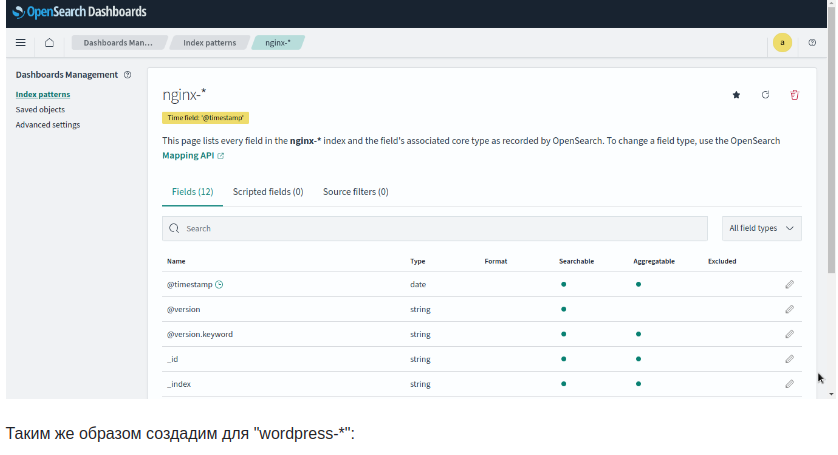

# Kafka

## Домашнее задание

### Реализация очереди для сборщика логов между logstash и elasticsearch

> настроить сбор логов с веб портала реализованного ранее настроить kafka как промежуточную очередь между logstash и elasticsearch

### Описание/Пошаговая инструкция выполнения домашнего задания:

> развернуть кафку на 1 ноде создать 2 топика по 2 партиции и 2 реплики (nginx и wordpress) на каждой ноде поставить на выбор filebeat/fluentd/vector собирать
> этим утилитами логи nginx и wordpress отправлять в 2 разных топика nginx и wordpress развернуть ELK на одной ноде настроить логстэш для забора данных с кафки
> и сохранение в 2 индекса настроить индекс паттерны в кибане Задание повышенной сложности* кафку и ELK развернуть в кластере


## Выполнение домашнего задания

### Создание стенда

> Стенд будем разворачивать с помощью Terraform на YandexCloud, настройку серверов будем выполнять с помощью Ansible.

> Выполним следующую команду:
```
terraform init
terraform apply -auto-approve
wait 1 min

ansible-playbook ./provision.yml \
--extra-vars "admin_password=admin@Otus1234 \
kibanaserver_password=kibana@Otus1234 \
logstash_password=logstash@Otus1234"
```

> По завершению команды получим данные outputs:

```
Outputs:

backend-servers-info = {
  "backend-01" = {
    "ip_address" = tolist([
      "10.10.10.16",
    ])
    "nat_ip_address" = tolist([
      "",
    ])
  }
  "backend-02" = {
    "ip_address" = tolist([
      "10.10.10.19",
    ])
    "nat_ip_address" = tolist([
      "",
    ])
  }
}
db-servers-info = {
  "db-01" = {
    "ip_address" = tolist([
      "10.10.10.5",
    ])
    "nat_ip_address" = tolist([
      "",
    ])
  }
}
iscsi-servers-info = {
  "iscsi-01" = {
    "ip_address" = tolist([
      "10.10.10.13",
    ])
    "nat_ip_address" = tolist([
      "",
    ])
  }
}
jump-servers-info = {
  "jump-01" = {
    "ip_address" = tolist([
      "10.10.10.26",
    ])
    "nat_ip_address" = tolist([
      "158.160.85.247",
    ])
  }
}
kafka-servers-info = {
  "kafka-01" = {
    "ip_address" = tolist([
      "10.10.10.23",
    ])
    "nat_ip_address" = tolist([
      "",
    ])
  }
  "kafka-02" = {
    "ip_address" = tolist([
      "10.10.10.34",
    ])
    "nat_ip_address" = tolist([
      "",
    ])
  }
  "kafka-03" = {
    "ip_address" = tolist([
      "10.10.10.14",
    ])
    "nat_ip_address" = tolist([
      "",
    ])
  }
}
loadbalancer-info = [
  {
    "attached_target_group" = toset([
      {
        "healthcheck" = tolist([
          {
            "healthy_threshold" = 2
            "http_options" = tolist([])
            "interval" = 2
            "name" = "tcp"
            "tcp_options" = tolist([
              {
                "port" = 5601
              },
            ])
            "timeout" = 1
            "unhealthy_threshold" = 2
          },
        ])
        "target_group_id" = "enpjt05m97l3ofpa98vq"
      },
      {
        "healthcheck" = tolist([
          {
            "healthy_threshold" = 2
            "http_options" = tolist([])
            "interval" = 2
            "name" = "tcp"
            "tcp_options" = tolist([
              {
                "port" = 80
              },
            ])
            "timeout" = 1
            "unhealthy_threshold" = 2
          },
        ])
        "target_group_id" = "enpoe1aie150cc3838vi"
      },
    ])
    "created_at" = "2024-07-11T09:39:57Z"
    "deletion_protection" = false
    "description" = ""
    "folder_id" = "b1gbrdno77jf9g08edas"
    "id" = "enpql2fp3kqf1ouct9n7"
    "labels" = tomap({})
    "listener" = toset([
      {
        "external_address_spec" = toset([
          {
            "address" = "158.160.172.95"
            "ip_version" = "ipv4"
          },
        ])
        "internal_address_spec" = toset([])
        "name" = "dashboards-listener"
        "port" = 5601
        "protocol" = "tcp"
        "target_port" = 5601
      },
      {
        "external_address_spec" = toset([
          {
            "address" = "158.160.172.95"
            "ip_version" = "ipv4"
          },
        ])
        "internal_address_spec" = toset([])
        "name" = "webservers-listener"
        "port" = 80
        "protocol" = "tcp"
        "target_port" = 80
      },
    ])
    "name" = "mylb"
    "network_load_balancer_id" = "enpql2fp3kqf1ouct9n7"
    "region_id" = "ru-central1"
    "type" = "external"
  },
]
nginx-servers-info = {
  "nginx-01" = {
    "ip_address" = tolist([
      "10.10.10.28",
    ])
    "nat_ip_address" = tolist([
      "",
    ])
  }
  "nginx-02" = {
    "ip_address" = tolist([
      "10.10.10.36",
    ])
    "nat_ip_address" = tolist([
      "",
    ])
  }
}
os-servers-info = {
  "os-01" = {
    "ip_address" = tolist([
      "10.10.10.21",
    ])
    "nat_ip_address" = tolist([
      "",
    ])
  }
}
```

> На всех серверах будут установлены ОС Almalinux 8, настроены смнхронизация времени Chrony, система принудительного контроля доступа SELinux, в качестве 
> firewall будет использоваться NFTables.

> Стенд был взят из лабораторной работы 7 Кафку развернём на кластере из трёх нод kafka-01, kafka-02, kafka-03. Координатором в целях выбора лидера в кластере 
> kafka будет осущетсвляться ZooKeeper.

> Для централизованного сбора логов со всех серверов данного стенда создадим воспользуемся OpenSearch, установленный и настроенный на сервере os-01. В нашем 
> проекте kafka будет собирать логи с балансировщиков (nginx-01 и nginx-02) и бэкендов (backend-01 и backend-02), где будут установлены WordPress, хранить у 
> себя и будет передавать эти логи OpenSearch через Logstash на сервере os-01.

> Для визуализации данных логов будем использовать OpenSearch Dashboard. В данном стенде OpenSearch Dashboard для удобства будем устанавливать на сервер Jump-01.

> Для установки OpenSearch и OpenSearch Dashboard был склонирован из репозитория https://github.com/opensearch-project/ansible-playbook с внесением небольших изменений под свой проект.

> В качестве агентов на серверах, откуда будем собирать логи, будем использовать FileBeat.
> Так как на YandexCloud ограничено количество выделяемых публичных IP адресов, в дополнение к этому стенду создадим ещё один сервер jump-01 в качестве
> JumpHost, через который будем подключаться по SSH (в частности для Ansible) к другим серверам той же подсети.

> Список виртуальных машин после запуска стенда:


> Для проверки работы стенда воспользуемся установленным на бэкендах Wordpress:


> Значение IP адреса сайта получен от балансировщика от YandexCloud:


> Страница OpenSearch Dashboard открывается в браузере, вводя в адресную строку публичный IP адрес балансировщика от YandexCloud с портом 5601:

```
84.201.146.67:5601
```


> Стартовая страница:


> Кликаем по ссылке "Index patterns":


> Далее нажимаем по кнопке "Create index pattern":


> В поле "Index pattern name" вводим "nginx-*" и нажимаем "Next step >" получаем: 




> Таким же образом создадим для "wordpress-*":


> В итоге получим: 


> Подключимся по ssh к консоли одного из серверов кластера kafka, например, kafka-03:

```
ssh cloud-user@10.10.10.7 -J cloud-user@84.201.146.67
```

> Зайдём в директорий kafka:

```
cd /opt/kafka
```

> Содержимое данной директории:

```
[root@kafka-03 kafka]# ls -l
total 68
drwxr-xr-x. 3 kafka kafka  4096 Sep 12 08:03 bin
drwxr-xr-x. 3 kafka kafka  4096 Nov 10 16:46 config
drwxr-xr-x. 2 kafka kafka  8192 Nov 10 16:46 libs
-rw-r--r--. 1 kafka kafka 14973 Sep 12 07:56 LICENSE
drwxr-xr-x. 2 kafka kafka  4096 Sep 12 08:03 licenses
drwxr-xr-x. 2 kafka kafka   172 Nov 10 16:46 logs
-rw-r--r--. 1 kafka kafka 28184 Sep 12 07:56 NOTICE
drwxr-xr-x. 2 kafka kafka    44 Sep 12 08:03 site-docs
```

> Список исполняющих файлов kafka:


```
[root@kafka-03 kafka]# ls -l ./bin/
total 176
-rwxr-xr-x. 1 kafka kafka  1423 Sep 12 07:56 connect-distributed.sh
-rwxr-xr-x. 1 kafka kafka  1396 Sep 12 07:56 connect-mirror-maker.sh
-rwxr-xr-x. 1 kafka kafka   963 Sep 12 07:56 connect-plugin-path.sh
-rwxr-xr-x. 1 kafka kafka  1420 Sep 12 07:56 connect-standalone.sh
-rwxr-xr-x. 1 kafka kafka   861 Sep 12 07:56 kafka-acls.sh
-rwxr-xr-x. 1 kafka kafka   873 Sep 12 07:56 kafka-broker-api-versions.sh
-rwxr-xr-x. 1 kafka kafka   871 Sep 12 07:56 kafka-cluster.sh
-rwxr-xr-x. 1 kafka kafka   864 Sep 12 07:56 kafka-configs.sh
-rwxr-xr-x. 1 kafka kafka   945 Sep 12 07:56 kafka-console-consumer.sh
-rwxr-xr-x. 1 kafka kafka   944 Sep 12 07:56 kafka-console-producer.sh
-rwxr-xr-x. 1 kafka kafka   871 Sep 12 07:56 kafka-consumer-groups.sh
-rwxr-xr-x. 1 kafka kafka   959 Sep 12 07:56 kafka-consumer-perf-test.sh
-rwxr-xr-x. 1 kafka kafka   882 Sep 12 07:56 kafka-delegation-tokens.sh
-rwxr-xr-x. 1 kafka kafka   880 Sep 12 07:56 kafka-delete-records.sh
-rwxr-xr-x. 1 kafka kafka   866 Sep 12 07:56 kafka-dump-log.sh
-rwxr-xr-x. 1 kafka kafka   877 Sep 12 07:56 kafka-e2e-latency.sh
-rwxr-xr-x. 1 kafka kafka   874 Sep 12 07:56 kafka-features.sh
-rwxr-xr-x. 1 kafka kafka   865 Sep 12 07:56 kafka-get-offsets.sh
-rwxr-xr-x. 1 kafka kafka   867 Sep 12 07:56 kafka-jmx.sh
-rwxr-xr-x. 1 kafka kafka   870 Sep 12 07:56 kafka-leader-election.sh
-rwxr-xr-x. 1 kafka kafka   874 Sep 12 07:56 kafka-log-dirs.sh
-rwxr-xr-x. 1 kafka kafka   881 Sep 12 07:56 kafka-metadata-quorum.sh
-rwxr-xr-x. 1 kafka kafka   873 Sep 12 07:56 kafka-metadata-shell.sh
-rwxr-xr-x. 1 kafka kafka   862 Sep 12 07:56 kafka-mirror-maker.sh
-rwxr-xr-x. 1 kafka kafka   959 Sep 12 07:56 kafka-producer-perf-test.sh
-rwxr-xr-x. 1 kafka kafka   874 Sep 12 07:56 kafka-reassign-partitions.sh
-rwxr-xr-x. 1 kafka kafka   885 Sep 12 07:56 kafka-replica-verification.sh
-rwxr-xr-x. 1 kafka kafka 10884 Sep 12 07:56 kafka-run-class.sh
-rwxr-xr-x. 1 kafka kafka  1376 Sep 12 07:56 kafka-server-start.sh
-rwxr-xr-x. 1 kafka kafka  1361 Sep 12 07:56 kafka-server-stop.sh
-rwxr-xr-x. 1 kafka kafka   860 Sep 12 07:56 kafka-storage.sh
-rwxr-xr-x. 1 kafka kafka   956 Sep 12 07:56 kafka-streams-application-reset.sh
-rwxr-xr-x. 1 kafka kafka   863 Sep 12 07:56 kafka-topics.sh
-rwxr-xr-x. 1 kafka kafka   879 Sep 12 07:56 kafka-transactions.sh
-rwxr-xr-x. 1 kafka kafka   958 Sep 12 07:56 kafka-verifiable-consumer.sh
-rwxr-xr-x. 1 kafka kafka   958 Sep 12 07:56 kafka-verifiable-producer.sh
-rwxr-xr-x. 1 kafka kafka  1714 Sep 12 07:56 trogdor.sh
drwxr-xr-x. 2 kafka kafka  4096 Sep 12 07:56 windows
-rwxr-xr-x. 1 kafka kafka   867 Sep 12 07:56 zookeeper-security-migration.sh
-rwxr-xr-x. 1 kafka kafka  1393 Sep 12 07:56 zookeeper-server-start.sh
-rwxr-xr-x. 1 kafka kafka  1366 Sep 12 07:56 zookeeper-server-stop.sh
-rwxr-xr-x. 1 kafka kafka  1019 Sep 12 07:56 zookeeper-shell.sh
```

> Детальный вывод по топику "nginx":

```
[root@kafka-03 kafka]# ./bin/kafka-topics.sh --describe --topic nginx --bootstrap-server 10.10.10.14:9092,10.10.10.39:9092,10.10.10.7:9092
Topic: nginx	TopicId: vqVw8X-3TsG_Jbnv4mMH8g	PartitionCount: 2	ReplicationFactor: 2	Configs: 
	Topic: nginx	Partition: 0	Leader: 1	Replicas: 1,2	Isr: 1,2
	Topic: nginx	Partition: 1	Leader: 2	Replicas: 2,3	Isr: 2,3
```

> Детальный вывод по топику "wordpress":

```
[root@kafka-03 kafka]# ./bin/kafka-topics.sh --describe --topic wordpress --bootstrap-server 10.10.10.14:9092,10.10.10.39:9092,10.10.10.7:9092
Topic: wordpress	TopicId: Sx59R2aAQUeTg-xBdxORgg	PartitionCount: 2	ReplicationFactor: 2	Configs: 
	Topic: wordpress	Partition: 0	Leader: 2	Replicas: 2,3	Isr: 2,3
	Topic: wordpress	Partition: 1	Leader: 3	Replicas: 3,1	Isr: 3,1
```

> С помощью следующей команды:

```
[root@kafka-02 kafka]# ./bin/kafka-console-consumer.sh --topic nginx --bootstrap-server 10.10.10.14:9092,10.10.10.39:9092,10.10.10.7:9092
```

> Можно делать вывод, что kafka кластер корректно функционирует, созданы два топика (nginx, wordpress), каждый имеет по две партиции и две реплики.


## Удаление стенда

> Удалить развернутый стенд командой:

```
terraform destroy -auto-approve
```