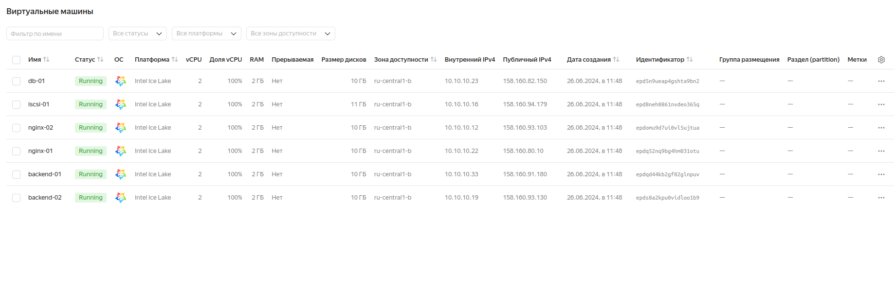
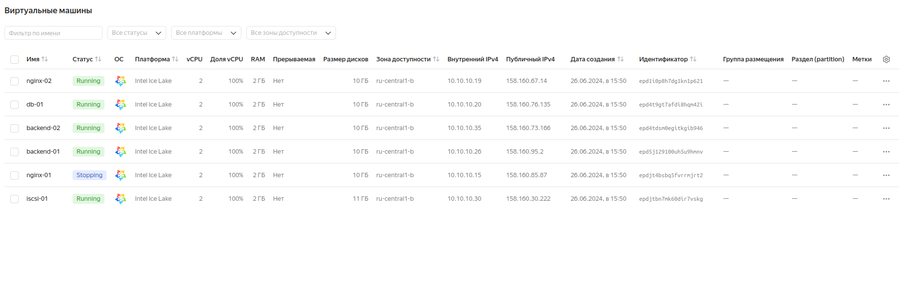
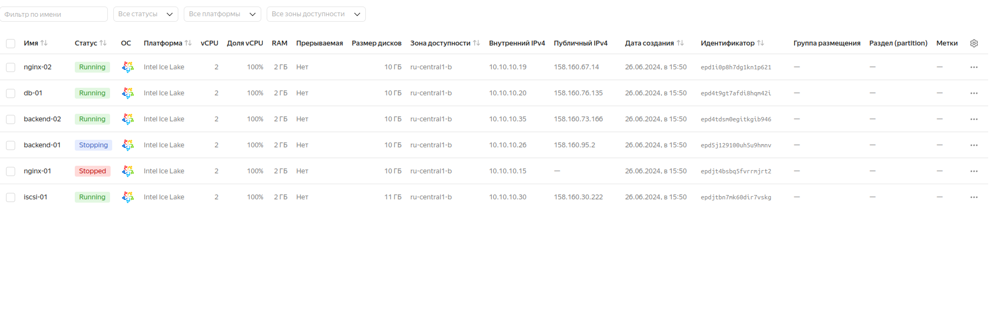
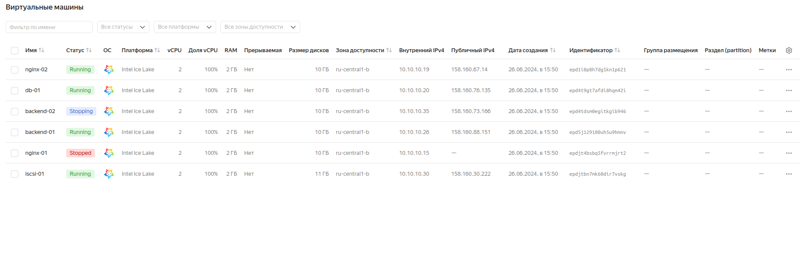

# Настройка конфигурации веб приложения под высокую нагрузку

## Цель:

> terraform (или vagrant) и ansible роль для развертывания серверов веб приложения под высокую нагрузку и отказоустойчивость
> в работе должны применяться:

- keepalived, (в случае использовать vagrant и virtualbox), load balancer от yandex в случае использования яндекс клауд
- nginx,
- uwsgi/unicorn/php-fpm
- некластеризованная бд mysql/mongodb/postgres/redis

### Описание/Пошаговая инструкция выполнения домашнего задания:

1. Создать несколько инстансов с помощью терраформ (2 nginx, 2 backend, 1 db);
2. Развернуть nginx и keepalived на серверах nginx при помощи ansible
3. Развернуть бэкенд способный работать по uwsgi/unicorn/php-fpm и базой. (Можно взять что нибудь из Django) при помощи ansible.
4. Развернуть gfs2 для бэкенд серверах, для хранения статики
5. Развернуть бд для работы бэкенда при помощи ansbile
6. Проверить отказоустойчивость системы при выходе из строя серверов backend/nginx


### Запускаем стенд:
```
terraform apply -auto-approve


Terraform used the selected providers to generate the following execution plan. Resource actions are indicated with the following symbols:
  + create
 <= read (data resources)

Terraform will perform the following actions:

  # data.yandex_compute_instance.backend-servers[0] will be read during apply
  # (config refers to values not yet known)
 <= data "yandex_compute_instance" "backend-servers" {
      + boot_disk                 = (known after apply)
      + created_at                = (known after apply)
      + description               = (known after apply)
      + folder_id                 = (known after apply)
      + fqdn                      = (known after apply)
      + gpu_cluster_id            = (known after apply)
      + id                        = (known after apply)
      + instance_id               = (known after apply)
      + labels                    = (known after apply)
      + maintenance_grace_period  = (known after apply)
      + maintenance_policy        = (known after apply)
      + metadata                  = (known after apply)
      + name                      = "backend-01"
      + network_acceleration_type = (known after apply)
      + network_interface         = (known after apply)
      + platform_id               = (known after apply)
      + resources                 = (known after apply)
      + scheduling_policy         = (known after apply)
      + secondary_disk            = (known after apply)
      + service_account_id        = (known after apply)
      + status                    = (known after apply)
      + zone                      = (known after apply)
    }

  # data.yandex_compute_instance.backend-servers[1] will be read during apply
  # (config refers to values not yet known)
 <= data "yandex_compute_instance" "backend-servers" {
      + boot_disk                 = (known after apply)
      + created_at                = (known after apply)
      + description               = (known after apply)
      + folder_id                 = (known after apply)
      + fqdn                      = (known after apply)
      + gpu_cluster_id            = (known after apply)
      + id                        = (known after apply)
      + instance_id               = (known after apply)
      + labels                    = (known after apply)
      + maintenance_grace_period  = (known after apply)
      + maintenance_policy        = (known after apply)
      + metadata                  = (known after apply)
      + name                      = "backend-02"
      + network_acceleration_type = (known after apply)
      + network_interface         = (known after apply)
      + platform_id               = (known after apply)
      + resources                 = (known after apply)
      + scheduling_policy         = (known after apply)
      + secondary_disk            = (known after apply)
      + service_account_id        = (known after apply)
      + status                    = (known after apply)
      + zone                      = (known after apply)
    }

  # data.yandex_compute_instance.db-servers[0] will be read during apply
  # (config refers to values not yet known)
 <= data "yandex_compute_instance" "db-servers" {
      + boot_disk                 = (known after apply)
      + created_at                = (known after apply)
      + description               = (known after apply)
      + folder_id                 = (known after apply)
      + fqdn                      = (known after apply)
      + gpu_cluster_id            = (known after apply)
      + id                        = (known after apply)
      + instance_id               = (known after apply)
      + labels                    = (known after apply)
      + maintenance_grace_period  = (known after apply)
      + maintenance_policy        = (known after apply)
      + metadata                  = (known after apply)
      + name                      = "db-01"
      + network_acceleration_type = (known after apply)
      + network_interface         = (known after apply)
      + platform_id               = (known after apply)
      + resources                 = (known after apply)
      + scheduling_policy         = (known after apply)
      + secondary_disk            = (known after apply)
      + service_account_id        = (known after apply)
      + status                    = (known after apply)
      + zone                      = (known after apply)
    }

  # data.yandex_compute_instance.iscsi-servers[0] will be read during apply
  # (config refers to values not yet known)
 <= data "yandex_compute_instance" "iscsi-servers" {
      + boot_disk                 = (known after apply)
      + created_at                = (known after apply)
      + description               = (known after apply)
      + folder_id                 = (known after apply)
      + fqdn                      = (known after apply)
      + gpu_cluster_id            = (known after apply)
      + id                        = (known after apply)
      + instance_id               = (known after apply)
      + labels                    = (known after apply)
      + maintenance_grace_period  = (known after apply)
      + maintenance_policy        = (known after apply)
      + metadata                  = (known after apply)
      + name                      = "iscsi-01"
      + network_acceleration_type = (known after apply)
      + network_interface         = (known after apply)
      + platform_id               = (known after apply)
      + resources                 = (known after apply)
      + scheduling_policy         = (known after apply)
      + secondary_disk            = (known after apply)
      + service_account_id        = (known after apply)
      + status                    = (known after apply)
      + zone                      = (known after apply)
    }

  # data.yandex_compute_instance.nginx-servers[0] will be read during apply
  # (config refers to values not yet known)
 <= data "yandex_compute_instance" "nginx-servers" {
      + boot_disk                 = (known after apply)
      + created_at                = (known after apply)
      + description               = (known after apply)
      + folder_id                 = (known after apply)
      + fqdn                      = (known after apply)
      + gpu_cluster_id            = (known after apply)
      + id                        = (known after apply)
      + instance_id               = (known after apply)
      + labels                    = (known after apply)
      + maintenance_grace_period  = (known after apply)
      + maintenance_policy        = (known after apply)
      + metadata                  = (known after apply)
      + name                      = "nginx-01"
      + network_acceleration_type = (known after apply)
      + network_interface         = (known after apply)
      + platform_id               = (known after apply)
      + resources                 = (known after apply)
      + scheduling_policy         = (known after apply)
      + secondary_disk            = (known after apply)
      + service_account_id        = (known after apply)
      + status                    = (known after apply)
      + zone                      = (known after apply)
    }

  # data.yandex_compute_instance.nginx-servers[1] will be read during apply
  # (config refers to values not yet known)
 <= data "yandex_compute_instance" "nginx-servers" {
      + boot_disk                 = (known after apply)
      + created_at                = (known after apply)
      + description               = (known after apply)
      + folder_id                 = (known after apply)
      + fqdn                      = (known after apply)
      + gpu_cluster_id            = (known after apply)
      + id                        = (known after apply)
      + instance_id               = (known after apply)
      + labels                    = (known after apply)
      + maintenance_grace_period  = (known after apply)
      + maintenance_policy        = (known after apply)
      + metadata                  = (known after apply)
      + name                      = "nginx-02"
      + network_acceleration_type = (known after apply)
      + network_interface         = (known after apply)
      + platform_id               = (known after apply)
      + resources                 = (known after apply)
      + scheduling_policy         = (known after apply)
      + secondary_disk            = (known after apply)
      + service_account_id        = (known after apply)
      + status                    = (known after apply)
      + zone                      = (known after apply)
    }

  # data.yandex_lb_network_load_balancer.keepalived will be read during apply
  # (config refers to values not yet known)
 <= data "yandex_lb_network_load_balancer" "keepalived" {
      + attached_target_group    = (known after apply)
      + created_at               = (known after apply)
      + deletion_protection      = (known after apply)
      + description              = (known after apply)
      + folder_id                = (known after apply)
      + id                       = (known after apply)
      + labels                   = (known after apply)
      + listener                 = (known after apply)
      + name                     = "my-network-load-balancer"
      + network_load_balancer_id = (known after apply)
      + region_id                = (known after apply)
      + type                     = (known after apply)
    }

  # local_file.group_vars_all_file will be created
  + resource "local_file" "group_vars_all_file" {
      + content              = (known after apply)
      + content_base64sha256 = (known after apply)
      + content_base64sha512 = (known after apply)
      + content_md5          = (known after apply)
      + content_sha1         = (known after apply)
      + content_sha256       = (known after apply)
      + content_sha512       = (known after apply)
      + directory_permission = "0777"
      + file_permission      = "0777"
      + filename             = "./group_vars/all/main.yml"
      + id                   = (known after apply)
    }

  # local_file.inventory_file will be created
  + resource "local_file" "inventory_file" {
      + content              = (known after apply)
      + content_base64sha256 = (known after apply)
      + content_base64sha512 = (known after apply)
      + content_md5          = (known after apply)
      + content_sha1         = (known after apply)
      + content_sha256       = (known after apply)
      + content_sha512       = (known after apply)
      + directory_permission = "0777"
      + file_permission      = "0777"
      + filename             = "./inventory.ini"
      + id                   = (known after apply)
    }

  # yandex_compute_disk.disks[0] will be created
  + resource "yandex_compute_disk" "disks" {
      + block_size  = 4096
      + created_at  = (known after apply)
      + folder_id   = (known after apply)
      + id          = (known after apply)
      + name        = "web-01"
      + product_ids = (known after apply)
      + size        = 1
      + status      = (known after apply)
      + type        = "network-hdd"
      + zone        = "ru-central1-b"
    }

  # yandex_lb_network_load_balancer.keepalived will be created
  + resource "yandex_lb_network_load_balancer" "keepalived" {
      + created_at          = (known after apply)
      + deletion_protection = (known after apply)
      + folder_id           = (known after apply)
      + id                  = (known after apply)
      + name                = "my-network-load-balancer"
      + region_id           = (known after apply)
      + type                = "external"

      + attached_target_group {
          + target_group_id = (known after apply)

          + healthcheck {
              + healthy_threshold   = 2
              + interval            = 2
              + name                = "http"
              + timeout             = 1
              + unhealthy_threshold = 2

              + http_options {
                  + path = "/ping"
                  + port = 80
                }
            }
        }

      + listener {
          + name        = "my-listener"
          + port        = 80
          + protocol    = (known after apply)
          + target_port = (known after apply)

          + external_address_spec {
              + address    = (known after apply)
              + ip_version = "ipv4"
            }
        }
    }

  # yandex_lb_target_group.keepalived_group will be created
  + resource "yandex_lb_target_group" "keepalived_group" {
      + created_at = (known after apply)
      + folder_id  = (known after apply)
      + id         = (known after apply)
      + name       = "my-keepalived-group"
      + region_id  = "ru-central1"

      + target {
          + address   = (known after apply)
          + subnet_id = (known after apply)
        }
      + target {
          + address   = (known after apply)
          + subnet_id = (known after apply)
        }
    }

  # yandex_resourcemanager_folder.folders["loadbalancer-folder"] will be created
  + resource "yandex_resourcemanager_folder" "folders" {
      + cloud_id   = "b1gbannjquqlafpgb0jg"
      + created_at = (known after apply)
      + id         = (known after apply)
      + name       = "loadbalancer-folder"
    }

  # yandex_vpc_network.vpc will be created
  + resource "yandex_vpc_network" "vpc" {
      + created_at                = (known after apply)
      + default_security_group_id = (known after apply)
      + folder_id                 = (known after apply)
      + id                        = (known after apply)
      + labels                    = (known after apply)
      + name                      = "my_vpc_network"
      + subnet_ids                = (known after apply)
    }

  # yandex_vpc_subnet.subnets["loadbalancer-subnet"] will be created
  + resource "yandex_vpc_subnet" "subnets" {
      + created_at     = (known after apply)
      + folder_id      = (known after apply)
      + id             = (known after apply)
      + labels         = (known after apply)
      + name           = "loadbalancer-subnet"
      + network_id     = (known after apply)
      + v4_cidr_blocks = [
          + "10.10.10.0/24",
        ]
      + v6_cidr_blocks = (known after apply)
      + zone           = "ru-central1-b"
    }

  # module.backend-servers[0].yandex_compute_instance.instances will be created
  + resource "yandex_compute_instance" "instances" {
      + allow_stopping_for_update = true
      + created_at                = (known after apply)
      + folder_id                 = (known after apply)
      + fqdn                      = (known after apply)
      + gpu_cluster_id            = (known after apply)
      + hostname                  = "backend-01"
      + id                        = (known after apply)
      + maintenance_grace_period  = (known after apply)
      + maintenance_policy        = (known after apply)
      + metadata                  = {
          + "ssh-keys" = <<-EOT
                ubuntu:ssh-rsa AAAAB3NzaC1yc2EAAAADAQABAAABgQDHG326ChxLn4Frwc1Spg66bS+7gzVQ/H6RUOmqZyH0uwEGAyF3JHEQtMLNbWQmwc38a7zAg9OJWrpBFYuJSr1+lCGYc29E+PK83e66AkUaSFwGkM00eg0+r5YUVAIcwx7PW9t3wE7srAgsIC7Qe6EUlVkyPavYtffNQEFNTqolDqEG4M8+YsmesdG0zpGGuG/ZFIKoxRJLzMIkH/z3fjSp00VsCnz4aeF9K/pJaOJGmAvNLCISiYNMY/Yt7AQLkaC55uVc32sE/QfxPhrHfQmRoinWOe16L4ykvWsdkB0fn0pTUwX15LyTYp4C17dp8NgVLhDuaJLCc1sXz6E48mHE+pT+G0Z8JKB5vyKuItVWn1v6T1sgwMv7Ht0a+uN+cALhZOHkWAM1FzOcd2pjqaxmSjGo52V60g05UoYG3+p11gBCoVHNvx5yzO76rPZoGJd/KePCxcBqRXXYZbGc/4eYXw/VA/BxFKbg15NryUiTxu38x36IO/66iU+utk5gXl0= mikhail.timofeev@lgepartner.com
            EOT
        }
      + name                      = "backend-01"
      + network_acceleration_type = "standard"
      + platform_id               = "standard-v3"
      + service_account_id        = (known after apply)
      + status                    = (known after apply)
      + zone                      = "ru-central1-b"

      + boot_disk {
          + auto_delete = true
          + device_name = (known after apply)
          + disk_id     = (known after apply)
          + mode        = (known after apply)

          + initialize_params {
              + block_size  = (known after apply)
              + description = (known after apply)
              + image_id    = "fd84itfojin92kj38vmb"
              + name        = (known after apply)
              + size        = 10
              + snapshot_id = (known after apply)
              + type        = "network-ssd"
            }
        }

      + network_interface {
          + index              = (known after apply)
          + ip_address         = (known after apply)
          + ipv4               = true
          + ipv6               = (known after apply)
          + ipv6_address       = (known after apply)
          + mac_address        = (known after apply)
          + nat                = true
          + nat_ip_address     = (known after apply)
          + nat_ip_version     = (known after apply)
          + security_group_ids = (known after apply)
          + subnet_id          = (known after apply)
        }

      + resources {
          + core_fraction = 100
          + cores         = 2
          + memory        = 2
        }
    }

  # module.backend-servers[1].yandex_compute_instance.instances will be created
  + resource "yandex_compute_instance" "instances" {
      + allow_stopping_for_update = true
      + created_at                = (known after apply)
      + folder_id                 = (known after apply)
      + fqdn                      = (known after apply)
      + gpu_cluster_id            = (known after apply)
      + hostname                  = "backend-02"
      + id                        = (known after apply)
      + maintenance_grace_period  = (known after apply)
      + maintenance_policy        = (known after apply)
      + metadata                  = {
          + "ssh-keys" = <<-EOT
                ubuntu:ssh-rsa AAAAB3NzaC1yc2EAAAADAQABAAABgQDHG326ChxLn4Frwc1Spg66bS+7gzVQ/H6RUOmqZyH0uwEGAyF3JHEQtMLNbWQmwc38a7zAg9OJWrpBFYuJSr1+lCGYc29E+PK83e66AkUaSFwGkM00eg0+r5YUVAIcwx7PW9t3wE7srAgsIC7Qe6EUlVkyPavYtffNQEFNTqolDqEG4M8+YsmesdG0zpGGuG/ZFIKoxRJLzMIkH/z3fjSp00VsCnz4aeF9K/pJaOJGmAvNLCISiYNMY/Yt7AQLkaC55uVc32sE/QfxPhrHfQmRoinWOe16L4ykvWsdkB0fn0pTUwX15LyTYp4C17dp8NgVLhDuaJLCc1sXz6E48mHE+pT+G0Z8JKB5vyKuItVWn1v6T1sgwMv7Ht0a+uN+cALhZOHkWAM1FzOcd2pjqaxmSjGo52V60g05UoYG3+p11gBCoVHNvx5yzO76rPZoGJd/KePCxcBqRXXYZbGc/4eYXw/VA/BxFKbg15NryUiTxu38x36IO/66iU+utk5gXl0= mikhail.timofeev@lgepartner.com
            EOT
        }
      + name                      = "backend-02"
      + network_acceleration_type = "standard"
      + platform_id               = "standard-v3"
      + service_account_id        = (known after apply)
      + status                    = (known after apply)
      + zone                      = "ru-central1-b"

      + boot_disk {
          + auto_delete = true
          + device_name = (known after apply)
          + disk_id     = (known after apply)
          + mode        = (known after apply)

          + initialize_params {
              + block_size  = (known after apply)
              + description = (known after apply)
              + image_id    = "fd84itfojin92kj38vmb"
              + name        = (known after apply)
              + size        = 10
              + snapshot_id = (known after apply)
              + type        = "network-ssd"
            }
        }

      + network_interface {
          + index              = (known after apply)
          + ip_address         = (known after apply)
          + ipv4               = true
          + ipv6               = (known after apply)
          + ipv6_address       = (known after apply)
          + mac_address        = (known after apply)
          + nat                = true
          + nat_ip_address     = (known after apply)
          + nat_ip_version     = (known after apply)
          + security_group_ids = (known after apply)
          + subnet_id          = (known after apply)
        }

      + resources {
          + core_fraction = 100
          + cores         = 2
          + memory        = 2
        }
    }

  # module.db-servers[0].yandex_compute_instance.instances will be created
  + resource "yandex_compute_instance" "instances" {
      + allow_stopping_for_update = true
      + created_at                = (known after apply)
      + folder_id                 = (known after apply)
      + fqdn                      = (known after apply)
      + gpu_cluster_id            = (known after apply)
      + hostname                  = "db-01"
      + id                        = (known after apply)
      + maintenance_grace_period  = (known after apply)
      + maintenance_policy        = (known after apply)
      + metadata                  = {
          + "ssh-keys" = <<-EOT
                ubuntu:ssh-rsa AAAAB3NzaC1yc2EAAAADAQABAAABgQDHG326ChxLn4Frwc1Spg66bS+7gzVQ/H6RUOmqZyH0uwEGAyF3JHEQtMLNbWQmwc38a7zAg9OJWrpBFYuJSr1+lCGYc29E+PK83e66AkUaSFwGkM00eg0+r5YUVAIcwx7PW9t3wE7srAgsIC7Qe6EUlVkyPavYtffNQEFNTqolDqEG4M8+YsmesdG0zpGGuG/ZFIKoxRJLzMIkH/z3fjSp00VsCnz4aeF9K/pJaOJGmAvNLCISiYNMY/Yt7AQLkaC55uVc32sE/QfxPhrHfQmRoinWOe16L4ykvWsdkB0fn0pTUwX15LyTYp4C17dp8NgVLhDuaJLCc1sXz6E48mHE+pT+G0Z8JKB5vyKuItVWn1v6T1sgwMv7Ht0a+uN+cALhZOHkWAM1FzOcd2pjqaxmSjGo52V60g05UoYG3+p11gBCoVHNvx5yzO76rPZoGJd/KePCxcBqRXXYZbGc/4eYXw/VA/BxFKbg15NryUiTxu38x36IO/66iU+utk5gXl0= mikhail.timofeev@lgepartner.com
            EOT
        }
      + name                      = "db-01"
      + network_acceleration_type = "standard"
      + platform_id               = "standard-v3"
      + service_account_id        = (known after apply)
      + status                    = (known after apply)
      + zone                      = "ru-central1-b"

      + boot_disk {
          + auto_delete = true
          + device_name = (known after apply)
          + disk_id     = (known after apply)
          + mode        = (known after apply)

          + initialize_params {
              + block_size  = (known after apply)
              + description = (known after apply)
              + image_id    = "fd84itfojin92kj38vmb"
              + name        = (known after apply)
              + size        = 10
              + snapshot_id = (known after apply)
              + type        = "network-ssd"
            }
        }

      + network_interface {
          + index              = (known after apply)
          + ip_address         = (known after apply)
          + ipv4               = true
          + ipv6               = (known after apply)
          + ipv6_address       = (known after apply)
          + mac_address        = (known after apply)
          + nat                = true
          + nat_ip_address     = (known after apply)
          + nat_ip_version     = (known after apply)
          + security_group_ids = (known after apply)
          + subnet_id          = (known after apply)
        }

      + resources {
          + core_fraction = 100
          + cores         = 2
          + memory        = 2
        }
    }

  # module.iscsi-servers[0].yandex_compute_instance.instances will be created
  + resource "yandex_compute_instance" "instances" {
      + allow_stopping_for_update = true
      + created_at                = (known after apply)
      + folder_id                 = (known after apply)
      + fqdn                      = (known after apply)
      + gpu_cluster_id            = (known after apply)
      + hostname                  = "iscsi-01"
      + id                        = (known after apply)
      + maintenance_grace_period  = (known after apply)
      + maintenance_policy        = (known after apply)
      + metadata                  = {
          + "ssh-keys" = <<-EOT
                ubuntu:ssh-rsa AAAAB3NzaC1yc2EAAAADAQABAAABgQDHG326ChxLn4Frwc1Spg66bS+7gzVQ/H6RUOmqZyH0uwEGAyF3JHEQtMLNbWQmwc38a7zAg9OJWrpBFYuJSr1+lCGYc29E+PK83e66AkUaSFwGkM00eg0+r5YUVAIcwx7PW9t3wE7srAgsIC7Qe6EUlVkyPavYtffNQEFNTqolDqEG4M8+YsmesdG0zpGGuG/ZFIKoxRJLzMIkH/z3fjSp00VsCnz4aeF9K/pJaOJGmAvNLCISiYNMY/Yt7AQLkaC55uVc32sE/QfxPhrHfQmRoinWOe16L4ykvWsdkB0fn0pTUwX15LyTYp4C17dp8NgVLhDuaJLCc1sXz6E48mHE+pT+G0Z8JKB5vyKuItVWn1v6T1sgwMv7Ht0a+uN+cALhZOHkWAM1FzOcd2pjqaxmSjGo52V60g05UoYG3+p11gBCoVHNvx5yzO76rPZoGJd/KePCxcBqRXXYZbGc/4eYXw/VA/BxFKbg15NryUiTxu38x36IO/66iU+utk5gXl0= mikhail.timofeev@lgepartner.com
            EOT
        }
      + name                      = "iscsi-01"
      + network_acceleration_type = "standard"
      + platform_id               = "standard-v3"
      + service_account_id        = (known after apply)
      + status                    = (known after apply)
      + zone                      = "ru-central1-b"

      + boot_disk {
          + auto_delete = true
          + device_name = (known after apply)
          + disk_id     = (known after apply)
          + mode        = (known after apply)

          + initialize_params {
              + block_size  = (known after apply)
              + description = (known after apply)
              + image_id    = "fd84itfojin92kj38vmb"
              + name        = (known after apply)
              + size        = 10
              + snapshot_id = (known after apply)
              + type        = "network-ssd"
            }
        }

      + network_interface {
          + index              = (known after apply)
          + ip_address         = (known after apply)
          + ipv4               = true
          + ipv6               = (known after apply)
          + ipv6_address       = (known after apply)
          + mac_address        = (known after apply)
          + nat                = true
          + nat_ip_address     = (known after apply)
          + nat_ip_version     = (known after apply)
          + security_group_ids = (known after apply)
          + subnet_id          = (known after apply)
        }

      + resources {
          + core_fraction = 100
          + cores         = 2
          + memory        = 2
        }

      + secondary_disk {
          + auto_delete = true
          + device_name = (known after apply)
          + disk_id     = (known after apply)
          + mode        = "READ_WRITE"
        }
    }

  # module.nginx-servers[0].yandex_compute_instance.instances will be created
  + resource "yandex_compute_instance" "instances" {
      + allow_stopping_for_update = true
      + created_at                = (known after apply)
      + folder_id                 = (known after apply)
      + fqdn                      = (known after apply)
      + gpu_cluster_id            = (known after apply)
      + hostname                  = "nginx-01"
      + id                        = (known after apply)
      + maintenance_grace_period  = (known after apply)
      + maintenance_policy        = (known after apply)
      + metadata                  = {
          + "ssh-keys" = <<-EOT
                ubuntu:ssh-rsa AAAAB3NzaC1yc2EAAAADAQABAAABgQDHG326ChxLn4Frwc1Spg66bS+7gzVQ/H6RUOmqZyH0uwEGAyF3JHEQtMLNbWQmwc38a7zAg9OJWrpBFYuJSr1+lCGYc29E+PK83e66AkUaSFwGkM00eg0+r5YUVAIcwx7PW9t3wE7srAgsIC7Qe6EUlVkyPavYtffNQEFNTqolDqEG4M8+YsmesdG0zpGGuG/ZFIKoxRJLzMIkH/z3fjSp00VsCnz4aeF9K/pJaOJGmAvNLCISiYNMY/Yt7AQLkaC55uVc32sE/QfxPhrHfQmRoinWOe16L4ykvWsdkB0fn0pTUwX15LyTYp4C17dp8NgVLhDuaJLCc1sXz6E48mHE+pT+G0Z8JKB5vyKuItVWn1v6T1sgwMv7Ht0a+uN+cALhZOHkWAM1FzOcd2pjqaxmSjGo52V60g05UoYG3+p11gBCoVHNvx5yzO76rPZoGJd/KePCxcBqRXXYZbGc/4eYXw/VA/BxFKbg15NryUiTxu38x36IO/66iU+utk5gXl0= mikhail.timofeev@lgepartner.com
            EOT
        }
      + name                      = "nginx-01"
      + network_acceleration_type = "standard"
      + platform_id               = "standard-v3"
      + service_account_id        = (known after apply)
      + status                    = (known after apply)
      + zone                      = "ru-central1-b"

      + boot_disk {
          + auto_delete = true
          + device_name = (known after apply)
          + disk_id     = (known after apply)
          + mode        = (known after apply)

          + initialize_params {
              + block_size  = (known after apply)
              + description = (known after apply)
              + image_id    = "fd84itfojin92kj38vmb"
              + name        = (known after apply)
              + size        = 10
              + snapshot_id = (known after apply)
              + type        = "network-ssd"
            }
        }

      + network_interface {
          + index              = (known after apply)
          + ip_address         = (known after apply)
          + ipv4               = true
          + ipv6               = (known after apply)
          + ipv6_address       = (known after apply)
          + mac_address        = (known after apply)
          + nat                = true
          + nat_ip_address     = (known after apply)
          + nat_ip_version     = (known after apply)
          + security_group_ids = (known after apply)
          + subnet_id          = (known after apply)
        }

      + resources {
          + core_fraction = 100
          + cores         = 2
          + memory        = 2
        }
    }

  # module.nginx-servers[1].yandex_compute_instance.instances will be created
  + resource "yandex_compute_instance" "instances" {
      + allow_stopping_for_update = true
      + created_at                = (known after apply)
      + folder_id                 = (known after apply)
      + fqdn                      = (known after apply)
      + gpu_cluster_id            = (known after apply)
      + hostname                  = "nginx-02"
      + id                        = (known after apply)
      + maintenance_grace_period  = (known after apply)
      + maintenance_policy        = (known after apply)
      + metadata                  = {
          + "ssh-keys" = <<-EOT
                ubuntu:ssh-rsa AAAAB3NzaC1yc2EAAAADAQABAAABgQDHG326ChxLn4Frwc1Spg66bS+7gzVQ/H6RUOmqZyH0uwEGAyF3JHEQtMLNbWQmwc38a7zAg9OJWrpBFYuJSr1+lCGYc29E+PK83e66AkUaSFwGkM00eg0+r5YUVAIcwx7PW9t3wE7srAgsIC7Qe6EUlVkyPavYtffNQEFNTqolDqEG4M8+YsmesdG0zpGGuG/ZFIKoxRJLzMIkH/z3fjSp00VsCnz4aeF9K/pJaOJGmAvNLCISiYNMY/Yt7AQLkaC55uVc32sE/QfxPhrHfQmRoinWOe16L4ykvWsdkB0fn0pTUwX15LyTYp4C17dp8NgVLhDuaJLCc1sXz6E48mHE+pT+G0Z8JKB5vyKuItVWn1v6T1sgwMv7Ht0a+uN+cALhZOHkWAM1FzOcd2pjqaxmSjGo52V60g05UoYG3+p11gBCoVHNvx5yzO76rPZoGJd/KePCxcBqRXXYZbGc/4eYXw/VA/BxFKbg15NryUiTxu38x36IO/66iU+utk5gXl0= mikhail.timofeev@lgepartner.com
            EOT
        }
      + name                      = "nginx-02"
      + network_acceleration_type = "standard"
      + platform_id               = "standard-v3"
      + service_account_id        = (known after apply)
      + status                    = (known after apply)
      + zone                      = "ru-central1-b"

      + boot_disk {
          + auto_delete = true
          + device_name = (known after apply)
          + disk_id     = (known after apply)
          + mode        = (known after apply)

          + initialize_params {
              + block_size  = (known after apply)
              + description = (known after apply)
              + image_id    = "fd84itfojin92kj38vmb"
              + name        = (known after apply)
              + size        = 10
              + snapshot_id = (known after apply)
              + type        = "network-ssd"
            }
        }

      + network_interface {
          + index              = (known after apply)
          + ip_address         = (known after apply)
          + ipv4               = true
          + ipv6               = (known after apply)
          + ipv6_address       = (known after apply)
          + mac_address        = (known after apply)
          + nat                = true
          + nat_ip_address     = (known after apply)
          + nat_ip_version     = (known after apply)
          + security_group_ids = (known after apply)
          + subnet_id          = (known after apply)
        }

      + resources {
          + core_fraction = 100
          + cores         = 2
          + memory        = 2
        }
    }

Plan: 14 to add, 0 to change, 0 to destroy.

Changes to Outputs:
  + backend-servers-info = {
      + backend-01 = {
          + ip_address     = (known after apply)
          + nat_ip_address = (known after apply)
        }
      + backend-02 = {
          + ip_address     = (known after apply)
          + nat_ip_address = (known after apply)
        }
    }
  + db-servers-info      = {
      + db-01 = {
          + ip_address     = (known after apply)
          + nat_ip_address = (known after apply)
        }
    }
  + iscsi-servers-info   = {
      + iscsi-01 = {
          + ip_address     = (known after apply)
          + nat_ip_address = (known after apply)
        }
    }
  + loadbalancer-info    = (known after apply)
  + nginx-servers-info   = {
      + nginx-01 = {
          + ip_address     = (known after apply)
          + nat_ip_address = (known after apply)
        }
      + nginx-02 = {
          + ip_address     = (known after apply)
          + nat_ip_address = (known after apply)
        }
    }
yandex_resourcemanager_folder.folders["loadbalancer-folder"]: Creating...
yandex_resourcemanager_folder.folders["loadbalancer-folder"]: Creation complete after 4s [id=b1gvhn9vo150ek8g4sml]
yandex_vpc_network.vpc: Creating...
yandex_compute_disk.disks[0]: Creating...
yandex_vpc_network.vpc: Creation complete after 2s [id=enp4img8iol1quv2qs4i]
yandex_vpc_subnet.subnets["loadbalancer-subnet"]: Creating...
yandex_vpc_subnet.subnets["loadbalancer-subnet"]: Creation complete after 1s [id=e2lv5mq6nifvsqkr49b4]
yandex_compute_disk.disks[0]: Creation complete after 9s [id=epd5df9eg3r6m6dh1q2k]
module.nginx-servers[1].yandex_compute_instance.instances: Creating...
module.db-servers[0].yandex_compute_instance.instances: Creating...
module.backend-servers[1].yandex_compute_instance.instances: Creating...
module.backend-servers[0].yandex_compute_instance.instances: Creating...
module.nginx-servers[0].yandex_compute_instance.instances: Creating...
module.iscsi-servers[0].yandex_compute_instance.instances: Creating...
module.nginx-servers[1].yandex_compute_instance.instances: Still creating... [10s elapsed]
module.db-servers[0].yandex_compute_instance.instances: Still creating... [10s elapsed]
module.nginx-servers[0].yandex_compute_instance.instances: Still creating... [10s elapsed]
module.backend-servers[1].yandex_compute_instance.instances: Still creating... [10s elapsed]
module.backend-servers[0].yandex_compute_instance.instances: Still creating... [10s elapsed]
module.iscsi-servers[0].yandex_compute_instance.instances: Still creating... [10s elapsed]
module.backend-servers[1].yandex_compute_instance.instances: Still creating... [20s elapsed]
module.nginx-servers[1].yandex_compute_instance.instances: Still creating... [20s elapsed]
module.nginx-servers[0].yandex_compute_instance.instances: Still creating... [20s elapsed]
module.backend-servers[0].yandex_compute_instance.instances: Still creating... [20s elapsed]
module.db-servers[0].yandex_compute_instance.instances: Still creating... [20s elapsed]
module.iscsi-servers[0].yandex_compute_instance.instances: Still creating... [20s elapsed]
module.nginx-servers[1].yandex_compute_instance.instances: Still creating... [30s elapsed]
module.backend-servers[0].yandex_compute_instance.instances: Still creating... [30s elapsed]
module.db-servers[0].yandex_compute_instance.instances: Still creating... [30s elapsed]
module.backend-servers[1].yandex_compute_instance.instances: Still creating... [30s elapsed]
module.nginx-servers[0].yandex_compute_instance.instances: Still creating... [30s elapsed]
module.iscsi-servers[0].yandex_compute_instance.instances: Still creating... [30s elapsed]
module.iscsi-servers[0].yandex_compute_instance.instances: Still creating... [40s elapsed]
module.backend-servers[1].yandex_compute_instance.instances: Still creating... [40s elapsed]
module.db-servers[0].yandex_compute_instance.instances: Still creating... [40s elapsed]
module.nginx-servers[0].yandex_compute_instance.instances: Still creating... [40s elapsed]
module.nginx-servers[1].yandex_compute_instance.instances: Still creating... [40s elapsed]
module.backend-servers[0].yandex_compute_instance.instances: Still creating... [40s elapsed]
module.nginx-servers[1].yandex_compute_instance.instances: Creation complete after 49s [id=epdomu9d7ui0vl5ujtua]
module.db-servers[0].yandex_compute_instance.instances: Still creating... [50s elapsed]
module.backend-servers[0].yandex_compute_instance.instances: Still creating... [50s elapsed]
module.iscsi-servers[0].yandex_compute_instance.instances: Still creating... [50s elapsed]
module.nginx-servers[0].yandex_compute_instance.instances: Still creating... [50s elapsed]
module.backend-servers[1].yandex_compute_instance.instances: Still creating... [50s elapsed]
module.db-servers[0].yandex_compute_instance.instances: Creation complete after 56s [id=epd5n9ueap4gshta9bn2]
data.yandex_compute_instance.db-servers[0]: Reading...
data.yandex_compute_instance.db-servers[0]: Read complete after 0s [id=epd5n9ueap4gshta9bn2]
module.iscsi-servers[0].yandex_compute_instance.instances: Creation complete after 57s [id=epd8neh8861nvdeo365q]
module.backend-servers[1].yandex_compute_instance.instances: Creation complete after 57s [id=epds8a2kpu0vidloo1b9]
data.yandex_compute_instance.iscsi-servers[0]: Reading...
data.yandex_compute_instance.iscsi-servers[0]: Read complete after 0s [id=epd8neh8861nvdeo365q]
module.nginx-servers[0].yandex_compute_instance.instances: Still creating... [1m0s elapsed]
module.backend-servers[0].yandex_compute_instance.instances: Still creating... [1m0s elapsed]
module.nginx-servers[0].yandex_compute_instance.instances: Creation complete after 1m4s [id=epdq52nq9bg4hm031otu]
data.yandex_compute_instance.nginx-servers[1]: Reading...
data.yandex_compute_instance.nginx-servers[0]: Reading...
data.yandex_compute_instance.nginx-servers[1]: Read complete after 1s [id=epdomu9d7ui0vl5ujtua]
data.yandex_compute_instance.nginx-servers[0]: Read complete after 1s [id=epdq52nq9bg4hm031otu]
yandex_lb_target_group.keepalived_group: Creating...
yandex_lb_target_group.keepalived_group: Creation complete after 3s [id=enper3oj5spo0ai173qf]
yandex_lb_network_load_balancer.keepalived: Creating...
module.backend-servers[0].yandex_compute_instance.instances: Creation complete after 1m9s [id=epdqd44kb2gf02glnpuv]
data.yandex_compute_instance.backend-servers[1]: Reading...
data.yandex_compute_instance.backend-servers[0]: Reading...
data.yandex_compute_instance.backend-servers[1]: Read complete after 1s [id=epds8a2kpu0vidloo1b9]
data.yandex_compute_instance.backend-servers[0]: Read complete after 1s [id=epdqd44kb2gf02glnpuv]
local_file.inventory_file: Creating...
local_file.group_vars_all_file: Creating...
local_file.inventory_file: Creation complete after 0s [id=6345d3d911961fbdd110645d49e6385c7f5e3d96]
local_file.group_vars_all_file: Creation complete after 0s [id=b615e4bdcb67ceeb5035ba402a2327621e76deed]
yandex_lb_network_load_balancer.keepalived: Creation complete after 3s [id=enputhccicfnddr73o1e]
data.yandex_lb_network_load_balancer.keepalived: Reading...
data.yandex_lb_network_load_balancer.keepalived: Read complete after 0s [id=enputhccicfnddr73o1e]

Apply complete! Resources: 14 added, 0 changed, 0 destroyed.

Outputs:

backend-servers-info = {
  "backend-01" = {
    "ip_address" = tolist([
      "10.10.10.33",
    ])
    "nat_ip_address" = tolist([
      "158.160.91.180",
    ])
  }
  "backend-02" = {
    "ip_address" = tolist([
      "10.10.10.19",
    ])
    "nat_ip_address" = tolist([
      "158.160.93.130",
    ])
  }
}
db-servers-info = {
  "db-01" = {
    "ip_address" = tolist([
      "10.10.10.23",
    ])
    "nat_ip_address" = tolist([
      "158.160.82.150",
    ])
  }
}
iscsi-servers-info = {
  "iscsi-01" = {
    "ip_address" = tolist([
      "10.10.10.16",
    ])
    "nat_ip_address" = tolist([
      "158.160.94.179",
    ])
  }
}
loadbalancer-info = toset([
  {
    "external_address_spec" = toset([
      {
        "address" = "158.160.137.2"
        "ip_version" = "ipv4"
      },
    ])
    "internal_address_spec" = toset([])
    "name" = "my-listener"
    "port" = 80
    "protocol" = "tcp"
    "target_port" = 80
  },
])
nginx-servers-info = {
  "nginx-01" = {
    "ip_address" = tolist([
      "10.10.10.22",
    ])
    "nat_ip_address" = tolist([
      "158.160.80.10",
    ])
  }
  "nginx-02" = {
    "ip_address" = tolist([
      "10.10.10.12",
    ])
    "nat_ip_address" = tolist([
      "158.160.93.103",
    ])
  }
}

```
> Потом запускаем ansible-playbook ./provision.yml

```
PLAY RECAP *********************************************************************************************************************************************************************
backend-01                 : ok=80   changed=48   unreachable=0    failed=0    skipped=17   rescued=0    ignored=0   
backend-02                 : ok=53   changed=30   unreachable=0    failed=0    skipped=23   rescued=0    ignored=0   
db-01                      : ok=31   changed=9    unreachable=0    failed=0    skipped=22   rescued=0    ignored=0   
iscsi-01                   : ok=12   changed=1    unreachable=0    failed=0    skipped=26   rescued=0    ignored=0   
nginx-01                   : ok=18   changed=6    unreachable=0    failed=0    skipped=16   rescued=0    ignored=0   
nginx-02                   : ok=18   changed=6    unreachable=0    failed=0    skipped=16   rescued=0    ignored=0   

```

```
На всех серверах будут установлены ОС Almalinux 8, настроены смнхронизация времени Chrony, система принудительного контроля доступа SELinux, в качестве firewall будет использоваться NFTables.

Сервера nginx-01 и nginx-02 будут служить балансировщиками нагрузки для распределения пакетов между серверами backend-01 и backend-02. Для балансировки на серверах nginx-01 и nginx-02 будет использоватья приложение Nginx. Балансировку настроим в режиме Round Robin, с максимальном количеством ошибок - 2, и timeout - 90 секунд:

upstream backend {
        server {{ ip_address['backend-01'] }}:80 max_fails=2 fail_timeout=90s;
        server {{ ip_address['backend-02'] }}:80 max_fails=2 fail_timeout=90s;
}
```

```
Для создания общего виртуального IP адреса для балансирощиков нагрузки обычно используется keepalived. Так как на YandexCloud keepalived реализовать невозможно, воспользуемся аналогичным ресурсом YandexCloud yandex_lb_network_load_balancer, что будет в свою очередь имитировать работу keepalived.
Сервера backend-01 и backend-02 входят в PCS кластер. На этих серверах установлены и настроены pcs, pacemaker, corosync, также веб-приложение nginx и php-fpm. Эти сервера имеют общее iSCSI хранилище, в которм размещены файлы сайта. iSCSI хранилище настроено с помощью LVM2 под файловую систему GFS2.
Для общего iSCSI хранилища был создан целевой iSCSI сервер iscsi-01, в котором имеется отдельно созданный диск, настроенный для расшаривания по iSCSI.
Для хранения баз данных будет использоваться сервер db-01, но котором установлено приложение Percona server для MySQL.
Для проверки работы развернутого стенда воспользуемся отображением в браузере веб-страниц, размещённых на серверах backend-01 и backend-02.
Получим запущенные виртуальные машины:
```



```
Для проверки работы балансировщика воспользуемся отображением простой страницы собственноручно созданного сайта на PHP, имитирующий продажу новых и подержанных автомобилей:
```


> При напонении сайта данные будут размещаться на сервере db-01. На данном сервере установлено 
> приложение MySQL от Percona. Заранее создана база данных 'cars', в котором созданы таблицы 'new' и 'used',
> имитирующие списки соответственно новых и подержанных автомобилей.

> Начнём наполнять этот сайт:


> Отключим одну виртуальную машину из балансировщиков, например, nginx-01:



> Обновим страницу:


> Продолжим наполнять сайт:


> Как видим, сайт работает без балансировщика nginx-01.

> Отключим одну виртуальную машину из бэкендов, например, backend-01:




> Обновим страницу:


> Добавим позицию:


> Сайт работает без балансировщика nginx-01 и бэкенда backend-01.

> Включим backend-01 и отключим backend-02:




> Обновим страницу:


> Сайт работает без балансировщика nginx-01 и бэкенда backend-02.

> Как мы наблюдаем, сайт работает

По ssh подключимся к серверу db-01:

```
ssh -i ~/.ssh/id_rsa cloud-user@158.160.76.135
```
> чтобы проверить наличие заполненных таблиц MySQL new и used в базе данных cars:

```
[root@db-01 ~]# mysql -e "SELECT * FROM cars.new"
+----+--------------+------+-----------+
| id | name         | year | price     |
+----+--------------+------+-----------+
|  6 | Ford         | 2024 |   2000000 |
|  7 | BMW          | 2010 |  15000000 |
|  8 | toyota camry | 2011 | 111111111 | 
+----+--------------+------+-----------+

[root@db-01 ~]# mysql -e "SELECT * FROM cars.new"
+----+--------------+------+-----------+
| id | name         | year | price     |
+----+--------------+------+-----------+
|  6 | Ford         | 2024 |   2000000 |
|  7 | BMW          | 2010 |  15000000 |
|  8 | toyota camry | 2011 | 111111111 |
|  9 | LADA         | 2004 |    200000 |
+----+--------------+------+-----------+
```

> Как видим, таблицы заполнены.
> На этом убеждаемся, что развернутый нами стенд работает корректно.

## Удаление стенда

```
terraform destroy -auto-approve
```