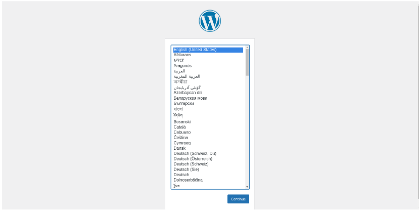

# Домашнее задание

## Деплой в k8s

## Цель:

> инсталляция k8s на виртуальные машины и скрипты автоматического деплоя конфигурации кластера веб портала из предыдущих занятий в k8s
> бэкап конфигурации кластера

### Описание/Пошаговая инструкция выполнения домашнего задания:

1. Инсталляция k8s на виртуальные машины и скрипты автоматического деплоя конфигурации кластера веб портала из предыдущих занятий в k8s;
2. Бэкап конфигурации кластера.


## Создание стенда


> Kubernetes кластер будем разворачивать с помощью Terraform, а все установки и настройки необходимых приложений будем реализовывать с помощью команд kubectl и
> helm.


> Установка kubectl с помощью встроенного пакетного менеджера:

```
# This overwrites any existing configuration in /etc/yum.repos.d/kubernetes.repo
cat <<EOF | sudo tee /etc/yum.repos.d/kubernetes.repo
[kubernetes]
name=Kubernetes
baseurl=https://pkgs.k8s.io/core:/stable:/v1.29/rpm/
enabled=1
gpgcheck=1
gpgkey=https://pkgs.k8s.io/core:/stable:/v1.29/rpm/repodata/repomd.xml.key
EOF
sudo dnf install -y kubectl
```

> Установка helm:

```
curl -LO https://get.helm.sh/helm-v3.13.3-linux-amd64.tar.gz
tar -xf ./helm-v3.13.3-linux-amd64.tar.gz
sudo mv ./linux-amd64/helm /usr/local/bin/
rm -rf ./helm-v3.13.3-linux-amd64.tar.gz ./linux-amd64/
```

> Для того чтобы развернуть kubernetes кластер, нужно выполнить следующую команду:

```
terraform apply -auto-approve
```

> В качестве балансировщика будем использовать Contour Ingress (https://projectcontour.io/):

```
kubectl apply -f https://projectcontour.io/quickstart/contour.yaml
```

> Установим mysql:

```
helm upgrade --install mysql ./Charts/mysql/ -f ./Charts/values.yaml
```

> Установим wordpress:

```
helm upgrade --install wordpress ./Charts/wordpress/ -f ./Charts/values.yaml
```

> С помощью следующей команды:

```
kubectl describe ingress wordpress-ingress
```

> получим публичный IP для доступа к веб-странице WordPress:

```
[user@rocky9 hw-12]$ kubectl describe ingress wordpress-ingress
Name:             wordpress-ingress
Labels:           app=wordpress
                  app.kubernetes.io/managed-by=Helm
Namespace:        default
Address:          158.160.133.132      # <--- Public IP address
Ingress Class:    contour
Default backend:  <default>
Rules:
  Host        Path  Backends
  ----        ----  --------
  *           
              /   wordpress-svc:80 (10.112.128.10:80,10.112.129.7:80)
Annotations:  meta.helm.sh/release-name: wordpress
              meta.helm.sh/release-namespace: default
Events:       <none>

```

> Полученный IP адрес вводим в адресной строке браузера, получим стартовую веб-страницу Wordpress:



> Можно сделать вывод, что развёрнутый kubernetes кластер работает должным образом.

> Информация о kubernetes кластере k8s-lab:

```
[user@rocky9 hw-12]$ kubectl cluster-info
Kubernetes control plane is running at https://158.160.19.24
CoreDNS is running at https://158.160.19.24/api/v1/namespaces/kube-system/services/kube-dns:dns/proxy
```

```
[user@rocky9 hw-12]$ yc managed-kubernetes cluster list --folder-name labfolder
+----------------------+---------+---------------------+---------+---------+-----------------------+-------------------+
|          ID          |  NAME   |     CREATED AT      | HEALTH  | STATUS  |   EXTERNAL ENDPOINT   | INTERNAL ENDPOINT |
+----------------------+---------+---------------------+---------+---------+-----------------------+-------------------+
| cata9c3gm1g3hcdth09e | k8s-lab | 2024-09-10 07:18:17 | HEALTHY | RUNNING | https://158.160.19.24 | https://10.1.0.33 |
+----------------------+---------+---------------------+---------+---------+-----------------------+-------------------+
```

> Информация о нодах kubernetes кластера:

```
[user@rocky9 hw-12]$ kubectl get nodes -o wide
NAME                        STATUS   ROLES    AGE   VERSION   INTERNAL-IP   EXTERNAL-IP   OS-IMAGE             KERNEL-VERSION      CONTAINER-RUNTIME
cl1mg330383d2ocabi8s-igyf   Ready    <none>   78m   v1.25.4   10.1.0.24     <none>        Ubuntu 20.04.6 LTS   5.4.0-165-generic   containerd://1.6.22
cl1mg330383d2ocabi8s-ocux   Ready    <none>   78m   v1.25.4   10.1.0.34     <none>        Ubuntu 20.04.6 LTS   5.4.0-165-generic   containerd://1.6.22
```

> Информация о группе безопасности:

```
[user@rocky9 hw-12]$ yc vpc security-group get --name k8s-public-services --folder-name labfolder
id: enp84ucdpovu1gv9chnq
folder_id: b1gul3kict74o0jbd6t9
created_at: "2024-09-10T07:18:16Z"
name: k8s-public-services
description: Правила группы разрешают подключение к сервисам из интернета. Примените правила только для групп узлов.
network_id: enpe1el9540smo09u8r5
status: ACTIVE
rules:
  - id: enpv8mjs1hmokqqv83t1
    description: Правило разрешает весь исходящий трафик. Узлы могут связаться с Yandex Container Registry, Yandex Object Storage, Docker Hub и т. д.
    direction: EGRESS
    ports:
      to_port: "65535"
    protocol_name: ANY
    protocol_number: "-1"
    cidr_blocks:
      v4_cidr_blocks:
        - 0.0.0.0/0
  - id: enp9oklk04q1tm3ldsmt
    description: Правило разрешает проверки доступности с диапазона адресов балансировщика нагрузки. Нужно для работы отказоустойчивого кластера Managed Service for Kubernetes и сервисов балансировщика.
    direction: INGRESS
    ports:
      to_port: "65535"
    protocol_name: TCP
    protocol_number: "6"
    predefined_target: loadbalancer_healthchecks
  - id: enp0din7ictpmf8divq0
    description: Правило разрешает входящий трафик из интернета на диапазон портов NodePort. Добавьте или измените порты на нужные вам.
    direction: INGRESS
    ports:
      from_port: "30000"
      to_port: "32767"
    protocol_name: TCP
    protocol_number: "6"
    cidr_blocks:
      v4_cidr_blocks:
        - 0.0.0.0/0
  - id: enp6j7uvridf2vb9l86j
    description: Правило разрешает взаимодействие под-под и сервис-сервис. Укажите подсети вашего кластера Managed Service for Kubernetes и сервисов.
    direction: INGRESS
    ports:
      to_port: "65535"
    protocol_name: ANY
    protocol_number: "-1"
    cidr_blocks:
      v4_cidr_blocks:
        - 10.1.0.0/16
  - id: enp8l5m8vqoqoqd5gtj1
    description: Правило разрешает взаимодействие мастер-узел и узел-узел внутри группы безопасности.
    direction: INGRESS
    ports:
      to_port: "65535"
    protocol_name: ANY
    protocol_number: "-1"
    predefined_target: self_security_group
  - id: enpbjj124jam524fkg5i
    description: Правило разрешает отладочные ICMP-пакеты из внутренних подсетей.
    direction: INGRESS
    protocol_name: ICMP
    protocol_number: "1"
    cidr_blocks:
      v4_cidr_blocks:
        - 10.0.0.0/8
        - 172.16.0.0/12
        - 192.168.0.0/16
  - id: enpqm1mjilvpjjj0d44l
    description: Правило разрешает входящий трафик из интернета на 80 порт для доступа к веб-странице WordPress. Добавьте или измените порты на нужные вам.
    direction: INGRESS
    ports:
      from_port: "80"
      to_port: "80"
    protocol_name: ANY
    protocol_number: "-1"
    cidr_blocks:
      v4_cidr_blocks:
        - 0.0.0.0/0
  - id: enptfq5amft9gte6m7go
    description: Правило разрешает входящий трафик из интернета на 443 порт для доступа к веб-странице WordPress. Добавьте или измените порты на нужные вам.
    direction: INGRESS
    ports:
      from_port: "443"
      to_port: "443"
    protocol_name: ANY
    protocol_number: "-1"
    cidr_blocks:
      v4_cidr_blocks:
        - 0.0.0.0/0
```

## Удаление стенда

> Удалить развернутый стенд командой:

```
terraform destroy -auto-approve
```