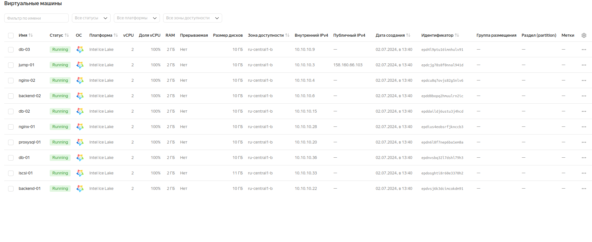
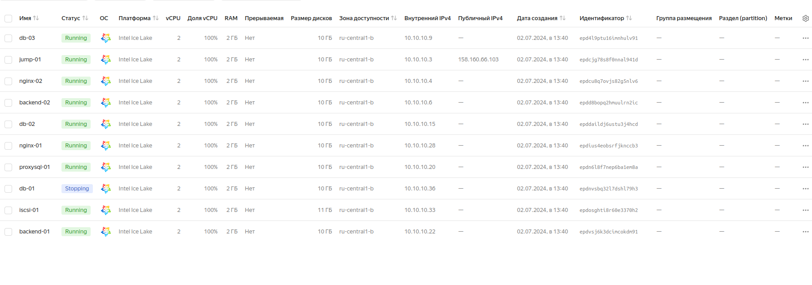
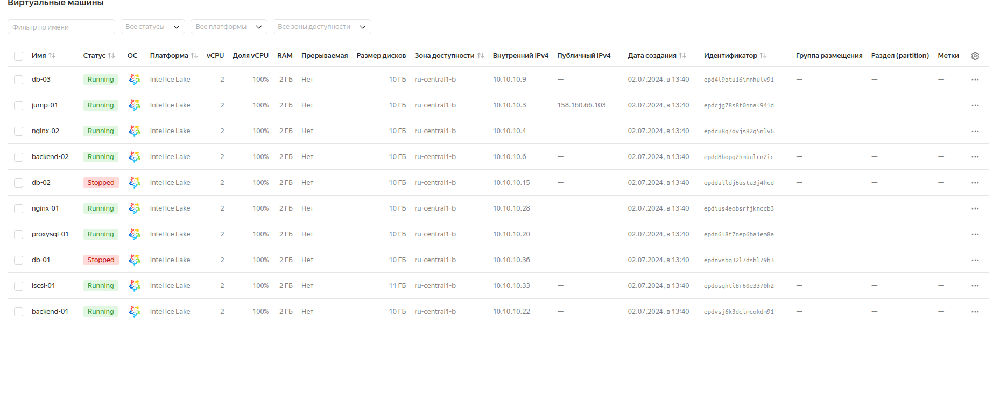
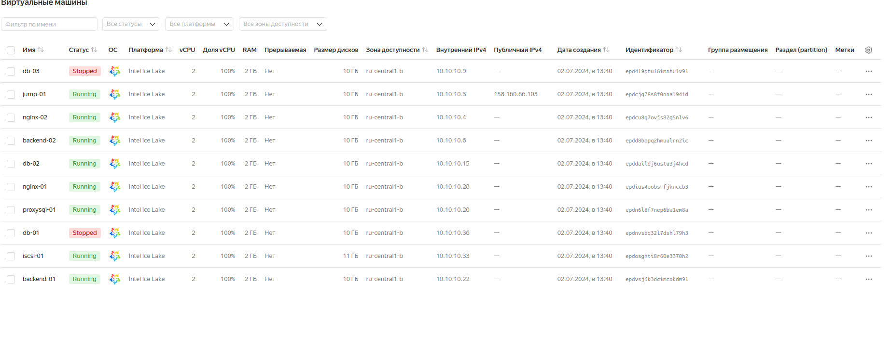

# Развернуть InnoDB или PXC кластер


## Цель:
> Перевести базу веб-проекта на один из вариантов кластера MySQL: Percona XtraDB Cluster или InnoDB Cluster.


## Описание/Пошаговая инструкция выполнения домашнего задания:

1. Разворачиваем отказоустойчивый кластер MySQL (PXC || Innodb) на ВМ или в докере любым способом
2. Создаем внутри кластера вашу БД для проекта


## Создание стенда

> Стенд будем разворачивать с помощью Terraform на YandexCloud, настройку серверов будем выполнять с помощью Ansible.


```
terraform apply -auto-approve

ansible-playbook ./provision.yml
```

> На всех серверах будут установлены ОС Almalinux 8, настроены смнхронизация времени Chrony, система принудительного контроля доступа SELinux, в качестве
> firewall будет использоваться NFTables.

> В стенд из keepalived_hw4 был добавлен кластер, состоящий из серверов db-01, db-02, db-03. Балансировщиком нагрузки для распределения пакетов между серверами
> кластера базы данных будет служить сервер proxysql-01, в котором установлено приложение ProxySQL2. Для создания кластера базы данных будем использовать
> Percona XtraDB Cluster.

> Так как на YandexCloud ограничено количество выделяемых публичных IP адресов, в дополнение к этому стенду создадим ещё один сервер jump-01 в качестве
> JumpHost, через который будем подключаться по SSH (в частности для Ansible) к другим серверам той же подсети.

> Список виртуальных машин после запуска стенда:



> С помощью ssh подключися к какому-либо сервера PXC кластера, например, db-03:

```
ssh -i ~/.ssh/otus -J cloud-user@158.160.66.103 cloud-user@10.10.10.9
```
> где: 158.160.66.103 IP адрес jump-01 (jumphost); 10.10.10.9 - IP адрес подключаемого сервера, в данном случае db-03.

> Посмотрим конфиги кластера:

```
+----------------------------------+------------------------------------------------------------------------------------------------------------------------------------------------+
| Variable_name                    | Value                                                                                                                                          |
+----------------------------------+------------------------------------------------------------------------------------------------------------------------------------------------+
| wsrep_local_state_uuid           | 1fe31171-771c-11ee-9fc1-c2dc179b4895                                                                                                           |
| wsrep_protocol_version           | 10                                                                                                                                             |
| wsrep_last_applied               | 22                                                                                                                                             |
| wsrep_last_committed             | 22                                                                                                                                             |
| wsrep_monitor_status (L/A/C)     | [ (41, 41), (22, 22), (22, 22) ]                                                                                                               |
| wsrep_replicated                 | 0                                                                                                                                              |
| wsrep_replicated_bytes           | 0                                                                                                                                              |
| wsrep_repl_keys                  | 0                                                                                                                                              |
| wsrep_repl_keys_bytes            | 0                                                                                                                                              |
| wsrep_repl_data_bytes            | 0                                                                                                                                              |
| wsrep_repl_other_bytes           | 0                                                                                                                                              |
| wsrep_received                   | 24                                                                                                                                             |
| wsrep_received_bytes             | 5391                                                                                                                                           |
| wsrep_local_commits              | 0                                                                                                                                              |
| wsrep_local_cert_failures        | 0                                                                                                                                              |
| wsrep_local_replays              | 0                                                                                                                                              |
| wsrep_local_send_queue           | 0                                                                                                                                              |
| wsrep_local_send_queue_max       | 1                                                                                                                                              |
| wsrep_local_send_queue_min       | 0                                                                                                                                              |
| wsrep_local_send_queue_avg       | 0                                                                                                                                              |
| wsrep_local_recv_queue           | 0                                                                                                                                              |
| wsrep_local_recv_queue_max       | 1                                                                                                                                              |
| wsrep_local_recv_queue_min       | 0                                                                                                                                              |
| wsrep_local_recv_queue_avg       | 0                                                                                                                                              |
| wsrep_local_cached_downto        | 5                                                                                                                                              |
| wsrep_flow_control_paused_ns     | 0                                                                                                                                              |
| wsrep_flow_control_paused        | 0                                                                                                                                              |
| wsrep_flow_control_sent          | 0                                                                                                                                              |
| wsrep_flow_control_recv          | 0                                                                                                                                              |
| wsrep_flow_control_active        | false                                                                                                                                          |
| wsrep_flow_control_requested     | false                                                                                                                                          |
| wsrep_flow_control_interval      | [ 173, 173 ]                                                                                                                                   |
| wsrep_flow_control_interval_low  | 173                                                                                                                                            |
| wsrep_flow_control_interval_high | 173                                                                                                                                            |
| wsrep_flow_control_status        | OFF                                                                                                                                            |
| wsrep_cert_deps_distance         | 1                                                                                                                                              |
| wsrep_apply_oooe                 | 0                                                                                                                                              |
| wsrep_apply_oool                 | 0                                                                                                                                              |
| wsrep_apply_window               | 1                                                                                                                                              |
| wsrep_apply_waits                | 1                                                                                                                                              |
| wsrep_commit_oooe                | 0                                                                                                                                              |
| wsrep_commit_oool                | 0                                                                                                                                              |
| wsrep_commit_window              | 1                                                                                                                                              |
| wsrep_local_state                | 4                                                                                                                                              |
| wsrep_local_state_comment        | Synced                                                                                                                                         |
| wsrep_cert_index_size            | 4                                                                                                                                              |
| wsrep_cert_bucket_count          | 7                                                                                                                                              |
| wsrep_gcache_pool_size           | 11264                                                                                                                                          |
| wsrep_causal_reads               | 0                                                                                                                                              |
| wsrep_cert_interval              | 0                                                                                                                                              |
| wsrep_open_transactions          | 0                                                                                                                                              |
| wsrep_open_connections           | 0                                                                                                                                              |
| wsrep_ist_receive_status         |                                                                                                                                                |
| wsrep_ist_receive_seqno_start    | 0                                                                                                                                              |
| wsrep_ist_receive_seqno_current  | 0                                                                                                                                              |
| wsrep_ist_receive_seqno_end      | 0                                                                                                                                              |
| wsrep_incoming_addresses         | 10.10.10.9:3306,10.10.10.12:3306,10.10.10.38:3306                                                                                             |
| wsrep_cluster_weight             | 3                                                                                                                                              |
| wsrep_desync_count               | 0                                                                                                                                              |
| wsrep_evs_delayed                |                                                                                                                                                |
| wsrep_evs_evict_list             |                                                                                                                                                |
| wsrep_evs_repl_latency           | 0/0/0/0/0                                                                                                                                      |
| wsrep_evs_state                  | OPERATIONAL                                                                                                                                    |
| wsrep_gcomm_uuid                 | 3c3463c8-771c-11ee-8dc7-6783ac61d9aa                                                                                                           |
| wsrep_gmcast_segment             | 0                                                                                                                                              |
| wsrep_cluster_capabilities       |                                                                                                                                                |
| wsrep_cluster_conf_id            | 5                                                                                                                                              |
| wsrep_cluster_size               | 3                                                                                                                                              |
| wsrep_cluster_state_uuid         | 1fe31171-771c-11ee-9fc1-c2dc179b4895                                                                                                           |
| wsrep_cluster_status             | Primary                                                                                                                                        |
| wsrep_connected                  | ON                                                                                                                                             |
| wsrep_local_bf_aborts            | 0                                                                                                                                              |
| wsrep_local_index                | 1                                                                                                                                              |
| wsrep_provider_capabilities      | :MULTI_MASTER:CERTIFICATION:PARALLEL_APPLYING:TRX_REPLAY:ISOLATION:PAUSE:CAUSAL_READS:INCREMENTAL_WRITESET:UNORDERED:PREORDERED:STREAMING:NBO: |
| wsrep_provider_name              | Galera                                                                                                                                         |
| wsrep_provider_vendor            | Codership Oy <info@codership.com> (modified by Percona <https://percona.com/>)                                                                 |
| wsrep_provider_version           | 4.15(6983fb2)                                                                                                                                  |
| wsrep_ready                      | ON                                                                                                                                             |
| wsrep_thread_count               | 9                                                                                                                                              |
+----------------------------------+------------------------------------------------------------------------------------------------------------------------------------------------+


```

> С помощью ssh подключися к серверу proxysql-01:
```
ssh -i ~/.ssh/otus -J cloud-user@158.160.66.103 cloud-user@10.10.10.20
Warning: Identity file /home/maikltim/.ssh/otus not accessible: No such file or directory.
Last login: Tue Jul  2 14:46:18 2024 from 10.10.10.3
[cloud-user@proxysql-01 ~]$ mysql -h 127.0.0.1 -P 6032 -e "SELECT * FROM mysql_servers;"
ERROR 1045 (28000): ProxySQL Error: Access denied for user 'cloud-user'@'127.0.0.1' (using password: NO)
[cloud-user@proxysql-01 ~]$ sudo -i
[root@proxysql-01 ~]# mysql -h 127.0.0.1 -P 6032 -e "SELECT * FROM mysql_servers;"
+--------------+-------------+------+-----------+--------+--------+-------------+-----------------+---------------------+---------+----------------+---------+
| hostgroup_id | hostname    | port | gtid_port | status | weight | compression | max_connections | max_replication_lag | use_ssl | max_latency_ms | comment |
+--------------+-------------+------+-----------+--------+--------+-------------+-----------------+---------------------+---------+----------------+---------+
| 0            | 10.10.10.36 | 3306 | 0         | ONLINE | 1      | 0           | 1000            | 0                   | 0       | 0              |         |
| 0            | 10.10.10.15 | 3306 | 0         | ONLINE | 1      | 0           | 1000            | 0                   | 0       | 0              |         |
| 0            | 10.10.10.9  | 3306 | 0         | ONLINE | 1      | 0           | 1000            | 0                   | 0       | 0              |         |
+--------------+-------------+------+-----------+--------+--------+-------------+-----------------+---------------------+---------+----------------+---------+
```


```
[root@proxysql-01 ~]# mysql -h 127.0.0.1 -P 6032 -e "SELECT * FROM global_variables WHERE variable_name LIKE 'mysql-monitor_%'"
Выводит на экран следующее:
+----------------------------------------------------------------------+-------------------+
| variable_name                                                        | variable_value    |
+----------------------------------------------------------------------+-------------------+
| mysql-monitor_enabled                                                | true              |
| mysql-monitor_connect_timeout                                        | 600               |
| mysql-monitor_ping_max_failures                                      | 3                 |
| mysql-monitor_ping_timeout                                           | 1000              |
| mysql-monitor_aws_rds_topology_discovery_interval                    | 1000              |
| mysql-monitor_read_only_max_timeout_count                            | 3                 |
| mysql-monitor_replication_lag_group_by_host                          | false             |
| mysql-monitor_replication_lag_interval                               | 10000             |
| mysql-monitor_replication_lag_timeout                                | 1000              |
| mysql-monitor_replication_lag_count                                  | 1                 |
| mysql-monitor_groupreplication_healthcheck_interval                  | 5000              |
| mysql-monitor_groupreplication_healthcheck_timeout                   | 800               |
| mysql-monitor_groupreplication_healthcheck_max_timeout_count         | 3                 |
| mysql-monitor_groupreplication_max_transactions_behind_count         | 3                 |
| mysql-monitor_groupreplication_max_transactions_behind_for_read_only | 1                 |
| mysql-monitor_galera_healthcheck_interval                            | 5000              |
| mysql-monitor_galera_healthcheck_timeout                             | 800               |
| mysql-monitor_galera_healthcheck_max_timeout_count                   | 3                 |
| mysql-monitor_replication_lag_use_percona_heartbeat                  |                   |
| mysql-monitor_query_interval                                         | 60000             |
| mysql-monitor_query_timeout                                          | 100               |
| mysql-monitor_slave_lag_when_null                                    | 60                |
| mysql-monitor_threads_min                                            | 8                 |
| mysql-monitor_threads_max                                            | 128               |
| mysql-monitor_threads_queue_maxsize                                  | 128               |
| mysql-monitor_local_dns_cache_ttl                                    | 300000            |
| mysql-monitor_local_dns_cache_refresh_interval                       | 60000             |
| mysql-monitor_local_dns_resolver_queue_maxsize                       | 128               |
| mysql-monitor_wait_timeout                                           | true              |
| mysql-monitor_writer_is_also_reader                                  | true              |
| mysql-monitor_username                                               | proxysql          |
| mysql-monitor_password                                               | proxysql@Otus1234 |
| mysql-monitor_history                                                | 600000            |
| mysql-monitor_connect_interval                                       | 60000             |
| mysql-monitor_ping_interval                                          | 10000             |
| mysql-monitor_read_only_interval                                     | 1500              |
| mysql-monitor_read_only_timeout                                      | 500               |
+----------------------------------------------------------------------+-------------------+
```

> Для проверки работы стенда воспользуемся отображением простой страницы собственноручно созданного сайта на PHP, имитирующий продажу новых и подержанных
> автомобилей:


> Значение IP адреса сайта получен от балансировщика от YandexCloud:


> При напонении сайта данные будут размещаться в базе данных кластера серверов db-01, db-02, db-03. На данном кластере, как и ранее заявлялось, установлено
> приложение Percona XtraDB Cluster. Заранее создана база данных 'cars', в котором созданы таблицы 'new' и 'used', имитирующие списки соответственно новых и
> подержанных автомобилей.

> Начнём наполнять этот сайт:


> Отключим одну виртуальную машину из кластера, например, db-01:


> Обновим страницу:


> Продолжим наполнять сайт:


> Как видим, сайт работает с отключенным сервером db-01.

> Отключим ещё одну виртуальную машину из кластера db-02:



> Обновим страницу:


> Как видим, сайт работает с отключенным серверами db-01 и db-02.

> Запускаем db-01 и отключаем виртуальную машину из кластера db-03:


> Как видим, сайт продолжает работать с отключенным серверами db-02 и db-03.

> Запустим db-02 и снова отключим db-01:



> Снова обновим страницу:


> Как мы наблюдаем, сайт продолжает работать с отключенным серверами db-01 и db-03.
> Мы провели все варианты отключения серверов, но сайт продолжает работать, значит созданный нами MySQL кластер выполняет свою функцию.

## Удаление стенда

> Удалить развернутый стенд командой:

```
terraform destroy -auto-approve
```