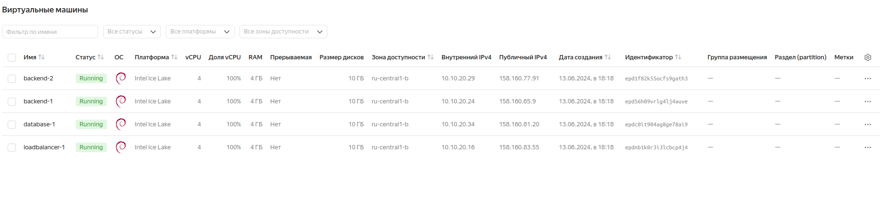
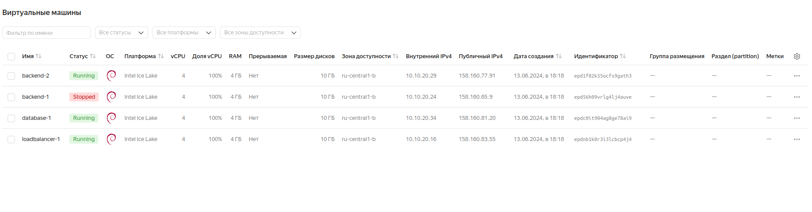
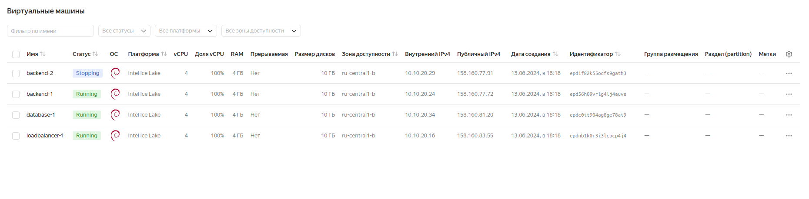

# Настраиваем балансировку веб-приложения

> Цель:
> научиться использовать Nginx в качестве балансировщика В результате получаем рабочий пример Nginx в качестве балансировщика, 
> и базовую отказоустойчивость бекенда.

1. Создать несколько инстансов с помощью терраформ (2 nginx, 2 backend, 1 db);

2. Развернуть nginx и keepalived на серверах nginx при помощи ansible

3. Развернуть бэкенд способный работать по uwsgi/unicorn/php-fpm и базой. (Можно взять что нибудь из Django) при помощи ansible.

4. Развернуть gfs2 для бэкенд серверах, для хранения статики

5. Развернуть бд для работы бэкенда при помощи ansbile

6. Развернуть бд для работы бэкенда при помощи ansbile


## Описание/Пошаговая инструкция выполнения домашнего задания:
> В работе должны применяться:

```
terraform
ansible
nginx;
uwsgi/unicorn/php-fpm;
некластеризованная бд mysql/mongodb/postgres/redis.-
```

### Выполнение домашнего задания

```
Сервер loadbalancer-1 будет служить балансировщиком для распределения пакетов между серверами backend-1 и backend-2. Для балансировки на сервере loadbalancer-1 будет использоватья приложение Nginx. Балансировку настроим в режиме Robin Round, с максимальном количеством ошибок - 2, и timeout - 90 секунд:

upstream backend {
        server {{ ip_address['backend-1'] }}:80 max_fails=2 fail_timeout=90s;
        server {{ ip_address['backend-2'] }}:80 max_fails=2 fail_timeout=90s;
}
```

```
Для проверки работы балансировщика loadbalancer-1 воспользуемся отображением в браузере веб-страниц, размещённых на серверах backend-1 и backend-2, где установлены php-fpm. Для хранения баз данных будет использоваться сервер database-1, но котором установлено приложение Percona server для MySQL.

На всех серверах будут использоваться ОС Debian 11.

Чтобы развернуть данную инфраструктуры запустим следующую команду:

terraform apply -auto-approve
```


```
terraform apply -auto-approve

Terraform used the selected providers to generate the following execution plan. Resource actions are indicated with the following symbols:
  + create

Terraform will perform the following actions:

  # local_file.group_vars_all_file will be created
  + resource "local_file" "group_vars_all_file" {
      + content              = (known after apply)
      + content_base64sha256 = (known after apply)
      + content_base64sha512 = (known after apply)
      + content_md5          = (known after apply)
      + content_sha1         = (known after apply)
      + content_sha256       = (known after apply)
      + content_sha512       = (known after apply)
      + directory_permission = "0777"
      + file_permission      = "0777"
      + filename             = "./group_vars/all/main.yml"
      + id                   = (known after apply)
    }

  # local_file.inventory_file will be created
  + resource "local_file" "inventory_file" {
      + content              = (known after apply)
      + content_base64sha256 = (known after apply)
      + content_base64sha512 = (known after apply)
      + content_md5          = (known after apply)
      + content_sha1         = (known after apply)
      + content_sha256       = (known after apply)
      + content_sha512       = (known after apply)
      + directory_permission = "0777"
      + file_permission      = "0777"
      + filename             = "./inventory.ini"
      + id                   = (known after apply)
    }

  # yandex_vpc_network.vpc will be created
  + resource "yandex_vpc_network" "vpc" {
      + created_at                = (known after apply)
      + default_security_group_id = (known after apply)
      + folder_id                 = (known after apply)
      + id                        = (known after apply)
      + labels                    = (known after apply)
      + name                      = "my_vpc_network"
      + subnet_ids                = (known after apply)
    }

  # yandex_vpc_subnet.subnet will be created
  + resource "yandex_vpc_subnet" "subnet" {
      + created_at     = (known after apply)
      + folder_id      = (known after apply)
      + id             = (known after apply)
      + labels         = (known after apply)
      + name           = "my_vpc_subnet"
      + network_id     = (known after apply)
      + v4_cidr_blocks = [
          + "10.10.20.0/24",
        ]
      + v6_cidr_blocks = (known after apply)
      + zone           = "ru-central1-b"
    }

  # module.backends[0].yandex_compute_instance.instances will be created
  + resource "yandex_compute_instance" "instances" {
      + created_at                = (known after apply)
      + folder_id                 = (known after apply)
      + fqdn                      = (known after apply)
      + gpu_cluster_id            = (known after apply)
      + hostname                  = "backend-1"
      + id                        = (known after apply)
      + maintenance_grace_period  = (known after apply)
      + maintenance_policy        = (known after apply)
      + metadata                  = {
          + "ssh-keys" = <<-EOT
                ubuntu:ssh-rsa AAAAB3NzaC1yc2EAAAADAQABAAABgQDHG326ChxLn4Frwc1Spg66bS+7gzVQ/H6RUOmqZyH0uwEGAyF3JHEQtMLNbWQmwc38a7zAg9OJWrpBFYuJSr1+lCGYc29E+PK83e66AkUaSFwGkM00eg0+r5YUVAIcwx7PW9t3wE7srAgsIC7Qe6EUlVkyPavYtffNQEFNTqolDqEG4M8+YsmesdG0zpGGuG/ZFIKoxRJLzMIkH/z3fjSp00VsCnz4aeF9K/pJaOJGmAvNLCISiYNMY/Yt7AQLkaC55uVc32sE/QfxPhrHfQmRoinWOe16L4ykvWsdkB0fn0pTUwX15LyTYp4C17dp8NgVLhDuaJLCc1sXz6E48mHE+pT+G0Z8JKB5vyKuItVWn1v6T1sgwMv7Ht0a+uN+cALhZOHkWAM1FzOcd2pjqaxmSjGo52V60g05UoYG3+p11gBCoVHNvx5yzO76rPZoGJd/KePCxcBqRXXYZbGc/4eYXw/VA/BxFKbg15NryUiTxu38x36IO/66iU+utk5gXl0= mikhail.timofeev@lgepartner.com
            EOT
        }
      + name                      = "backend-1"
      + network_acceleration_type = "standard"
      + platform_id               = "standard-v3"
      + service_account_id        = (known after apply)
      + status                    = (known after apply)
      + zone                      = "ru-central1-b"

      + boot_disk {
          + auto_delete = true
          + device_name = (known after apply)
          + disk_id     = (known after apply)
          + mode        = (known after apply)

          + initialize_params {
              + block_size  = (known after apply)
              + description = (known after apply)
              + image_id    = "fd83u9thmahrv9lgedrk"
              + name        = (known after apply)
              + size        = 10
              + snapshot_id = (known after apply)
              + type        = "network-ssd"
            }
        }

      + network_interface {
          + index              = (known after apply)
          + ip_address         = (known after apply)
          + ipv4               = true
          + ipv6               = (known after apply)
          + ipv6_address       = (known after apply)
          + mac_address        = (known after apply)
          + nat                = true
          + nat_ip_address     = (known after apply)
          + nat_ip_version     = (known after apply)
          + security_group_ids = (known after apply)
          + subnet_id          = (known after apply)
        }

      + resources {
          + core_fraction = 100
          + cores         = 4
          + memory        = 4
        }
    }

  # module.backends[1].yandex_compute_instance.instances will be created
  + resource "yandex_compute_instance" "instances" {
      + created_at                = (known after apply)
      + folder_id                 = (known after apply)
      + fqdn                      = (known after apply)
      + gpu_cluster_id            = (known after apply)
      + hostname                  = "backend-2"
      + id                        = (known after apply)
      + maintenance_grace_period  = (known after apply)
      + maintenance_policy        = (known after apply)
      + metadata                  = {
          + "ssh-keys" = <<-EOT
                ubuntu:ssh-rsa AAAAB3NzaC1yc2EAAAADAQABAAABgQDHG326ChxLn4Frwc1Spg66bS+7gzVQ/H6RUOmqZyH0uwEGAyF3JHEQtMLNbWQmwc38a7zAg9OJWrpBFYuJSr1+lCGYc29E+PK83e66AkUaSFwGkM00eg0+r5YUVAIcwx7PW9t3wE7srAgsIC7Qe6EUlVkyPavYtffNQEFNTqolDqEG4M8+YsmesdG0zpGGuG/ZFIKoxRJLzMIkH/z3fjSp00VsCnz4aeF9K/pJaOJGmAvNLCISiYNMY/Yt7AQLkaC55uVc32sE/QfxPhrHfQmRoinWOe16L4ykvWsdkB0fn0pTUwX15LyTYp4C17dp8NgVLhDuaJLCc1sXz6E48mHE+pT+G0Z8JKB5vyKuItVWn1v6T1sgwMv7Ht0a+uN+cALhZOHkWAM1FzOcd2pjqaxmSjGo52V60g05UoYG3+p11gBCoVHNvx5yzO76rPZoGJd/KePCxcBqRXXYZbGc/4eYXw/VA/BxFKbg15NryUiTxu38x36IO/66iU+utk5gXl0= mikhail.timofeev@lgepartner.com
            EOT
        }
      + name                      = "backend-2"
      + network_acceleration_type = "standard"
      + platform_id               = "standard-v3"
      + service_account_id        = (known after apply)
      + status                    = (known after apply)
      + zone                      = "ru-central1-b"

      + boot_disk {
          + auto_delete = true
          + device_name = (known after apply)
          + disk_id     = (known after apply)
          + mode        = (known after apply)

          + initialize_params {
              + block_size  = (known after apply)
              + description = (known after apply)
              + image_id    = "fd83u9thmahrv9lgedrk"
              + name        = (known after apply)
              + size        = 10
              + snapshot_id = (known after apply)
              + type        = "network-ssd"
            }
        }

      + network_interface {
          + index              = (known after apply)
          + ip_address         = (known after apply)
          + ipv4               = true
          + ipv6               = (known after apply)
          + ipv6_address       = (known after apply)
          + mac_address        = (known after apply)
          + nat                = true
          + nat_ip_address     = (known after apply)
          + nat_ip_version     = (known after apply)
          + security_group_ids = (known after apply)
          + subnet_id          = (known after apply)
        }

      + resources {
          + core_fraction = 100
          + cores         = 4
          + memory        = 4
        }
    }

  # module.databases[0].yandex_compute_instance.instances will be created
  + resource "yandex_compute_instance" "instances" {
      + created_at                = (known after apply)
      + folder_id                 = (known after apply)
      + fqdn                      = (known after apply)
      + gpu_cluster_id            = (known after apply)
      + hostname                  = "database-1"
      + id                        = (known after apply)
      + maintenance_grace_period  = (known after apply)
      + maintenance_policy        = (known after apply)
      + metadata                  = {
          + "ssh-keys" = <<-EOT
                ubuntu:ssh-rsa AAAAB3NzaC1yc2EAAAADAQABAAABgQDHG326ChxLn4Frwc1Spg66bS+7gzVQ/H6RUOmqZyH0uwEGAyF3JHEQtMLNbWQmwc38a7zAg9OJWrpBFYuJSr1+lCGYc29E+PK83e66AkUaSFwGkM00eg0+r5YUVAIcwx7PW9t3wE7srAgsIC7Qe6EUlVkyPavYtffNQEFNTqolDqEG4M8+YsmesdG0zpGGuG/ZFIKoxRJLzMIkH/z3fjSp00VsCnz4aeF9K/pJaOJGmAvNLCISiYNMY/Yt7AQLkaC55uVc32sE/QfxPhrHfQmRoinWOe16L4ykvWsdkB0fn0pTUwX15LyTYp4C17dp8NgVLhDuaJLCc1sXz6E48mHE+pT+G0Z8JKB5vyKuItVWn1v6T1sgwMv7Ht0a+uN+cALhZOHkWAM1FzOcd2pjqaxmSjGo52V60g05UoYG3+p11gBCoVHNvx5yzO76rPZoGJd/KePCxcBqRXXYZbGc/4eYXw/VA/BxFKbg15NryUiTxu38x36IO/66iU+utk5gXl0= mikhail.timofeev@lgepartner.com
            EOT
        }
      + name                      = "database-1"
      + network_acceleration_type = "standard"
      + platform_id               = "standard-v3"
      + service_account_id        = (known after apply)
      + status                    = (known after apply)
      + zone                      = "ru-central1-b"

      + boot_disk {
          + auto_delete = true
          + device_name = (known after apply)
          + disk_id     = (known after apply)
          + mode        = (known after apply)

          + initialize_params {
              + block_size  = (known after apply)
              + description = (known after apply)
              + image_id    = "fd83u9thmahrv9lgedrk"
              + name        = (known after apply)
              + size        = 10
              + snapshot_id = (known after apply)
              + type        = "network-ssd"
            }
        }

      + network_interface {
          + index              = (known after apply)
          + ip_address         = (known after apply)
          + ipv4               = true
          + ipv6               = (known after apply)
          + ipv6_address       = (known after apply)
          + mac_address        = (known after apply)
          + nat                = true
          + nat_ip_address     = (known after apply)
          + nat_ip_version     = (known after apply)
          + security_group_ids = (known after apply)
          + subnet_id          = (known after apply)
        }

      + resources {
          + core_fraction = 100
          + cores         = 4
          + memory        = 4
        }
    }

  # module.loadbalancers[0].yandex_compute_instance.instances will be created
  + resource "yandex_compute_instance" "instances" {
      + created_at                = (known after apply)
      + folder_id                 = (known after apply)
      + fqdn                      = (known after apply)
      + gpu_cluster_id            = (known after apply)
      + hostname                  = "loadbalancer-1"
      + id                        = (known after apply)
      + maintenance_grace_period  = (known after apply)
      + maintenance_policy        = (known after apply)
      + metadata                  = {
          + "ssh-keys" = <<-EOT
                ubuntu:ssh-rsa AAAAB3NzaC1yc2EAAAADAQABAAABgQDHG326ChxLn4Frwc1Spg66bS+7gzVQ/H6RUOmqZyH0uwEGAyF3JHEQtMLNbWQmwc38a7zAg9OJWrpBFYuJSr1+lCGYc29E+PK83e66AkUaSFwGkM00eg0+r5YUVAIcwx7PW9t3wE7srAgsIC7Qe6EUlVkyPavYtffNQEFNTqolDqEG4M8+YsmesdG0zpGGuG/ZFIKoxRJLzMIkH/z3fjSp00VsCnz4aeF9K/pJaOJGmAvNLCISiYNMY/Yt7AQLkaC55uVc32sE/QfxPhrHfQmRoinWOe16L4ykvWsdkB0fn0pTUwX15LyTYp4C17dp8NgVLhDuaJLCc1sXz6E48mHE+pT+G0Z8JKB5vyKuItVWn1v6T1sgwMv7Ht0a+uN+cALhZOHkWAM1FzOcd2pjqaxmSjGo52V60g05UoYG3+p11gBCoVHNvx5yzO76rPZoGJd/KePCxcBqRXXYZbGc/4eYXw/VA/BxFKbg15NryUiTxu38x36IO/66iU+utk5gXl0= mikhail.timofeev@lgepartner.com
            EOT
        }
      + name                      = "loadbalancer-1"
      + network_acceleration_type = "standard"
      + platform_id               = "standard-v3"
      + service_account_id        = (known after apply)
      + status                    = (known after apply)
      + zone                      = "ru-central1-b"

      + boot_disk {
          + auto_delete = true
          + device_name = (known after apply)
          + disk_id     = (known after apply)
          + mode        = (known after apply)

          + initialize_params {
              + block_size  = (known after apply)
              + description = (known after apply)
              + image_id    = "fd83u9thmahrv9lgedrk"
              + name        = (known after apply)
              + size        = 10
              + snapshot_id = (known after apply)
              + type        = "network-ssd"
            }
        }

      + network_interface {
          + index              = (known after apply)
          + ip_address         = (known after apply)
          + ipv4               = true
          + ipv6               = (known after apply)
          + ipv6_address       = (known after apply)
          + mac_address        = (known after apply)
          + nat                = true
          + nat_ip_address     = (known after apply)
          + nat_ip_version     = (known after apply)
          + security_group_ids = (known after apply)
          + subnet_id          = (known after apply)
        }

      + resources {
          + core_fraction = 100
          + cores         = 4
          + memory        = 4
        }
    }

Plan: 8 to add, 0 to change, 0 to destroy.

Changes to Outputs:
  + backends_info      = [
      + {
          + ip_address     = (known after apply)
          + name           = "backend-1"
          + nat_ip_address = (known after apply)
        },
      + {
          + ip_address     = (known after apply)
          + name           = "backend-2"
          + nat_ip_address = (known after apply)
        },
    ]
  + databases_info     = [
      + {
          + ip_address     = (known after apply)
          + name           = "database-1"
          + nat_ip_address = (known after apply)
        },
    ]
  + loadbalancers_info = [
      + {
          + ip_address     = (known after apply)
          + name           = "loadbalancer-1"
          + nat_ip_address = (known after apply)
        },
    ]
yandex_vpc_network.vpc: Creating...
yandex_vpc_network.vpc: Creation complete after 5s [id=enpq7rcgkppukp7c9jbl]
yandex_vpc_subnet.subnet: Creating...
yandex_vpc_subnet.subnet: Creation complete after 0s [id=e2lr1016orlfh4cn1foc]
module.backends[1].yandex_compute_instance.instances: Creating...
module.databases[0].yandex_compute_instance.instances: Creating...
module.loadbalancers[0].yandex_compute_instance.instances: Creating...
module.backends[0].yandex_compute_instance.instances: Creating...
module.backends[1].yandex_compute_instance.instances: Still creating... [10s elapsed]
module.databases[0].yandex_compute_instance.instances: Still creating... [10s elapsed]
module.backends[0].yandex_compute_instance.instances: Still creating... [10s elapsed]
module.loadbalancers[0].yandex_compute_instance.instances: Still creating... [10s elapsed]
module.databases[0].yandex_compute_instance.instances: Still creating... [20s elapsed]
module.backends[1].yandex_compute_instance.instances: Still creating... [20s elapsed]
module.backends[0].yandex_compute_instance.instances: Still creating... [20s elapsed]
module.loadbalancers[0].yandex_compute_instance.instances: Still creating... [20s elapsed]
module.backends[1].yandex_compute_instance.instances: Still creating... [30s elapsed]
module.databases[0].yandex_compute_instance.instances: Still creating... [30s elapsed]
module.backends[0].yandex_compute_instance.instances: Still creating... [30s elapsed]
module.loadbalancers[0].yandex_compute_instance.instances: Still creating... [30s elapsed]
module.backends[1].yandex_compute_instance.instances: Still creating... [40s elapsed]
module.databases[0].yandex_compute_instance.instances: Still creating... [40s elapsed]
module.backends[0].yandex_compute_instance.instances: Still creating... [40s elapsed]
module.loadbalancers[0].yandex_compute_instance.instances: Still creating... [40s elapsed]
module.databases[0].yandex_compute_instance.instances: Creation complete after 42s [id=epdc0it904ag8ge78ai9]
module.backends[1].yandex_compute_instance.instances: Creation complete after 42s [id=epd1f82k55ocfs9gath3]
module.loadbalancers[0].yandex_compute_instance.instances: Still creating... [50s elapsed]
module.backends[0].yandex_compute_instance.instances: Still creating... [50s elapsed]
module.backends[0].yandex_compute_instance.instances: Creation complete after 51s [id=epd56h09vrlg4lj4auve]
module.loadbalancers[0].yandex_compute_instance.instances: Still creating... [1m0s elapsed]
module.loadbalancers[0].yandex_compute_instance.instances: Creation complete after 1m3s [id=epdnb1k0r3i3lcbcp4j4]
local_file.group_vars_all_file: Creating...
local_file.inventory_file: Creating...
local_file.group_vars_all_file: Creation complete after 0s [id=f0b2a2d4721335f413114e52d27fe8b8b0c252d0]
local_file.inventory_file: Creation complete after 0s [id=36e3c534f337e2175dd5c3e1923bfe1cbd699a5c]

Apply complete! Resources: 8 added, 0 changed, 0 destroyed.

Outputs:

backends_info = [
  {
    "ip_address" = "10.10.20.24"
    "name" = "backend-1"
    "nat_ip_address" = "158.160.65.9"
  },
  {
    "ip_address" = "10.10.20.29"
    "name" = "backend-2"
    "nat_ip_address" = "158.160.77.91"
  },
]
databases_info = [
  {
    "ip_address" = "10.10.20.34"
    "name" = "database-1"
    "nat_ip_address" = "158.160.81.20"
  },
]
loadbalancers_info = [
  {
    "ip_address" = "10.10.20.16"
    "name" = "loadbalancer-1"
    "nat_ip_address" = "158.160.83.55"
  },
]
```
> Получим запущенные виртуальные машины:



> После запуска предыдущей команды terraform автоматически сгенерировал inventory файл, который понадобится для последующего запуска команды ansible:

```
cat ./inventory.ini
[all]
loadbalancer-1 ansible_host=158.160.83.55
backend-1 ansible_host=158.160.65.9
backend-2 ansible_host=158.160.77.91
database-1 ansible_host=158.160.81.20

[loadbalancers]
loadbalancer-1

[backends]
backend-1
backend-2

[databases]
database-1
```
> Далее для настройки этих виртуальных машин запустим ansible-playbook:

```
ansible-playbook -u debian --private-key ~/.ssh/id_rsa -b ./provision.yml

PLAY [all] *************************************************************************************************************************************************************************

TASK [Gathering Facts] *************************************************************************************************************************************************************
ok: [backend-1]
ok: [backend-2]
ok: [database-1]
ok: [loadbalancer-1]

TASK [chrony : Installing Chrony Debian] *******************************************************************************************************************************************
changed: [backend-2]
changed: [database-1]
changed: [backend-1]
changed: [loadbalancer-1]

TASK [chrony : Start Chrony Service Debian] ****************************************************************************************************************************************
ok: [backend-1]
ok: [loadbalancer-1]
ok: [backend-2]
ok: [database-1]

TASK [chrony : Set timezone to Europe/Moscow] **************************************************************************************************************************************
ERROR! The requested handler 'Restart Chrony Debian' was not found in either the main handlers list nor in the listening handlers list
maikltim@maikltim-HP-EliteDesk-800-G5-TWR:~/HighLoad_Systems_Otus/nginx_balancer_hw3$ 
maikltim@maikltim-HP-EliteDesk-800-G5-TWR:~/HighLoad_Systems_Otus/nginx_balancer_hw3$ ansible-playbook -u debian --private-key ~/.ssh/id_rsa -b ./provision.yml

PLAY [all] ********************************************************************************************************************************************************

TASK [Gathering Facts] ********************************************************************************************************************************************
ok: [loadbalancer-1]
ok: [backend-1]
ok: [backend-2]
ok: [database-1]

TASK [chrony : Installing Chrony Debian] **************************************************************************************************************************
ok: [backend-1]
ok: [loadbalancer-1]
ok: [backend-2]
ok: [database-1]

TASK [chrony : Start Chrony Service Debian] ***********************************************************************************************************************
ok: [loadbalancer-1]
ok: [backend-1]
ok: [backend-2]
ok: [database-1]

TASK [chrony : Set timezone to Europe/Moscow] *********************************************************************************************************************
ok: [backend-1]
ok: [loadbalancer-1]
ok: [backend-2]
ok: [database-1]

TASK [chrony : Installing Chrony RedHat] **************************************************************************************************************************
skipping: [loadbalancer-1]
skipping: [backend-1]
skipping: [backend-2]
skipping: [database-1]

TASK [chrony : Start Chronyd Service RedHat] **********************************************************************************************************************
skipping: [loadbalancer-1]
skipping: [backend-1]
skipping: [backend-2]
skipping: [database-1]

TASK [chrony : Set timezone to Europe/Moscow] *********************************************************************************************************************
skipping: [loadbalancer-1]
skipping: [backend-1]
skipping: [backend-2]
skipping: [database-1]

TASK [loadbalancers : Include nftables service] *******************************************************************************************************************
skipping: [backend-1]
skipping: [backend-2]
skipping: [database-1]
included: /home/maikltim/HighLoad_Systems_Otus/nginx_balancer_hw3/roles/loadbalancers/tasks/nftables.yml for loadbalancer-1

TASK [loadbalancers : Install nftables Debian] ********************************************************************************************************************
ok: [loadbalancer-1]

TASK [loadbalancers : Copy nftables.conf Debian] ******************************************************************************************************************
changed: [loadbalancer-1]

TASK [loadbalancers : Install nftables RedHat] ********************************************************************************************************************
skipping: [loadbalancer-1]

TASK [loadbalancers : Copy nftables.conf RedHat] ******************************************************************************************************************
skipping: [loadbalancer-1]

TASK [loadbalancers : Restart NFTables] ***************************************************************************************************************************
changed: [loadbalancer-1]

TASK [loadbalancers : Include sysctl config] **********************************************************************************************************************
skipping: [backend-1]
skipping: [backend-2]
skipping: [database-1]
included: /home/maikltim/HighLoad_Systems_Otus/nginx_balancer_hw3/roles/loadbalancers/tasks/sysctl.yml for loadbalancer-1

TASK [loadbalancers : Set ip forwarding on in /proc and verify token value with the sysctl command] ***************************************************************
changed: [loadbalancer-1]

TASK [loadbalancers : Include nginx service] **********************************************************************************************************************
skipping: [backend-1]
skipping: [backend-2]
skipping: [database-1]
included: /home/maikltim/HighLoad_Systems_Otus/nginx_balancer_hw3/roles/loadbalancers/tasks/nginx.yml for loadbalancer-1

TASK [loadbalancers : Install nginx Debian] ***********************************************************************************************************************
changed: [loadbalancer-1]

TASK [loadbalancers : Install nginx RedHat] ***********************************************************************************************************************
skipping: [loadbalancer-1]

TASK [loadbalancers : Template nginx config files] ****************************************************************************************************************
changed: [loadbalancer-1] => (item=conf.d/upstreams.conf)

TASK [loadbalancers : Copy file /etc/nginx/sites-available/default to upstreams] **********************************************************************************
changed: [loadbalancer-1]

TASK [loadbalancers : Insert line proxy_pass to /etc/nginx/sites-available/upstreams] *****************************************************************************
changed: [loadbalancer-1]

TASK [loadbalancers : Comment out the line /etc/nginx/sites-available/upstreams] **********************************************************************************
changed: [loadbalancer-1]

TASK [loadbalancers : Create a symbolic default link to /etc/nginx/sites-available/upstreams] *********************************************************************
changed: [loadbalancer-1]

TASK [loadbalancers : Start Nginx Service] ************************************************************************************************************************
changed: [loadbalancer-1]

TASK [backends : Include nftables service] ************************************************************************************************************************
skipping: [loadbalancer-1]
skipping: [database-1]
included: /home/maikltim/HighLoad_Systems_Otus/nginx_balancer_hw3/roles/backends/tasks/nftables.yml for backend-1, backend-2

TASK [backends : Install nftables Debian] *************************************************************************************************************************
ok: [backend-1]
ok: [backend-2]

TASK [backends : Copy nftables.conf Debian] ***********************************************************************************************************************
changed: [backend-1]
changed: [backend-2]

TASK [backends : Install nftables RedHat] *************************************************************************************************************************
skipping: [backend-1]
skipping: [backend-2]

TASK [backends : Copy nftables.conf RedHat] ***********************************************************************************************************************
skipping: [backend-1]
skipping: [backend-2]

TASK [backends : Restart NFTables] ********************************************************************************************************************************
changed: [backend-1]
changed: [backend-2]

TASK [backends : Include nginx service] ***************************************************************************************************************************
skipping: [loadbalancer-1]
skipping: [database-1]
included: /home/maikltim/HighLoad_Systems_Otus/nginx_balancer_hw3/roles/backends/tasks/nginx.yml for backend-1, backend-2

TASK [backends : Install nginx Debian] ****************************************************************************************************************************
changed: [backend-2]
changed: [backend-1]

TASK [backends : Install nginx RedHat] ****************************************************************************************************************************
skipping: [backend-1]
skipping: [backend-2]

TASK [backends : Template nginx config files] *********************************************************************************************************************
changed: [backend-1] => (item=sites-available/phpsite)
changed: [backend-2] => (item=sites-available/phpsite)

TASK [backends : Create a symbolic default link to /etc/nginx/sites-available/upstreams] **************************************************************************
changed: [backend-1]
changed: [backend-2]

TASK [backends : Start Nginx Service] *****************************************************************************************************************************
changed: [backend-1]
changed: [backend-2]

TASK [backends : Include php-fpm service] *************************************************************************************************************************
skipping: [loadbalancer-1]
skipping: [database-1]
included: /home/maikltim/HighLoad_Systems_Otus/nginx_balancer_hw3/roles/backends/tasks/php-fpm.yml for backend-1, backend-2

TASK [backends : Install PHP-FPM Debian] **************************************************************************************************************************
changed: [backend-2]
changed: [backend-1]

TASK [backends : Create html directory] ***************************************************************************************************************************
ok: [backend-1]
ok: [backend-2]

TASK [backends : Template php files] ******************************************************************************************************************************
changed: [backend-1] => (item=index.php)
changed: [backend-2] => (item=index.php)
changed: [backend-1] => (item=add.php)
changed: [backend-2] => (item=add.php)
changed: [backend-1] => (item=update.php)
changed: [backend-2] => (item=update.php)
changed: [backend-1] => (item=delete.php)
changed: [backend-2] => (item=delete.php)
changed: [backend-1] => (item=phpinfo.php)
changed: [backend-2] => (item=phpinfo.php)

TASK [backends : Start php-fpm service] ***************************************************************************************************************************
changed: [backend-1]
changed: [backend-2]

TASK [databases : Include nftables service] ***********************************************************************************************************************
skipping: [loadbalancer-1]
skipping: [backend-1]
skipping: [backend-2]
included: /home/maikltim/HighLoad_Systems_Otus/nginx_balancer_hw3/roles/databases/tasks/nftables.yml for database-1

TASK [databases : Install nftables debian] ************************************************************************************************************************
ok: [database-1]

TASK [databases : Copy nftables.conf debian] **********************************************************************************************************************
changed: [database-1]

TASK [databases : Install nftables redhat] ************************************************************************************************************************
skipping: [database-1]

TASK [databases : Copy nftables.conf redhat] **********************************************************************************************************************
skipping: [database-1]

TASK [databases : Restart NFTables] *******************************************************************************************************************************
changed: [database-1]

TASK [databases : Include mysql service] **************************************************************************************************************************
skipping: [loadbalancer-1]
skipping: [backend-1]
skipping: [backend-2]
included: /home/maikltim/HighLoad_Systems_Otus/nginx_balancer_hw3/roles/databases/tasks/percona.yml for database-1

TASK [databases : Install gnupg2 Debian] **************************************************************************************************************************
changed: [database-1]

TASK [databases : Install a .deb package from the internet Debian] ************************************************************************************************
changed: [database-1]

TASK [databases : Update apt cache] *******************************************************************************************************************************
changed: [database-1]

TASK [databases : percona-release setup ps80] *********************************************************************************************************************
changed: [database-1]

TASK [databases : Install percona-server-server] ******************************************************************************************************************
changed: [database-1]

TASK [databases : Copy .my.cnf file with root password credentials] ***********************************************************************************************
changed: [database-1]

TASK [databases : Update MySQL root password] *********************************************************************************************************************
changed: [database-1] => (item=database-1)
changed: [database-1] => (item=127.0.0.1)
changed: [database-1] => (item=localhost)

TASK [databases : Ensure anonymous users are not in the database] *************************************************************************************************
ok: [database-1] => (item=database-1)
ok: [database-1] => (item=localhost)

TASK [databases : remove test database] ***************************************************************************************************************************
ok: [database-1]

TASK [databases : Create fnv1a_64] ********************************************************************************************************************************
changed: [database-1]

TASK [databases : Create fnv_64] **********************************************************************************************************************************
changed: [database-1]

TASK [databases : Create murmur_hash] *****************************************************************************************************************************
changed: [database-1]

TASK [databases : Write custom server configuration] **************************************************************************************************************
changed: [database-1]

TASK [databases : Restart Percona service] ************************************************************************************************************************
changed: [database-1]

TASK [databases : Create application database] ********************************************************************************************************************
changed: [database-1]

TASK [databases : Copy SQL dump file to the server] ***************************************************************************************************************
changed: [database-1]

TASK [databases : Dump file into the database] ********************************************************************************************************************
changed: [database-1]

TASK [databases : Create Application user database] ***************************************************************************************************************
changed: [database-1]

TASK [databases : Create Application user database] ***************************************************************************************************************
changed: [database-1]

TASK [databases : Install a .rpm package from the internet RedHat] ************************************************************************************************
skipping: [database-1]

TASK [databases : Install percona-server-server-5.7 RedHat] *******************************************************************************************************
skipping: [database-1]

TASK [databases : Copy config files] ******************************************************************************************************************************
skipping: [database-1] => (item=01-base.cnf) 
skipping: [database-1] => (item=02-max-connections.cnf) 
skipping: [database-1] => (item=03-performance.cnf) 
skipping: [database-1] => (item=04-slow-query.cnf) 
skipping: [database-1] => (item=05-binlog.cnf) 

TASK [databases : Start MySQL service] ****************************************************************************************************************************
skipping: [database-1]

TASK [databases : Get temporary mysql root password] **************************************************************************************************************
skipping: [database-1]

TASK [databases : Update mysql root password] *********************************************************************************************************************
skipping: [database-1]

TASK [databases : data | Create mysql user 'phpadmin' for php site admin] *****************************************************************************************
skipping: [database-1]

TASK [databases : data | Grant php site admin for mysql user 'phpadmin'] ******************************************************************************************
skipping: [database-1]

TASK [databases : data | Restart MySQL service] *******************************************************************************************************************
skipping: [database-1]

TASK [databases : data | Upload database to mysql] ****************************************************************************************************************
skipping: [database-1]

PLAY RECAP ********************************************************************************************************************************************************
backend-1                  : ok=18   changed=9    unreachable=0    failed=0    skipped=11   rescued=0    ignored=0   
backend-2                  : ok=18   changed=9    unreachable=0    failed=0    skipped=11   rescued=0    ignored=0   
database-1                 : ok=28   changed=19   unreachable=0    failed=0    skipped=21   rescued=0    ignored=0   
loadbalancer-1             : ok=18   changed=10   unreachable=0    failed=0    skipped=11   rescued=0    ignored=0   

```

> Дл проверки работы балансировщика воспользуемся отображением простой страницы собственноручно созданного сайта на PHP, 
> имитирующий продажу новых и подержанных автомобилей:


> При напонении сайта данные будут размещаться на сервере database-1. На данном сервере установлено приложение MySQL от Percona. 
> Заранее создана база данных 'cars', в котором созданы таблицы 'new' и 'used', имитирующие списки соответственно новых и подержанных автомобилей.

> Начнём наполнять этот сайт:


> Отключим одну виртуальную машину, например, backend-1:



> Обновим страницу:


> Запустим сервер backend-1 и  остановим backend-2:



> Снова наполняем сайт:


> Как видим, сайт работает при отключении одного из backend-серверов.

> По ssh подключимся к серверу database-1:


```
ssh -i ~/.ssh/id_rsa debian@158.160.81.20
```

> чтобы проверить наличие заполненных таблиц MySQL new и used в базе данных cars:

```
root@database-1:~# mysql -e "SELECT * FROM cars.new"
+----+--------------+------+--------+
| id | name         | year | price  |
+----+--------------+------+--------+
|  6 | LADA         | 2024 | 500000 |
|  7 | honda civic  | 2010 | 360000 |
|  8 | toyota camry | 2011 | 600000 |
+----+--------------+------+--------+
```

> Как видим, таблицы заполнены.

> Убеждаемся, что балансировщик loadbalancer-1 корректно выполняет свою функцию при отключении одного из backend-серверов.