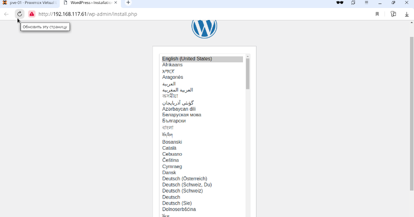

# proxmox

# Домашнее задание

## развертывание виртуальных машин на proxmox с помощью terraform

### Цель:

> terraform скрипты для развертывания виртуальных машин на проксмоксе


## Выполнение домашнего задания


> Обновим систему и установим необходимые пакеты:

```
apt update && apt install -y wget unzip git ansible && \
wget https://hashicorp-releases.yandexcloud.net/terraform/1.6.6/terraform_1.6.6_linux_amd64.zip && \
unzip -u terraform_1.6.6_linux_amd64.zip -d /bin/
```

> Укажем источник, из которого будет устанавливаться провайдер:

```
cat > ~/.terraform << EOF
provider_installation {
  network_mirror {
    url = "https://terraform-mirror.yandexcloud.net/"
    include = ["registry.terraform.io/*/*"]
  }
  direct {
    exclude = ["registry.terraform.io/*/*"]
  }
}
EOF
```

> При необходимости сгенерировать пару ssh ключей:

```
ssh-keygen -t rsa -b 4096 -f ~/.ssh/id_rsa -q
```

> Создадим новую роль 'TerraformProv':

```
pveum role add TerraformProv -privs \
"Datastore.AllocateSpace \
Datastore.Audit \
Pool.Allocate \
Sys.Audit \
Sys.Console \
Sys.Modify \
VM.Allocate \
VM.Audit \
VM.Clone \
VM.Config.CDROM \
VM.Config.Cloudinit \
VM.Config.CPU \
VM.Config.Disk \
VM.Config.HWType \
VM.Config.Memory \
VM.Config.Network \
VM.Config.Options \
VM.Migrate \
VM.Monitor \
VM.PowerMgmt \
SDN.Use"
```

> Создадим нового пользователя 'user':


```
pveum user add user@pve-01
```


> Сгенерируем токен для пользователя 'user':

```
root@pve-01:~# pveum user token add user@pve-01 terraform --privsep 0
┌──────────────┬──────────────────────────────────────┐
│ key          │ value                                │
╞══════════════╪══════════════════════════════════════╡
│ full-tokenid │ user@pve-01!terraform                │
├──────────────┼──────────────────────────────────────┤
│ info         │ {"privsep":"0"}                      │
├──────────────┼──────────────────────────────────────┤
│ value        │ 018fa057-9eda-400a-8351-3d8c715c6983 │
└──────────────┴──────────────────────────────────────┘
root@pve-01:~# 
```
> Добавим роль 'TerraformProv' только что созданному пользователю 'user':

```
pveum aclmod / -user user@pve-01 -role TerraformProv
```
> Скачаем образ:


```
wget http://cloud.debian.org/images/cloud/bookworm/latest/debian-12-generic-amd64.qcow2
```


> Создадим шаблон 'debian-12-generic-amd64', с которого в дальнейшем будем создавать (клонировать) виртуальные машины:

```
apt update -y && apt install libguestfs-tools -y && \
virt-customize -a debian-12-generic-amd64.qcow2 --install qemu-guest-agent && \
qm create 9000 --name "debian-12-generic-amd64" --memory 1024 --cores 2 --net0 virtio,bridge=vmbr0 && \
qm importdisk 9000 debian-12-generic-amd64.qcow2 local-lvm && \
qm set 9000 --scsihw virtio-scsi-pci --scsi0 local-lvm:vm-9000-disk-0 && \
qm set 9000 --boot c --bootdisk scsi0 && \
qm resize 9000 scsi0 +10G && \
qm set 9000 --ide2 local-lvm:cloudinit && \
qm set 9000 --serial0 socket --vga serial0 && \
qm set 9000 --agent enabled=1 && \
qm template 9000
```

> Скачиваем проект с гитхаба:

```
git clone https://github.com/maikltim/lab-10.git && cd ./proxmox_hw10
```

> В файле 'input.auto.tfvars' подставляем в параметры 'proxmox_api_token_id' и 'proxmox_api_token_secret' значения полученные при генерации токена для пользователя
> 'user'.

> При необходимости в файле main.tf вставить нужные 'ssh_public_key' и 'ssh_private_key', так как по умолчанию соответсвенно id_rsa.pub и id_rsa:

```
ssh_public_key  = "~/.ssh/id_rsa.pub"
ssh_private_key = "~/.ssh/id_rsa"
```

> Для того чтобы развернуть стенд, нужно выполнить следующую команду:

```
terraform init && terraform apply -auto-approve && \
sleep 60 && ansible-playbook ./provision.yml
```

> По завершению команды получим данные outputs:


```
Outputs:

bes-info = {
  "be-01" = {
    "ip_address" = "192.168.117.51"
  }
  "be-02" = {
    "ip_address" = "192.168.117.52"
  }
}
dbs-info = {
  "db-01" = {
    "ip_address" = "192.168.117.41"
  }
}
lbs-info = {
  "lb-01" = {
    "ip_address" = "192.168.117.61"
  }
}
```

> На всех серверах будут установлены ОС Debian 12, статические IP адреса, настроены смнхронизация времени Chrony, в качестве firewall будет использоваться NFTables.

> Стенд состоит из одного сервера с базой данных db-01, двух серверов-бэкендов be-01 и be-02, одного сервера-балансировщика lb-01. На сервере с базой данных db-01
> будут установлены Percona-server. На серверах-бэкендах be-01, be-02 будут установлены Nginx, PHP, WordPress. На сервере-балансировщике lb-01 будет установлен и
> настроен Nginx в режиме upstream.

> Список виртуальных машин после запуска стенда (в адресной строке браузера вводится IP адрес самого Proxmox сервера с указанием порта 8006, в нашем случае 192.168.
> 117.177:8006):


> Для проверки работы стенда вводим в адресной строке браузера IP адрес сервера-балансировщика lb-01 (в нашем случае 192.168.117.61):


> Остановим один из серверов-бэкендов, например, be-01:


> Обновим страницу в браузере и проверим:


> Как мы наблюдаем, сайт работает.

> Включим сервер be-01 и остановим be-02:


> Снова проверим:



> Как видим, сайт работает при отключении любого одного из бэкенд-серверов.

> Перезагрузим сам Proxmox сервер pve-01, чтобы убедиться, все виртуальные машины снова запустятся после загрузки системы самого Proxmox сервера:


> Список запущенных серверов:


> Обратить внимание, что uptime самого Proxmox сервера pve-01 равен 0:06:28.


> Проверим работу сайта:


> Как видим, всё работает, можно делать вывод, что развёрнутый и настроенный стенд на Proxmox сервере корректно выполняет свою функцию.

### Удаление стенда

> Удалить развернутый стенд командой:

```
terraform destroy -auto-approve
```

