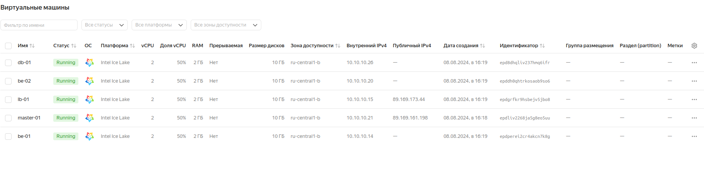

# Управление конфигурацией на несколько серверов


# Цель:


## настроить управление конфигурацией проекта ( предыдущее ДЗ) через salt

## Описание/Пошаговая инструкция выполнения домашнего задания:

1. добавить в проект salt server;
2. добавить на конечные ноды миньоны солта;
3. настроить управление конфигурацией nginx и iptables.

## Выполнение домашнего задания

> Стенд будем разворачивать с помощью Terraform на YandexCloud, настройку серверов будем выполнять с помощью Saltstack.

> Стенд состоит из salt-мастера master-01 и salt-миньонов: балансировщик lb-01, бэкендов be-01 и be-02, сервер хранения базы данных db-01.

> Инфраструктуру будем разворачивать с помощью Terraform, а все установки и настройки необходимых приложений будем полностью реализовывать с помощью 
> команд SaltStack.

> Для того чтобы развернуть стенд, нужно выполнить следующую команду:

```
terraform init

terraform apply -auto-approve
```

> Получаем:

```
Apply complete! Resources: 12 added, 0 changed, 0 destroyed.

Outputs:

bes-info = {
  "be-01" = {
    "ip_address" = tolist([
      "10.10.10.14",
    ])
    "nat_ip_address" = tolist([
      "",
    ])
  }
  "be-02" = {
    "ip_address" = tolist([
      "10.10.10.20",
    ])
    "nat_ip_address" = tolist([
      "",
    ])
  }
}
dbs-info = {
  "db-01" = {
    "ip_address" = tolist([
      "10.10.10.26",
    ])
    "nat_ip_address" = tolist([
      "",
    ])
  }
}
lbs-info = {
  "lb-01" = {
    "ip_address" = tolist([
      "10.10.10.15",
    ])
    "nat_ip_address" = tolist([
      "89.169.173.44",
    ])
  }
}
masters-info = {
  "master-01" = {
    "ip_address" = tolist([
      "10.10.10.21",
    ])
    "nat_ip_address" = tolist([
      "89.169.161.198",
    ])
  }
}
```

> Список виртуальных машин после запуска стенда:



> На всех серверах установлены ОС Almalinux 9. Приложения salt-master на мастере master-01 и salt-minion на всех миньонах lb-01, be-01, be-02, db-01, 
> а также на мастере master-01 (он также является и миньоном сам себе), автоматически устанавливаются и настраиваются с помощью cloud-init.


> Все последующие команды будем запускать от имени root. На мастер master-01 с помощью salt-ssh отправим следующую команду, чтобы убедиться, что на 
> мастере подключились необхлдимые ключи от миньонов:

> salt-ssh -i --priv=/home/user/.ssh/otus --sudo almalinux@89.169.161.198 cmd.run "salt-key -L"

> Получаем следующий вывод:

```
89.169.161.198:
    Accepted Keys:
    be-01
    be-02
    db-01
    lb-01
    master-01
    Denied Keys:
    Unaccepted Keys:
    Rejected Keys:
```

> Как видим, все ключи от миньонов приняты.

> Отправим с помощью salt-ssh на мастер master-01 команду для применения всех необходимых настроек на миньонах, а мастер, в свою очередь, с помощью salt 
> передаст эти команды миньонам:

```
salt-ssh -i --priv=/home/user/.ssh/otus --sudo almalinux@89.169.161.198 cmd.run "salt '*' state.apply"
```

> На всех серверах будут :
- настроена синхронизация времени Chrony,
- настроена система принудительного контроля доступа SELinux,
- открыты только необходимые порты (в качестве firewall используется NFTables): на мастере master-01 открыты порты 4505, 4506 для обмена сообщениями с      миньонами, а также порт 22 управления мастером с помощью команды salt-ssh; на балансировщике lb-01 открыты порты 80, 443, 8080 для доступа к сайту (worpress); на бэкендах be-01 и be-02 открыт порт 80 для связи с балансировщиком lb-01; на сервере баз данных db-01 открыт порт 3306 для доступа от бэкендов be-01 и be-02 к базе данных.
- установлены и настроены необходимые приложения: на балансировщике lb-01: nginx; бэкендах be-01 и be-02: nginx, php-fpm, wordpress; на сервере базы данных: percona-server

- на миньонах отключены сервисы sshd и закрыты порты 22.

> Посмотрим правила nftables на всех серверах:

```[root@rocky ~]# salt-ssh -i --priv=/home/user/.ssh/otus --sudo almalinux@89.169.161.198 cmd.run "salt '*' cmd.run 'nft list ruleset'"
84.201.155.81:
    be-01:
        table ip filter {
        	chain NGINX_INP {
        		ip saddr 10.10.10.15 tcp dport 80 ct state new counter packets 3 bytes 180 accept
        	}
        
        	chain INPUT {
        		type filter hook input priority filter; policy drop;
        		ct state invalid counter packets 0 bytes 0 drop
        		iifname "lo" counter packets 0 bytes 0 accept
        		ct state established,related counter packets 4398 bytes 31580438 accept
        		counter packets 15 bytes 6768 jump NGINX_INP
        	}
        
        	chain FORWARD {
        		type filter hook forward priority filter; policy drop;
        	}
        
        	chain OUTPUT {
        		type filter hook output priority filter; policy drop;
        		ct state established,related,new counter packets 3334 bytes 395041 accept
        	}
        }
    lb-01:
        table ip filter {
        	chain NGINX_INP {
        		tcp dport { 80, 443, 8080 } ct state new counter packets 2948 bytes 153684 accept
        	}
        
        	chain INPUT {
        		type filter hook input priority filter; policy drop;
        		ct state invalid counter packets 1 bytes 60 drop
        		iifname "lo" counter packets 0 bytes 0 accept
        		ct state established,related counter packets 625 bytes 3159297 accept
        		counter packets 3490 bytes 183727 jump NGINX_INP
        	}
        
        	chain FORWARD {
        		type filter hook forward priority filter; policy drop;
        	}
        
        	chain OUTPUT {
        		type filter hook output priority filter; policy drop;
        		ct state established,related,new counter packets 3577 bytes 207620 accept
        	}
        }
    master-01:
        table ip filter {
        	chain SALT_INP {
        		ip saddr 10.10.10.16 tcp dport { 4505, 4506 } ct state new counter packets 12 bytes 14672 accept
        		ip saddr 10.10.10.8 tcp dport { 4505, 4506 } ct state new counter packets 13 bytes 14724 accept
        		ip saddr 10.10.10.31 tcp dport { 4505, 4506 } ct state new counter packets 10 bytes 13501 accept
        		ip saddr 10.10.10.15 tcp dport { 4505, 4506 } ct state new counter packets 13 bytes 12286 accept
        		ip saddr 10.10.10.5 tcp dport { 4505, 4506 } ct state new counter packets 0 bytes 0 accept
        	}
        
        	chain INPUT {
        		type filter hook input priority filter; policy drop;
        		ct state invalid counter packets 2 bytes 80 drop
        		iifname "lo" counter packets 70 bytes 9316 accept
        		tcp dport 22 ct state new counter packets 248 bytes 14820 accept
        		ct state established,related counter packets 3985 bytes 1020183 accept
        		counter packets 560 bytes 77223 jump SALT_INP
        	}
        
        	chain FORWARD {
        		type filter hook forward priority filter; policy drop;
        	}
        
        	chain OUTPUT {
        		type filter hook output priority filter; policy drop;
        		ct state established,related,new counter packets 4103 bytes 732235 accept
        	}
        }
    be-02:
        table ip filter {
        	chain NGINX_INP {
        		ip saddr 10.10.10.15 tcp dport 80 ct state new counter packets 3 bytes 180 accept
        	}
        
        	chain INPUT {
        		type filter hook input priority filter; policy drop;
        		ct state invalid counter packets 0 bytes 0 drop
        		iifname "lo" counter packets 0 bytes 0 accept
        		ct state established,related counter packets 4373 bytes 31585875 accept
        		counter packets 15 bytes 6768 jump NGINX_INP
        	}
        
        	chain FORWARD {
        		type filter hook forward priority filter; policy drop;
        	}
        
        	chain OUTPUT {
        		type filter hook output priority filter; policy drop;
        		ct state established,related,new counter packets 3154 bytes 401498 accept
        	}
        }
    db-01:
        table ip filter {
        	chain MYSQL_INP {
        		ip saddr 10.10.10.16 tcp dport 3306 ct state new counter packets 3 bytes 180 accept
        		ip saddr 10.10.10.8 tcp dport 3306 ct state new counter packets 3 bytes 180 accept
        	}
        
        	chain INPUT {
        		type filter hook input priority filter; policy drop;
        		ct state invalid counter packets 0 bytes 0 drop
        		iifname "lo" counter packets 0 bytes 0 accept
        		ct state established,related counter packets 13226 bytes 87417919 accept
        		counter packets 18 bytes 6948 jump MYSQL_INP
        	}
        
        	chain FORWARD {
        		type filter hook forward priority filter; policy drop;
        	}
        
        	chain OUTPUT {
        		type filter hook output priority filter; policy drop;
        		ct state established,related,new counter packets 10168 bytes 584245 accept
        	}
        }
```

> Указанные ip адреса серверов регулируются с помощью jinja, например конфигурационный файл nftables сервера базы данных db-01:


```
#!/usr/sbin/nft -f

flush ruleset

table ip filter {

        chain MYSQL_INP {

                ip saddr {{ addrs[0] }} tcp dport {{ pillar['mysql_port'] }} ct state new counter accept

        }
        chain INPUT {
                type filter hook input priority filter; policy drop;
                ct state invalid counter drop
                iifname "lo" counter accept
                #tcp dport 22 ct state new counter accept
                ct state established,related counter accept
                counter jump MYSQL_INP
        }

        chain FORWARD {
                type filter hook forward priority filter; policy drop;
        }

        chain OUTPUT {
                type filter hook output priority filter; policy drop;
                ct state established,related,new counter accept
        }
}
```

> Таким же образом динамически изменяются ip адреса в конфигурационных файлах nginx в балансировщике lb-01, в данном случае upstream.conf.jinja:

```
upstream @backend {

        server {{ addrs[0] }}:80 max_fails=1;

}
```

> Убедимся, что на всех миньонах, кроме мастера, не включены сервисы sshd:

```
[root@rocky ~]# salt-ssh -i --priv=/home/user/.ssh/otus --sudo almalinux@89.169.161.198 cmd.run "salt '*' cmd.run 'systemctl is-enabled sshd'"
84.201.155.81:
    be-01:
        disabled
    lb-01:
        disabled
    master-01:
        enabled
    be-02:
        disabled
    db-01:
        disabled
```

> и не запущены сервисы sshd:

```
[root@rocky ~]# salt-ssh -i --priv=/home/user/.ssh/otus --sudo almalinux@89.169.161.198 cmd.run "salt '*' cmd.run 'systemctl is-active sshd'"
84.201.155.81:
    be-01:
        inactive
    lb-01:
        inactive
    master-01:
        active
    db-01:
        inactive
    be-02:
        inactive
```

> Проверяем работу сайта на wordpress, вставив в адресную строку браузера публичный ip адресс балансировщика lb-01:


> Можно сделать вывод, что развёрнутая система, настроенная с помощью команд SaltStack, работает должным образом.


## Удаление стенда

> Удалить развернутый стенд командой:

```
terraform destroy -auto-approve
```