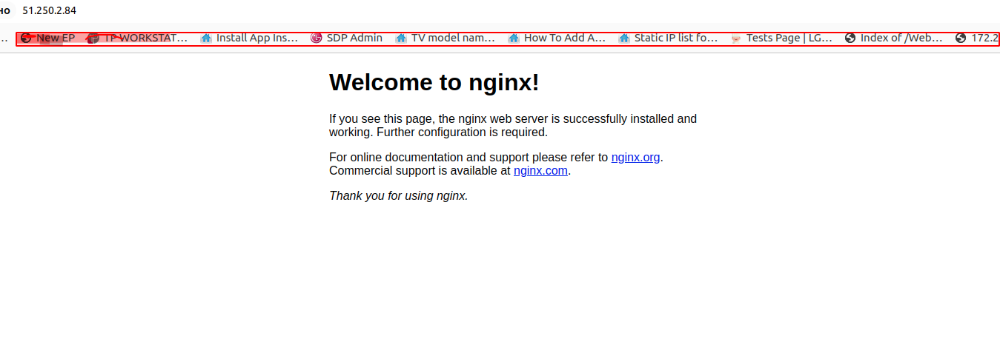

# HW 1

## Создать Terraform скрипт

## Цель:

### Описание/Пошаговая инструкция выполнения домашнего задания:

### Необходимо: 

1. реализовать терраформ для разворачивания одной виртуалки в yandex-cloud
2. запровиженить nginx с помощью ansible


## Выполнение домашнего задания

1. создадим каталог ***otus-highload***
2. проверим установлен ли terraform 

```
Terraform v1.8.3
on linux_amd64

Your version of Terraform is out of date! The latest version
```

3. создадим файл .gitignore 

```
Это делается для того чтобы файлы, содержащие значения переменных не будут 
отправлены в удаленный репозиторий. Это делается для того, чтобы случайно 
не передать туда пароли и другую секретную информацию, которая может 
содержаться в этих файлах.
*.tfvars
*.auto.tfvars
```

4. виртуальные сети
```
Сначала создадим виртуальную сеть.
Для этого мы будем использовать файл network.tf

resource "yandex_vpc_network" "this" {
  name = "vpc-network"
}

resource "yandex_vpc_subnet" "this" {
  name = "vpc-subnet"
  v4_cidr_blocks = ["10.10.0.0/16"]
  zone           = "ru-central1-a"
  network_id     = yandex_vpc_network.this.id
}
```


5. виртуальная машина
```
Создадим файл main.tf
locals { 
  user            = "debian"
  ssh_private_key = "~/.ssh/id_rsa"
}

resource "yandex_compute_instance" "this" {
  name = "test"
  platform_id = "standard-v1"
  zone = "ru-central1-a"

  resources {
    cores  = 2
    memory = 4
  }

  boot_disk {
    initialize_params {
      image_id = "fd83u9thmahrv9lgedrk"
      size = 10
    }
  }

  network_interface {
    subnet_id = yandex_vpc_subnet.this.id
    nat       = true
  }

  metadata = {
    ssh-keys = "ubuntu:${file("~/.ssh/id_rsa.pub")}"
  }


provisioner "remote-exec" {
      inline = ["echo It is alive!"]
  
      connection {
        host        = self.network_interface.0.nat_ip_address
        type        = "ssh"
        user        = local.user
        private_key = file(local.ssh_private_key)
        #agent       = true
      }
  }

  provisioner "local-exec" {
    command = "ansible-playbook -u '${local.user}' --private-key '${local.ssh_private_key}' --become -i '${self.network_interface.0.nat_ip_address},' ansible/playbook.yml"

    environment = {
      ANSIBLE_HOST_KEY_CHECKING = "False"
    }

  }

}
```

6. создадим файл provider.tf 
```
provider "yandex" {
  token     = var.yc_token
  cloud_id  = var.yc_cloud
  folder_id = var.yc_folder
}

terraform {
  required_providers {
    yandex = {
      source = "yandex-cloud/yandex"
    }
  }
  required_version = ">= 0.13"
}
```

7. создадим файл variables.tf
```
variable "yc_cloud" {
  type = string
  description = "Yandex Cloud ID"
}

variable "yc_folder" {
  type = string
  description = "Yandex Cloud folder"
}

variable "yc_token" {
  type = string
  description = "Yandex Cloud OAuth token"
}
```

8. содадим файл outputs.tf, для вывода public_ip
```
output "public_ip" {
  description = "Public IP address for instance"
  value = yandex_compute_instance.this.network_interface.0.nat_ip_address
}
```

9. Для инициализации проекта запустим команду:
```
terraform init
```

10. Следующей командой увидим план предстоящего выполнения проекта:
```
terraform plan
```
11. создадим паппку ansible с ролью nginx

> Добавим provision ansible для автоматической установки в ВМ сервиса nginx.
> В файл main.tf добавим следующие блоки:
```
provisioner "remote-exec" {
      inline = ["echo It is alive!"]
  
      connection {
        host        = self.network_interface.0.nat_ip_address
        type        = "ssh"
        user        = local.user
        private_key = file(local.ssh_private_key)
        #agent       = true
      }
  }

  provisioner "local-exec" {
    command = "ansible-playbook -u '${local.user}' --private-key '${local.ssh_private_key}' --become -i '${self.network_interface.0.nat_ip_address},' ansible/playbook.yml"

    environment = {
      ANSIBLE_HOST_KEY_CHECKING = "False"
    }
  }
```

> Создадим playbook файл provision.yml:
```
---

- name: Install Nginx
  hosts: all
  become: true
  
  roles:
    - nginx
```

> Для роли nginx создадим playbook файл ./ansible/nginx/tasks/main.ym
```
---
- name: Debian OS
  block:

  # apt install nginx -y
  - name: Ensure Nginx is at the latest version
    ansible.builtin.apt:
      name:
        - nginx
      state: latest
      update_cache: yes

  # systemctl enable nginx --now
  - name: Start Nginx Service
    ansible.builtin.systemd:
      name: nginx
      state: started
      enabled: yes

  when: ansible_os_family == "Debian"

- name: Redhat OS
  block:

  # dnf install chrony -y
  - name: Ensure Nginx is at the latest version
    ansible.builtin.yum:
      name:
        - nginx
      state: latest
      enabled: yes

  # systemctl enable nginx --now
  - name: Start Nginx Service
    ansible.builtin.systemd:
      name: nginx
      state: started
      enabled: yes

  when: ansible_os_family == "RedHat"
```
> Создадим ansible конфиг файл ansible.cfg:

```
[defaults]
host_key_checking = False
```

12. Теперь выполним проект с помощью следующей команды

```
terraform apply --auto-approve

Terraform used the selected providers to generate the following execution plan. Resource actions are indicated with the following symbols:
  + create

Terraform will perform the following actions:

  # yandex_compute_instance.this will be created
  + resource "yandex_compute_instance" "this" {
      + created_at                = (known after apply)
      + folder_id                 = (known after apply)
      + fqdn                      = (known after apply)
      + gpu_cluster_id            = (known after apply)
      + hostname                  = (known after apply)
      + id                        = (known after apply)
      + maintenance_grace_period  = (known after apply)
      + maintenance_policy        = (known after apply)
      + metadata                  = {
          + "ssh-keys" = <<-EOT
                ubuntu:ssh-rsa AAAAB3NzaC1yc2EAAAADAQABAAABgQDHG326ChxLn4Frwc1Spg66bS+7gzVQ/H6RUOmqZyH0uwEGAyF3JHEQtMLNbWQmwc38a7zAg9OJWrpBFYuJSr1+lCGYc29E+PK83e66AkUaSFwGkM00eg0+r5YUVAIcwx7PW9t3wE7srAgsIC7Qe6EUlVkyPavYtffNQEFNTqolDqEG4M8+YsmesdG0zpGGuG/ZFIKoxRJLzMIkH/z3fjSp00VsCnz4aeF9K/pJaOJGmAvNLCISiYNMY/Yt7AQLkaC55uVc32sE/QfxPhrHfQmRoinWOe16L4ykvWsdkB0fn0pTUwX15LyTYp4C17dp8NgVLhDuaJLCc1sXz6E48mHE+pT+G0Z8JKB5vyKuItVWn1v6T1sgwMv7Ht0a+uN+cALhZOHkWAM1FzOcd2pjqaxmSjGo52V60g05UoYG3+p11gBCoVHNvx5yzO76rPZoGJd/KePCxcBqRXXYZbGc/4eYXw/VA/BxFKbg15NryUiTxu38x36IO/66iU+utk5gXl0= mikhail.timofeev@lgepartner.com
            EOT
        }
      + name                      = "test"
      + network_acceleration_type = "standard"
      + platform_id               = "standard-v1"
      + service_account_id        = (known after apply)
      + status                    = (known after apply)
      + zone                      = "ru-central1-a"

      + boot_disk {
          + auto_delete = true
          + device_name = (known after apply)
          + disk_id     = (known after apply)
          + mode        = (known after apply)

          + initialize_params {
              + block_size  = (known after apply)
              + description = (known after apply)
              + image_id    = "fd83u9thmahrv9lgedrk"
              + name        = (known after apply)
              + size        = 10
              + snapshot_id = (known after apply)
              + type        = "network-hdd"
            }
        }

      + network_interface {
          + index              = (known after apply)
          + ip_address         = (known after apply)
          + ipv4               = true
          + ipv6               = (known after apply)
          + ipv6_address       = (known after apply)
          + mac_address        = (known after apply)
          + nat                = true
          + nat_ip_address     = (known after apply)
          + nat_ip_version     = (known after apply)
          + security_group_ids = (known after apply)
          + subnet_id          = (known after apply)
        }

      + resources {
          + core_fraction = 100
          + cores         = 2
          + memory        = 4
        }
    }

  # yandex_vpc_network.this will be created
  + resource "yandex_vpc_network" "this" {
      + created_at                = (known after apply)
      + default_security_group_id = (known after apply)
      + folder_id                 = (known after apply)
      + id                        = (known after apply)
      + labels                    = (known after apply)
      + name                      = "vpc-network"
      + subnet_ids                = (known after apply)
    }

  # yandex_vpc_subnet.this will be created
  + resource "yandex_vpc_subnet" "this" {
      + created_at     = (known after apply)
      + folder_id      = (known after apply)
      + id             = (known after apply)
      + labels         = (known after apply)
      + name           = "vpc-subnet"
      + network_id     = (known after apply)
      + v4_cidr_blocks = [
          + "10.10.0.0/16",
        ]
      + v6_cidr_blocks = (known after apply)
      + zone           = "ru-central1-a"
    }

Plan: 3 to add, 0 to change, 0 to destroy.

Changes to Outputs:
  + public_ip = (known after apply)
yandex_vpc_network.this: Creating...
yandex_vpc_network.this: Creation complete after 4s [id=enpdr2rt9f2vdr3nk9ru]
yandex_vpc_subnet.this: Creating...
yandex_vpc_subnet.this: Creation complete after 1s [id=e9b59m7uqrfpujsqu8dp]
yandex_compute_instance.this: Creating...
yandex_compute_instance.this: Still creating... [10s elapsed]
yandex_compute_instance.this: Still creating... [20s elapsed]
yandex_compute_instance.this: Still creating... [30s elapsed]
yandex_compute_instance.this: Still creating... [40s elapsed]
yandex_compute_instance.this: Still creating... [50s elapsed]
yandex_compute_instance.this: Provisioning with 'remote-exec'...
yandex_compute_instance.this (remote-exec): Connecting to remote host via SSH...
yandex_compute_instance.this (remote-exec):   Host: 51.250.2.84
yandex_compute_instance.this (remote-exec):   User: debian
yandex_compute_instance.this (remote-exec):   Password: false
yandex_compute_instance.this (remote-exec):   Private key: true
yandex_compute_instance.this (remote-exec):   Certificate: false
yandex_compute_instance.this (remote-exec):   SSH Agent: true
yandex_compute_instance.this (remote-exec):   Checking Host Key: false
yandex_compute_instance.this (remote-exec):   Target Platform: unix
yandex_compute_instance.this: Still creating... [1m0s elapsed]
yandex_compute_instance.this: Still creating... [1m10s elapsed]
yandex_compute_instance.this (remote-exec): Connecting to remote host via SSH...
yandex_compute_instance.this (remote-exec):   Host: 51.250.2.84
yandex_compute_instance.this (remote-exec):   User: debian
yandex_compute_instance.this (remote-exec):   Password: false
yandex_compute_instance.this (remote-exec):   Private key: true
yandex_compute_instance.this (remote-exec):   Certificate: false
yandex_compute_instance.this (remote-exec):   SSH Agent: true
yandex_compute_instance.this (remote-exec):   Checking Host Key: false
yandex_compute_instance.this (remote-exec):   Target Platform: unix
yandex_compute_instance.this (remote-exec): Connecting to remote host via SSH...
yandex_compute_instance.this (remote-exec):   Host: 51.250.2.84
yandex_compute_instance.this (remote-exec):   User: debian
yandex_compute_instance.this (remote-exec):   Password: false
yandex_compute_instance.this (remote-exec):   Private key: true
yandex_compute_instance.this (remote-exec):   Certificate: false
yandex_compute_instance.this (remote-exec):   SSH Agent: true
yandex_compute_instance.this (remote-exec):   Checking Host Key: false
yandex_compute_instance.this (remote-exec):   Target Platform: unix
yandex_compute_instance.this (remote-exec): Connecting to remote host via SSH...
yandex_compute_instance.this (remote-exec):   Host: 51.250.2.84
yandex_compute_instance.this (remote-exec):   User: debian
yandex_compute_instance.this (remote-exec):   Password: false
yandex_compute_instance.this (remote-exec):   Private key: true
yandex_compute_instance.this (remote-exec):   Certificate: false
yandex_compute_instance.this (remote-exec):   SSH Agent: true
yandex_compute_instance.this (remote-exec):   Checking Host Key: false
yandex_compute_instance.this (remote-exec):   Target Platform: unix
yandex_compute_instance.this (remote-exec): Connected!
yandex_compute_instance.this: Still creating... [1m20s elapsed]
yandex_compute_instance.this (remote-exec): It is alive!
yandex_compute_instance.this: Provisioning with 'local-exec'...
yandex_compute_instance.this (local-exec): Executing: ["/bin/sh" "-c" "ansible-playbook -u 'debian' --private-key '~/.ssh/id_rsa' --become -i '51.250.2.84,' ansible/playbook.yml"]

yandex_compute_instance.this (local-exec): PLAY [Install Nginx] ***********************************************************

yandex_compute_instance.this (local-exec): TASK [Gathering Facts] *********************************************************
yandex_compute_instance.this (local-exec): ok: [51.250.2.84]

yandex_compute_instance.this (local-exec): TASK [nginx : Ensure Nginx is at the latest version] ***************************
yandex_compute_instance.this: Still creating... [1m30s elapsed]
yandex_compute_instance.this: Still creating... [1m40s elapsed]
yandex_compute_instance.this: Still creating... [1m50s elapsed]
yandex_compute_instance.this (local-exec): changed: [51.250.2.84]

yandex_compute_instance.this (local-exec): TASK [nginx : Start Nginx Service] *********************************************
yandex_compute_instance.this (local-exec): ok: [51.250.2.84]

yandex_compute_instance.this (local-exec): TASK [nginx : Ensure Nginx is at the latest version] ***************************
yandex_compute_instance.this (local-exec): skipping: [51.250.2.84]

yandex_compute_instance.this (local-exec): TASK [nginx : Start Nginx Service] *********************************************
yandex_compute_instance.this (local-exec): skipping: [51.250.2.84]

yandex_compute_instance.this (local-exec): PLAY RECAP *********************************************************************
yandex_compute_instance.this (local-exec): 51.250.2.84                : ok=3    changed=1    unreachable=0    failed=0    skipped=2    rescued=0    ignored=0

yandex_compute_instance.this: Creation complete after 1m55s [id=fhmbjdb3v8sqn0qp875n]

Apply complete! Resources: 3 added, 0 changed, 0 destroyed.

Outputs:

public_ip = "51.250.2.84"
```


13. проверим public_ip = "51.250.2.84" в браузере




> Видно, что наши скрипты отработали.

14. Удаление стенда
```
terraform destroy -auto-approve
```

15. Запуск стенда
```
git clone https://github.com/maikltim/HighLoad_Systems_Otus/terraform_script_hw1.git/ && \
cd ./terraform_script_hw1/ && \
terraform init && \
terraform apply -auto-approve
```